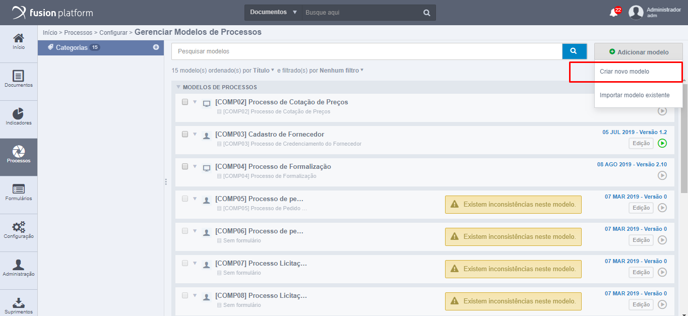
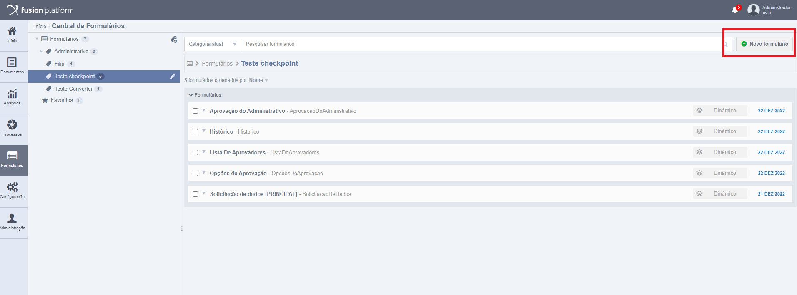
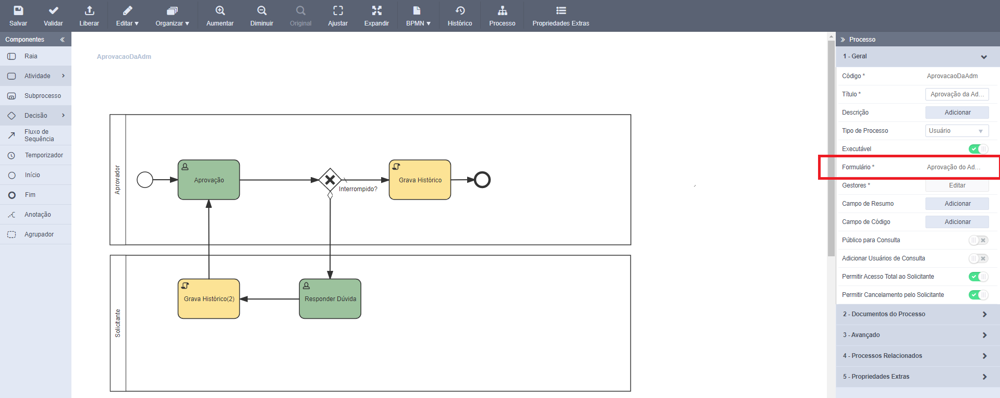
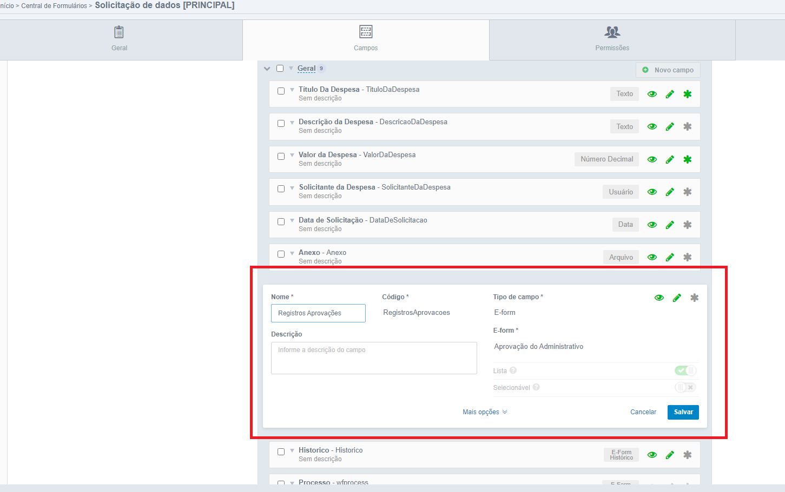
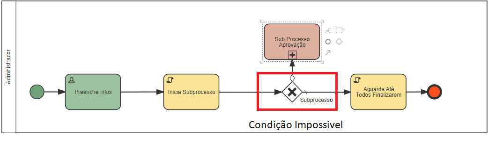
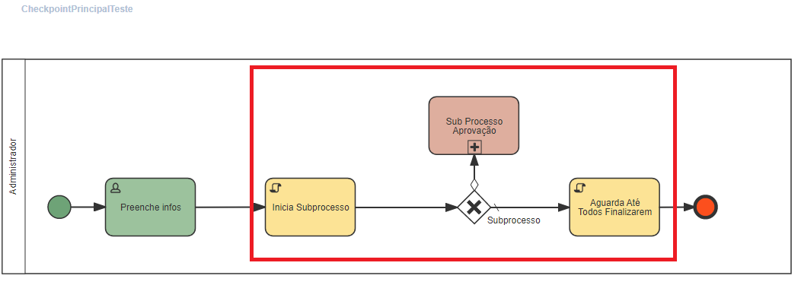

# Criando a classe java de customização

 - Antes de criar uma classe Java deve-se ter em mente em qual *package* será melhor por questões de organização.
 - Os Adapters geralmente são criados dentro do diretório "com.neomind.fusion.workflow.adapter".
 - Por questão de boas práticas seria interessante criar um novo *package* dentro desse diretório que seja relacionado ao Checkpoint desenvolvido.
     
## 1. Onde configurar um Checkpoin no Fusion

O Checkpoint faz parte da modelagem de um processo. Para implementar um checkpoint será nescessário:
 
 - Acessar o Gerenciamento de Modelos de Processos em **Processos - Configurar - Gerenciar Modelos de Processos** e criar um modelo novo ou editar um existente, esse processo será um subprocesso em nosso processo principal.



*Caminho para acessar a Gerenciamento de Modelos de Processos.*

 - Acessar a central de formulários em **Formulários - Central de Formulários - Novo Formulário**. Criar um novo formulário do nosso novo processo. Lembre-se de criar nesse formulário um campo do tipo E-form que referencie o formulário principal do nosso processo principal.



*Caminho para a criação do fomulário.*

 - Atribuir o formulário criado como formulário principal no sub processo



*Subprocesso que será executado pelo checkpoint.*

 - Criar um campo no formulário do processo principal de tipo E-form que referencie o formulário principal do nosso subprocesso. Chamaremos esse campo de **Lista de Entidades**



*Campo do E-form do subprocesso no formulário do processo principal.*
        
## 2. Parâmetros do Adapter

Os parãmetros são os mesmos utilizados no [Adapter Interface][1].

## 3. Implementação simples

### 3.1 Descrição:
 
 - Para implementar um é necessário criar na modelagem dois *Adapters* e uma representação de sub processo constituída e uma decisão.
 - O checkpoint consiste em dois adapters que executam o subprocesso via código, e não por fluxo normal de processo. Para que isso ocorra, é necessaria inserção uma condição impossivel no fluxo do adapter para o subprocesso.
 - O **Adapter Inicial** executa o subprocesso, a quantidade de execuções depende do número de registros do campo **Lista de Entidades**
 - O **Adapter Final** finaliza o checkpoint assim que forem finalizados todos os subfluxos gerados pelo **Adapter Inicial**

    

    *Condição impossivel de ocorrer para que o subprocesso não seja executado da maneira 'usual'.*

    

    *Imagem para representar como fazer a modelagem de um checkpoint.*

### 3.2 Adapter Inicia Subprocesso:

 - *Inicia Subprocesso* para iniciar os sub processos:  
     - Para iniciar os subfluxos é necessário passar o nome do subprocesso no modelo (Sub Processo Aprovação), a ultima task de usuário, o formulario do processo e o codigo do campo do formulario que representa a **Lista de Entidades**.
     
    ```java
    package com.neomind.fusion.workflow.adapter.checkpointSimples;
        
    import com.neomind.fusion.entity.EntityWrapper;
    import com.neomind.fusion.workflow.Activity;
    import com.neomind.fusion.workflow.Task;
    import com.neomind.fusion.workflow.adapter.AdapterInterface;
    import com.neomind.fusion.workflow.adapter.CheckPointUtils;
    
    public class CheckpointSimples implements AdapterInterface
    {
        @Override
        public void back(EntityWrapper entityWrapper, Activity activity)
        {
            // TODO Auto-generated method stub
        }
    
        @Override
        public void start(Task task, EntityWrapper entityWrapper, Activity activity)
        {
    
        new CheckPointUtils().startSubProcessProcess( "Sub Processo Aprovação",
					task, entityWrapper, "RegistrosAprovacoes" );
        }
    }
    ```

 - O método 'startSubProcess()' é o gatilho que inicia o subprocesso. Atenção para:
     - O primeiro parâmetro, que recebe o nome do subprocesso (nome que está na modelagem do processo principal).
     - O ultimo parâmetro, que recebe o código do campo do formulário principal e referencia o subprocesso, contendo a lista de NeoObjects que irá iniciar os sub processos. Para cada registro nessa lista, será criado um subfluxo diferente do subprocesso.
 
### 3.3 Adapter de Interface que irá aguardar até todos sub processos finalizarem:
  
```java
package com.neomind.fusion.custom.treinamento.checkpoint;

import com.neomind.fusion.entity.EntityWrapper;
import com.neomind.fusion.workflow.Activity;
import com.neomind.fusion.workflow.Task;
import com.neomind.fusion.workflow.adapter.AdapterInterface;
import com.neomind.fusion.workflow.adapter.CheckPointUtils;

public class FinalizaAprovacoes implements AdapterInterface
{
	@Override
	public void start(Task task, EntityWrapper entityWrapper, Activity activity)
	{
		new CheckPointUtils().checkFinishNew(entityWrapper, activity, "RegistrosAprovacoes",
			"Sub Processo Aprovação", "Aguarda Até Todos Finalizarem");
	}

	@Override
	public void back(EntityWrapper entityWrapper, Activity activity)
	{

	}
}
```

 - Assim que o checkpoint tenha executado um subfluxo para cada registro na **Lista de Entidades**, o *Adapter final* irá finalizar o checkpoint e seguirá o fluxo normal do processo principal

 - Atenção para o ultimo parâmetro do método 'checkFinishNew()', que recebe o nome da atividade de Script deste adapter


[1]: [http://192.168.1.81:8000/adapters/custom-adapter-interface/understanding-about/]