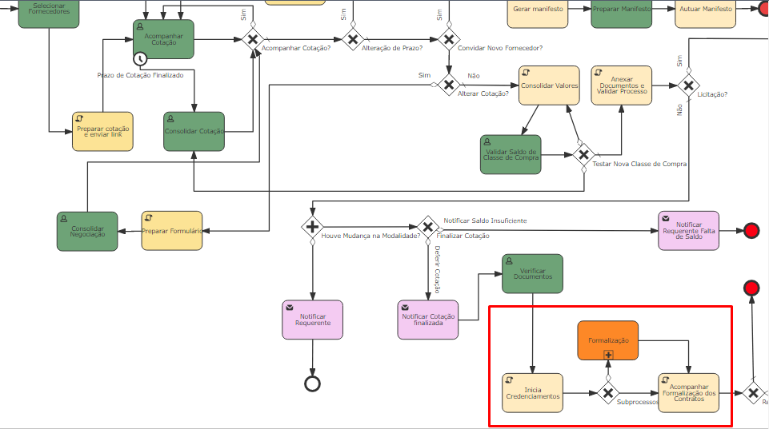

# CheckPoint

*CheckPoint*, é parte de uma modelagem de um processo constituida de dois [adapters de interface][1] que permitem iniciar subprocessos simultâneos. Os subprocessos são independentes e o fluxo principal so da continuidade quando todos eles são finalizados.

*Retângulo em vermelho identificando checkpoint em um fluxo do Fusion*

## 1. Por que usar?

Em alguns casos pode se tornar necessária na modelagem de um fluxo que inicialize mais de um subfluxo simultaneamente, isso de acordo com a regra de negócio e demanda de cada organização.

## 2. Como é disparado?

Os gatilhos do Checkpoint são os mesmos do *[Adapter Interface][1]*, tendo em vista que é implementado dois deles.

[1]: http://192.168.1.81:8000/adapters/custom-adapter-interface/understanding-about/