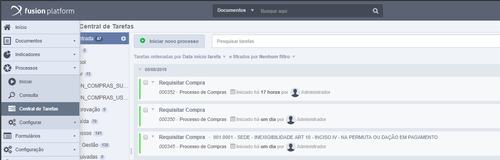

# Entity Adapter

*Entity Adapter*, é um adapter de entidade (formulário) com fácil implementação que permite criar customizações de ações que não estão nos padrões do Fusion Platform utilizando uma
classe java. O adapter é executado antes de persistir os dados de um formulário no banco de dados.

## 1. Por que usar?

Em alguns casos pode se tornar necessária uma funcionalidade adicional conforme a regra de negócio e demanda de cada organização.

Um *Entity Adapter* pode ser utilizado para executar alguma funcionalidade na qual os padrões do Fusion não atendem e ele é executado antes de persistir os dados do formulário.

## 2. Como é disparado?

Toda vez que clicar em ok ou aplicar em um formulário que possua um Entity Adapter configurado nele, seja ao criar um novo registro ou editando registros já existentes, será
executado o adapter de customização e em seguida persistido as informações no banco de dados.

### 2.1. Nos formulários em Formulários-Navegar;

Ao acessar os formulários em **Formulários - Navegar** terá acesso aos dados dos formulários do Fusion.

*Caminho para acessar os dados dos formulários do Fusion.*

Toda vez que clicar em **ok** ou **aplicar** em um formulário que possua um *Entity Adapter* configurado nele, seja ao criar um novo registro ou editando registros já existentes,
ao clicar no **ok** do formulário será executado o adapter de customização antes de persistir as informações no banco de dados.

*Retângulo em vermelho identificando os botões de **ok** e de **aplicar** em um formulário.*

### 2.2. Em uma atividade de um processo;

Ao acessar as atividades em **Processo - Central de Tarefas** terá acesso as atividades do fusion.

*Caminho para acessar a central de tarefas do Fusion.*

Ao abrir uma atividade disponível para execução na central de tarefas do Fusion e clicar em **Salvar** ou **Enviar**, no canto inferior direito, um Entity Adapter configurado nele
será executado.

*Retângulo em vermelho identificando os botões de **Salvar** e de **Enviar** de uma atividade.*