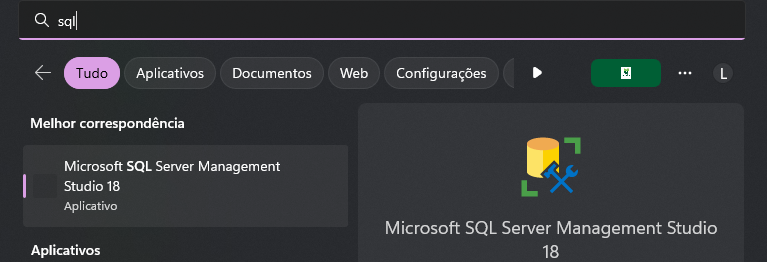
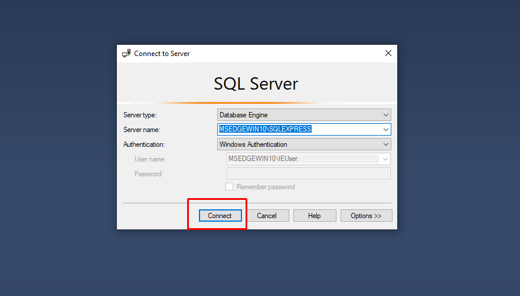
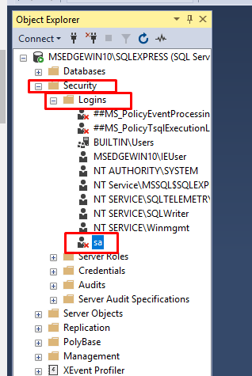
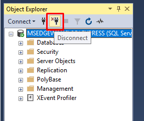
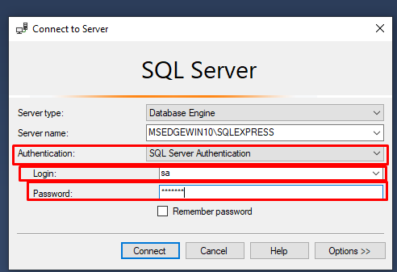

# 1. Configurando o Microsoft SQL Server para desenvolvimento

Agora que temos nosso manager configurado, vamos iniciar a utilização do **Microsoft SQL Server**.

---

## 1️⃣ Abrindo o Microsoft SQL Server

Ao abrir, aparecerá a tela de login. Por enquanto, não é necessário alterar nada.  
Clique em **Conectar**.

---

## 2️⃣ Habilitando o login pelo usuário **sa**

Na tela principal do SQL Server:

Para utilizar o usuário **sa** para login e conexões, siga:

1. Navegue em: **Segurança > Logons**
2. Clique duas vezes no usuário **sa** (ele estará marcado com um *x*, indicando que não está habilitado).

3. No menu aberto, configure a **Senha** e confirme.

⚠️ **Atenção:**
Essa senha será usada para logar e conectar no banco de dados futuramente. Escolha uma senha segura, mas fácil de lembrar.

4. Habilite o usuário clicando em **Status** e garantindo que **Logon** esteja *Habilitado*.

Clique em **OK**.

---

## 3️⃣ Mudando o modo de autenticação do SQL Server

Clique com o botão direito no usuário conectado e selecione **Propriedades**:

No menu aberto, vá em **Segurança** e localize **Autenticação do servidor**.  
Mude de **Modo de autenticação do Windows** para **Modo de autenticação do SQL Server e do Windows**.

Clique em **OK**.

---

## 4️⃣ Logando com o usuário **sa**

⚠️ **Atenção:**
A partir de agora, todas as conexões deverão ser feitas com este usuário.

1. Desconecte da sessão atual (usuário Windows) clicando no ícone de cabo com um *x*:

2. Configure o login:

- **Autenticação:** Autenticação do SQL Server
- **Login:** sa
- **Senha:** a senha criada anteriormente

Clique em **Conectar**.

---

Após estas etapas, seu ambiente SQL Server estará pronto para criação de bancos de dados.  
Para saber [como criar um banco de dados](create-bda.md) siga o guia indicado.
