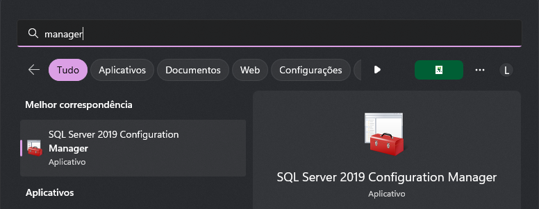
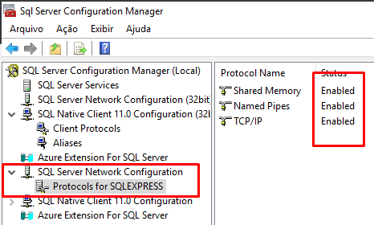

# 2.️ Configurando o SQL Server Configuration Manager

Para começar a configuração, basta abrir o aplicativo **SQL Server Configuration Manager**.  
Pesquise esse nome na barra de pesquisa do Windows, e aparecerá o seguinte ícone:

Ao abrir, esta será a tela inicial:

---

## 🔍 1. Verificando se está tudo habilitado

### 🧩 1.1 Configuração do SQL Native Client

Procure pelo primeiro **Configuração do SQL Native Client**.  
Em seguida, expanda e clique em **Protocolos de cliente**.

Verifique se essas 3 opções estão marcadas como **Habilitada (Enabled)**.  
Caso não estejam, clique duas vezes e **habilite**!

---

### 🌐 1.2 Configuração de Rede do SQL Server

Procure por **Configuração de rede do SQL Server**,  
em seguida clique em **Protocolos para SQLSERVER**.

Verifique se essas 3 opções estão marcadas como **Habilitada (Enabled)**.  
Caso não estejam, clique duas vezes e habilite.

---

### ⚙️ 1.3 Configuração do segundo SQL Native Client

Procure pelo **outro** item chamado **Configuração do SQL Native Client** (sim, há dois).  
Expanda e clique novamente em **Protocolos de cliente**.

Verifique se as 3 opções estão **Habilitadas (Enabled)**.  
Caso contrário, habilite todas.

---

## 🔒 2. Configurando as Portas

Também precisamos habilitar e definir algumas portas para o banco funcionar corretamente.

Procure por **Configuração de rede do SQL Server**,  
clique em **Protocolos para SQLSERVER**,  
e depois dê dois cliques em **TCP/IP**.

---

### 🧠 2.1 Editando os IP Addresses

Na janela que se abrir, vá até a aba **IP Addresses**.

Você verá vários blocos — *IP1, IP2, IP3...*  
Cada um tem os campos **Enabled** e **TCP Port**.

Habilite todos os que estiverem desabilitados,  
e para cada um, defina a **porta 1433** (padrão do SQL Server).

No final da lista, adicione também no **IPAll** a porta **1433**.

Clique em **OK** para salvar.

---

⚠️ **Atenção:**
Agora é **fundamental reiniciar o serviço** do SQL Server para aplicar as alterações.

---

## 🔁 3. Reiniciando o Serviço do Banco de Dados

Pressione a tecla **Windows**, digite **Serviços**, e abra o aplicativo correspondente.

Pesquise pelo serviço **SQL Server**, selecione-o,  
e clique em **Reiniciar** no painel lateral.

Aguarde o serviço reiniciar completamente antes de continuar.

---

👉 Próximo passo: [**Habilitando o usuário SA →**](ConfigBda.md)
