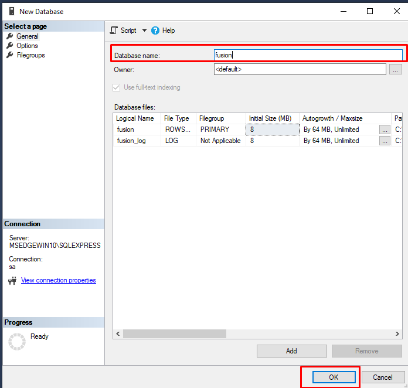

# 3. Criando um Novo Banco de Dados no SQL Server

Após estarmos logados no SQL Server com o usuário **sa**, o processo de criação do banco é bastante simples.

---

## 🧩 1. Acessando a opção de criação

Clique com o **botão direito do mouse** sobre a pasta **Banco de dados**  
e selecione a opção **Novo banco de dados...**

---

## 🧠 2. Definindo o nome do banco

Na janela que abrir, basta informar um nome para o banco de dados.

ℹ️ **Informação:**
**Padrão recomendado:** Para o ambiente de desenvolvimento, utilizamos o nome **fusion**.

Defina então o nome do banco como `fusion`, conforme o padrão.

Clique em **OK** para concluir.

---

## ✅ 3. Verificando a criação

Após confirmar, expanda novamente o item **Banco de dados**  
e você verá o banco **fusion** criado com sucesso.

---

🚀 O banco está pronto!  
Agora podemos seguir para a configuração dos **usuários e permissões** ou para **importar os dados iniciais**.