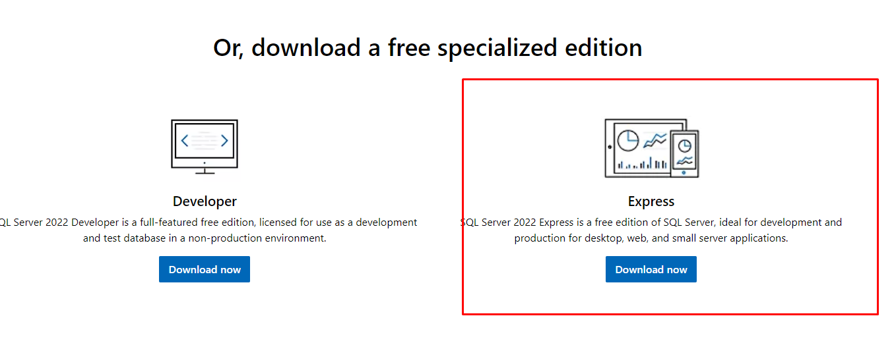

# 4. Instalação do Microsoft SQL Server e SQL Server Management Studio (SSMS)

Antes de configurarmos o banco de dados, precisamos instalar o **Microsoft SQL Server** e o **SQL Server Management Studio (SSMS)**.  
Essas duas ferramentas serão essenciais para gerenciar e manipular nossos bancos de forma visual e prática.

---

## 🧩 1. Fazendo o download do Microsoft SQL Server

Para baixar o **Microsoft SQL Server**, acesse o link oficial abaixo:

🔗 [Download do Microsoft SQL Server](https://www.microsoft.com/en-us/sql-server/sql-server-downloads)

Na página de download, procure pela versão **Express** — ela é gratuita e suficiente para o ambiente de desenvolvimento.

Após o download, **siga a instalação padrão**, clicando em **“Próximo”** até a conclusão.

ℹ️ **Informação:**
A versão *Express* é ideal para testes e desenvolvimento, pois é leve e compatível com o SSMS.

---

## 🧠 2. Instalando o SQL Server Management Studio (SSMS)

Em seguida, faça o download do **SQL Server Management Studio (SSMS)** — o ambiente gráfico usado para acessar e gerenciar o SQL Server.

🔗 [Download do SSMS](https://learn.microsoft.com/en-us/sql/ssms/download-sql-server-management-studio-ssms?view=sql-server-ver16)

Na página, clique em **Free download** para iniciar o download.

Após o download, execute o instalador e **siga o processo padrão de instalação**.

🧩 Após concluído, você estará pronto para iniciar as configurações no SQL Server.

---

📘 **Próximo passo:**  
[Configurando o Manager do SQL Server →](ConfigManager.md)
