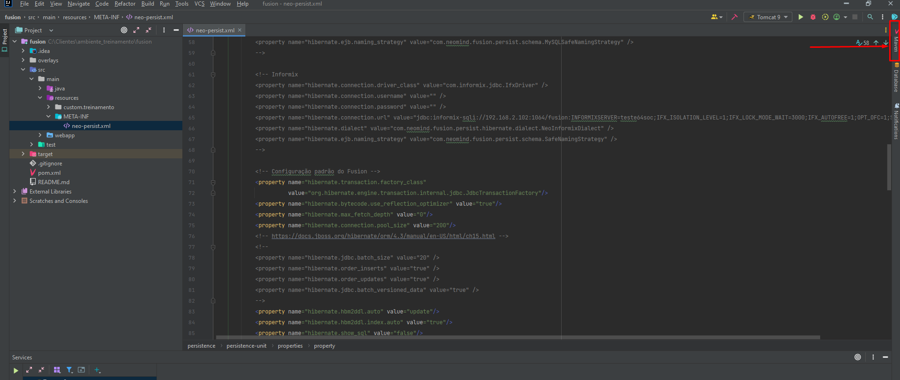
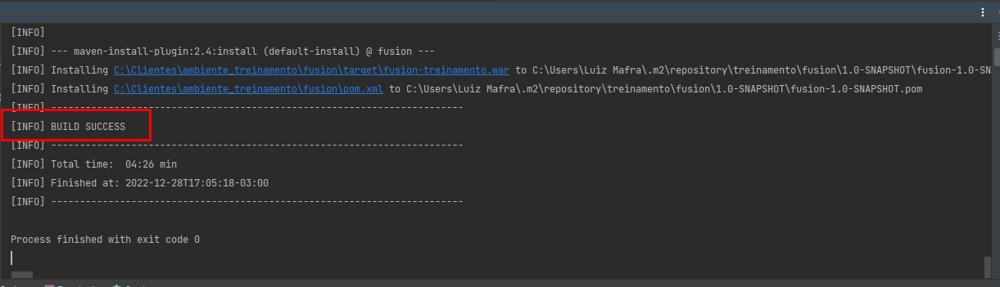

# 2. Achando a aba do Maven no IntelliJ

Quando abrimos um projeto novo, uma das primeiras coisas que devemos fazer antes de rodá-lo é **baixar as dependências do Maven**.  
Para isso, localize no canto direito do IntelliJ a aba **Maven**.  
A localização exata segue na imagem abaixo:

⚠️ **Atenção:**  
Agora que estamos na janela do Maven, verifique se há algum Maven adicionado.  
Caso **não exista**, siga para o **Item 1.1**.  
Caso **já exista**, pule direto para o **Item 1.2**.

---

## 1.1 Adicionando o Maven

Para adicionar o Maven é bem simples:  
basta clicar no ícone com o sinal **“+”** e adicionar o seu arquivo **pom.xml** do projeto.

ℹ️ **Informação:**  
O Maven adicionado aqui dentro é o **pom.xml** do seu projeto.

Em seguida, clique em **OK**.  
Feito isso, seu Maven está adicionado e pronto para ser configurado no próximo item.

---

## 1.2 Configurando o Maven

Inicialmente devemos dar um **reload** no Maven para que ele possa carregar todas as dependências.  
Para fazer isso, clique no círculo com **duas flechas torcidas** apontando uma para a outra, conforme a imagem:

Basta esperar um pouco — geralmente não demora muito.

ℹ️ **Dica:**  
Para confirmar se o Maven foi recarregado, basta expandir a pasta e verificar se as pastas **Plugins** e **Dependencies** foram criadas.

---

### 1.2.1 Clean and Install

Após o Maven ter carregado as dependências, precisaremos executar um **Clean** e um **Install**.  
Para isso:

1. Expanda a pasta do Maven.
2. Expanda a pasta **Lifecycle**.
3. Segure **CTRL** e selecione **clean** e **install**.

Em seguida, clique no botão com o ícone de **Play** ▶️ e aguarde.

Após o término da execução, o final da mensagem no console deverá ser:

    BUILD SUCCESS
    Total time:  XX.XXX s
    Finished at: 2024-XX-XXTXX:XX:XX-03:00
------------------------------------------------------------------------

💡 **Observação:**  
É comum demorar um pouco nessa parte, **não se preocupe**.
