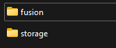
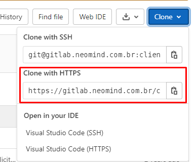
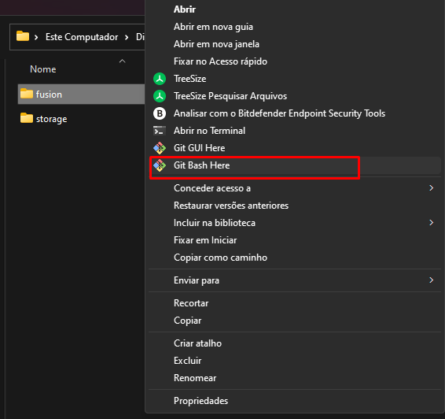
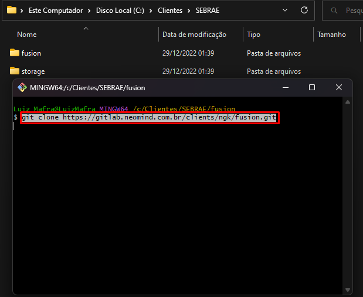
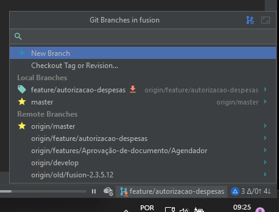
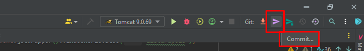

# 7. Clonando um projeto do Git no IntelliJ

Primeiramente, procure no GitLab da Neomind o cliente no qual você está trabalhando.

[Link Gitlab Neomind](https://gitlab.neomind.com.br/)

Para pesquisar, vá até o campo de pesquisa e digite o nome do cliente. Ao terminar de digitar, irão aparecer duas opções: uma pesquisa geral e outra provavelmente com o título **Groups**, assim:

- *Clientes / 'nome do cliente'*

Essa é a opção que você deve usar para acessar a página principal do cliente.

---

## 🏠 Pasta para cada cliente (Não obrigatório)

Antes de iniciar a clonagem, por organização, caso você não tenha a estrutura de pasta **Clientes**, recomendo criar uma pasta no seu disco principal, dentro dela ficará uma pasta destinada a cada cliente.


ℹ️ **Informação:** 
**Não é obrigatório seguir essa estrutura, mas ajuda na organização!**

⚠️ **Atenção:** 
**Dentro dessa pasta do cliente, crie as seguintes pastas obrigatórias:**

    - fusion
    - storage
    
    

---

## 🔗 Pegando o link do clone do Git

Após encontrar o projeto no Git e selecionar a branch que deseja clonar, clique no botão **Clone**. Copie a opção **Clone with HTTPS**, que será usada para clonar no seu ambiente local.



---

## 1️⃣ Utilizando Git Bash

Para clonar via Git Bash:

1. Acesse a pasta **Clientes** e entre na pasta do cliente (ex: SEBRAE).
2. Clique com o botão direito na pasta **fusion** → **Git Bash Here**.



⚠️ **Atenção:** 
**Se não aparecer, verifique se o Git Bash está instalado.**

3. Na tela do Git Bash, digite:

```bash
git clone 'linkHTTPS-clone-git'
```

> Use o link HTTPS que você copiou do Gitlab do cliente.

4. Aperte **ENTER** e aguarde o término do clone.



---

## 2️⃣ Utilizando Upload Version Control do IntelliJ

### 2.1 Primeira forma

Você pode clonar diretamente pelo IntelliJ usando a opção **Open VCS**:


Feche o projeto atual e abra a tela inicial do IntelliJ. Clique em **Get from VCS** para abrir o menu.

### 2.2 Segunda forma


Sem fechar o projeto, vá na aba **VCS** → **Get from Version Control**.

---

### 2.3 Clonando o projeto

1. Selecione **Git** em **Version Control**.
2. Cole o link HTTPS no campo **URL**.
3. Selecione a pasta `Clientes/nomeCliente/fusion` em **Directory**.


---

## 🔄 3️⃣ Selecionando branch e fazendo Checkout

1. Abra o seletor de branch no canto inferior direito.


2. Selecione a branch desejada.



3. Clique na branch → **Checkout**. O IntelliJ atualizará os arquivos locais.


⚠️ **Atenção:** 
Sempre faça checkout antes de modificar arquivos!

---

## ⚙️ 4️⃣ Configurando a neo-persist

⚠️ **Atenção:** 
**Atenção:** a configuração padrão aponta para a máquina do cliente. É essencial ajustar para o seu ambiente.

Caminho: `src > main > resources > META-INF > neo-persist.xml`.

- Ajuste a **conexão do banco de dados** para o seu banco local.
- Configure o caminho da pasta **storage**.

  


Salve o arquivo após as alterações.

---

## 🏗️ 5️⃣ Build Maven

Para fazer a build do Maven, acesse: [Build Maven](build-project-maven.md)

---

## 🖥️ 6️⃣ Configurando Tomcat Server

Para configurar o Tomcat, acesse: [Configurando o Tomcat](config-tomcat-server.md)

---

## ▶️ 7️⃣ Executando o projeto

Rode sempre em modo **Debug** clicando no ícone da baratinha:


ℹ️ **Informação:**
Sem o modo Debug, o projeto executará normalmente, mas breakpoints não funcionarão.

---

## 💾 8️⃣ Commitando na branch

1. Clique no ícone de **Commit** (uma seta) próximo ao Tomcat.



2. Selecione os arquivos modificados (NUNCA inclua o neo-persist).
3. Descreva as alterações.
4. Clique em **Commit and Push**.

⚠️ **Atenção:** 
Verifique a branch antes de commitar e não inclua o neo-persist.

