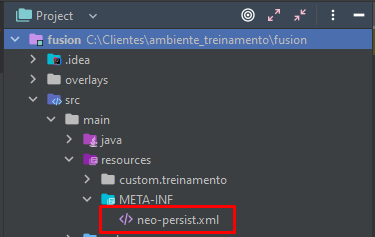
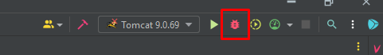

# 8. Como montar meu ambiente IntelliJ do zero

Aqui você vai encontrar um passo a passo de como configurar seu ambiente IntelliJ do zero.  
Caso tenha dúvidas no meio do caminho, consulte a seção de [Dúvidas Frequentes](duvidas.md)

ℹ️ **Informação:**
O passo a passo deste manual foi obtido da documentação da equipe de [Inovação](https://docs.pages.neomind.com.br/dev/development/eclipse/eclipse/) e adaptado para a realidade de Serviços.

---

## 💻 Instalações

Será necessário instalar:

1. Um banco de dados (recomenda-se SQL Server para uso local).
2. JDK compatível com a versão do Fusion.
3. Apache Tomcat compatível com a versão do Fusion.
4. LibreOffice para conversor de documentos.
5. GhostScript para visualização de documentos.
6. Maven para desenvolvimento local.
7. IntelliJ IDEA.

Você encontrará as versões compatíveis no manual de instalação do Fusion, acessível pelo [portal](https://www.neomind.com.br/fusion/) > GED > Materiais do Fusion > Documentação.  
Escolha a versão, de preferência a mais recente, e verifique as configurações na seção **Servidor Windows**.

> O manual está voltado para aplicações que executam com serviço. Neste guia, vamos configurar a aplicação para rodar dentro do IntelliJ.  
> O Maven é necessário apenas em ambiente de desenvolvimento.

---

## 📦 Apache Maven

Faça download da última versão do Apache Maven no [site oficial](https://maven.apache.org/download.cgi) e finalize a instalação.

⚠️ **Atenção:**
Caso você já tenha Maven e Tomcat instalados, não é necessário baixar novamente.

---

## 🖥️ IntelliJ IDEA

Após instalar os pré-requisitos, instale a IDE IntelliJ IDEA.

ℹ️ **Informação:**
Se você possui e-mail institucional de faculdade, pode solicitar licença premium do IntelliJ [aqui](https://www.jetbrains.com/community/education/#students).

Faça download da IDE e a inicie.

---

## 1️⃣ Abrindo o ambiente de treinamento pela primeira vez

Ao abrir o IntelliJ pela primeira vez, selecione **Open** na tela inicial.

Navegue até a pasta do seu ambiente de treinamento.  
Dentro da pasta principal que contém o *pom* (no nosso exemplo: pasta *fusion*), selecione-a (**a cor do pom deve diferir, caso contrário revise o caminho**).

Clique em **Ok**.

---

### 🔧 Configurando neo-persist

Localize o arquivo:  
`src > main > resources > META-INF > neo-persist.xml`

Ajuste:

- **Banco de dados:** Configure **username** como `sa` e a senha criada.
- **databaseName:** Informe exatamente o nome do banco criado.

- **Storage:** Configure o caminho da pasta storage.  
  Caso não exista, crie a pasta.

Salve o arquivo.

⚠️ **Atenção:**
Confirmar as configurações da neo-persist é de extrema importância!!

---

## 2️⃣ Configurando o SDK do projeto

Acesse **File > Project Structure**:

Na aba **Project**, verifique se o SDK do Java está configurado. Caso não esteja, adicione-o.

ℹ️ **Informação:**
Geralmente o IntelliJ reconhece automaticamente, mas pode falhar em alguns casos.

---

## 3️⃣ Build Maven

Para fazer a build do Maven, acesse: [Build Maven](build-project-maven.md)

---

## 4️⃣ Configurando servidor Tomcat

Para configurar o Tomcat no IntelliJ, acesse: [Configurando o Tomcat](config-tomcat-server.md)

---

## 5️⃣ Executando o projeto

Sempre rode o projeto em **modo Debug**, clicando no ícone da baratinha:

ℹ️ **Informação:**
Caso não rode em modo Debug, o projeto funcionará normalmente, mas breakpoints não serão aplicáveis durante a execução.