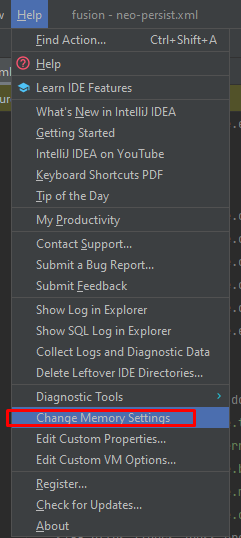

# 1. Otimizando a Performance do IntelliJ IDEA

Para aumentar a performance do nosso querido **IntelliJ IDEA**, é possível aplicar algumas configurações que ajudam a evitar gargalos durante a execução de projetos — entre elas, **alocar mais memória para o IDE**.

⚠️ **Atenção:**  
Não é recomendado alocar mais de **2/3 da memória RAM total** do seu computador, pois isso pode causar perda de desempenho em outros processos do sistema.

---

### 💡 Como alocar mais memória no IntelliJ

1. Acesse a aba **Help** no menu superior.
2. Clique em **Change Memory Settings**.
3. Ajuste o valor conforme necessário.

---

### 🧠 Configuração recomendada

Recomendamos definir o valor **máximo de 4096 MB (4 GB)**, para equilibrar o desempenho do IntelliJ sem comprometer o restante da máquina.

---

Por fim, **salve as alterações e reinicie o IntelliJ IDEA** para aplicar as novas configurações.