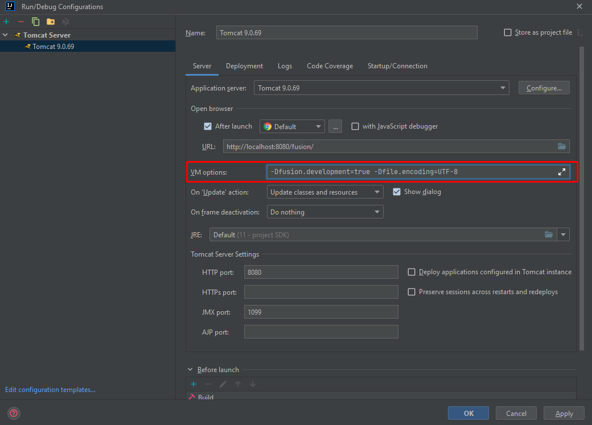
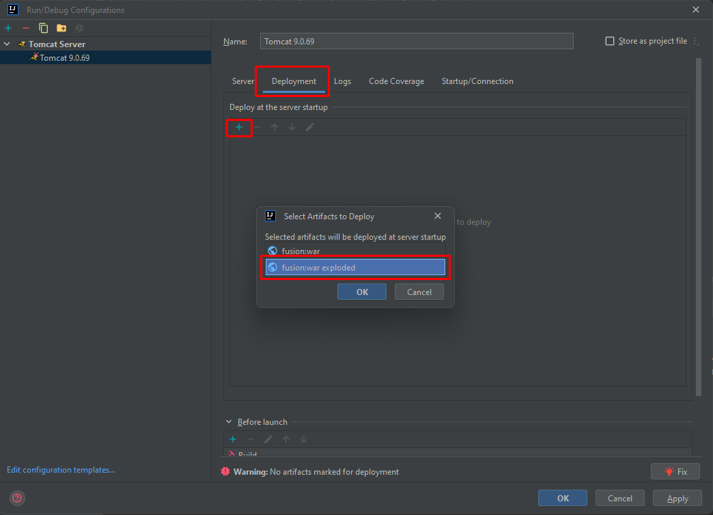

# 4. Configurando o Tomcat Server no IntelliJ IDEA

Configurar o **Tomcat Server** no IntelliJ é um passo essencial para executar e debugar aplicações Java Web.  
A seguir está um guia passo a passo simples e ilustrado.

---

## 1️⃣ Abrindo o menu de configuração

Para configurar o servidor Tomcat, precisamos abrir o menu de execução do projeto.

1. No canto superior direito do IntelliJ, localize o campo onde escolhemos **como** rodar o projeto.  
   Normalmente aparece como **Current File**, mas o nome pode variar.

💡 **Observação:**  
Caso não apareça como *Current File*, não se preocupe — o importante é acessar o menu de configurações.

2. Clique sobre esse campo e escolha a opção **Edit Configurations...**  
   Uma nova janela será aberta.


---

## 2️⃣ Adicionando o Tomcat Server

Com a nova aba de configurações aberta, siga estes passos:

1. Clique no ícone **“+”** para adicionar uma nova configuração;
2. Procure por **Tomcat Server**;
3. Selecione a opção **Local**.


Agora será exibido o painel de configuração do servidor Tomcat.

---

### 2.1 🧠 Configurando VM Options

No campo **VM Options**, adicione o seguinte texto:

```text
-Dfusion.development=true -Dfile.encoding=UTF-8
```

Copie e cole exatamente como acima.



---

### 2.2 📦 Deployment

1. Clique no ícone **“+”** dentro da seção **Deployment**;
2. Escolha a opção **Artifact**;
3. Selecione o artefato que termina com **_exploded**.



⚠️ **Atenção:**  
Sempre selecione o **exploded** como o tipo de deploy!  
Isso garante que o Tomcat possa atualizar os arquivos sem precisar reconstruir todo o artefato.

4. No campo **Application context**, apague o sufixo *_war_exploded* e deixe apenas **fusion**.


ℹ️ **Informação:**  
O *Application context* define o caminho de acesso no navegador.  
Assim, você acessará pelo link **localhost:8080/fusion**, em vez de **localhost:8080/fusion_war_exploded**.

---

### 2.3 🔄 Update Action

Em **On 'Update' action**, selecione **Update classes and resources**.


ℹ️ **Informação:**  
Essa opção faz com que o Tomcat recarregue apenas classes e recursos alterados, sem precisar reiniciar o sistema inteiro — economizando tempo durante o debug.

---

## 3️⃣ Executando o projeto

Para executar o projeto, sempre utilize o modo **Debug**, representado pelo ícone da **baratinha** 🪲:


💡 **Observação:**  
Rodar em modo debug não é obrigatório, mas é **altamente recomendado**.  
Assim, você poderá adicionar *breakpoints* e inspecionar variáveis durante a execução.

---

✅ **Pronto!**  
Seu **Tomcat Server** está configurado e pronto para rodar o projeto com eficiência e suporte total a depuração.