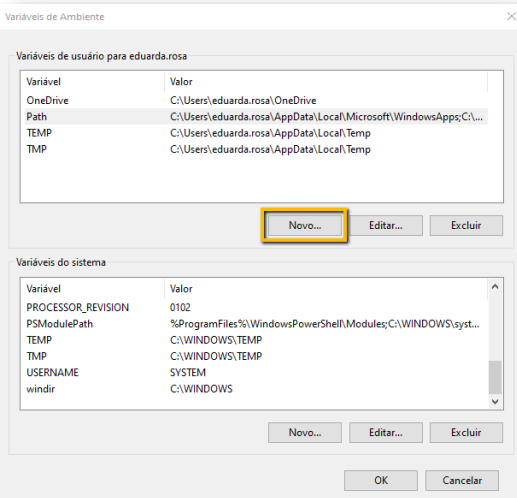
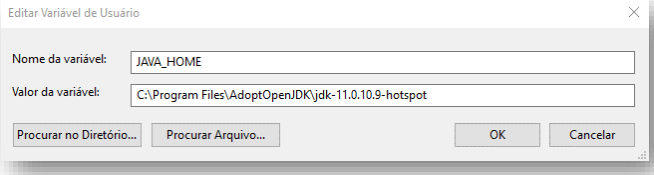
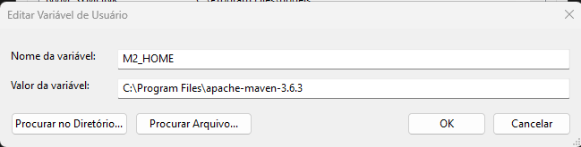
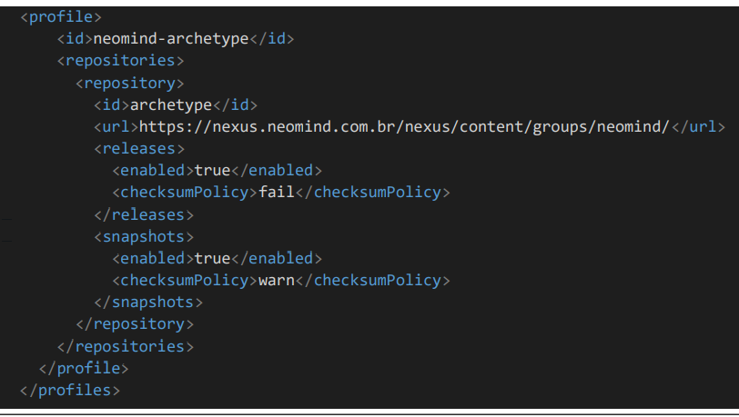
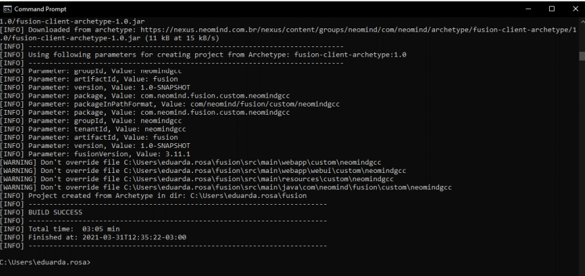

# 5. Como baixar o projeto Fusion para desenvolvimento
## 1.1 Estrutura de pastas

Crie a seguinte estrutura de pastas:

**C:/Clientes**

**C:/Clientes/ambiente_desenvolvimento**

Caso não tenha uma pasta chamada Clientes, recomenda-se que você crie ela dentro da sua pasta principal de arquivos **(C:)**.

Em seguida, dentro dela, crie uma pasta chamada **ambiente_desenvolvimento**.

Será dentro da pasta *ambiente_desenvolvimento* que todos os recursos e as aplicações relacionadas ao
ambiente de desenvolvimento serão armazenados.

ℹ️ **Informação:**  
Note que as pastas foram criadas sem espaço e com letras maiúsculas, opte por utilizar dessas boas práticas, pois elas podem evitar problemas futuros de comunicação com outras aplicações e programas na hora de localizar o caminho dessas pastas.

## 1.2 Git

Para instalar o Git você pode fazer o download clicando [aqui](https://git-scm.com/download/win)

## 1.3 Maven

⚠️ **Atenção:**  
**Só faça essa parte, se você não tiver baixado o Maven no seu computador, caso contrário poderá pular esta etapa.**

Acesse o link a seguir para fazer o download da versão binary em formato zip da aplicação Maven: [clique aqui](https://downloads.apache.org/maven/maven-3/3.6.3/binaries/apache-maven-3.6.3-bin.zip).

Após o download, extraia o arquivo zipado dentro da pasta **C:/Arquivos de Programas**.

## 1.4 Java

Caso não possua o Java instalado, siga os passos abaixo:

### 1.4.1 Passo 1 - Baixando o arquivo

Baixe o arquivo **LTS** na versão mais recente pelo [link](https://adoptopenjdk.net/index.html?variant=openjdk11&jvmVariant=hotspot)

### 1.4.2 Passo 2 - Instalando o java via instalador da aplicação

Após fazer o download, abra o instalador e siga os passos até finalizar a instalação.


## 1.5 Tomcat

⚠️ **Atenção:**  
Siga esse passo do **Tomcat** se apenas você não o tem baixado em sua máquina, caso contrário pode pular para o próximo passo.

Baixe o arquivo referente a versão do sistema do servidor pelo [link](https://tomcat.apache.org/download-90.cgi) . Note que o link leva para a
versão mais atualizada da aplicação.

Ao acessar o link selecione em Core, a opção zip compatível com o seu sistema operacional.


Após fazer o download, extraia o conteúdo para a pasta **Arquivos de programa**.

## 1.6 Variáveis de ambiente

No menu iniciar do seu computador digite **Variáveis de Ambiente** e acesse a opção **Editar as variáveis de ambiente do sistema**.


Uma tela de configuração das propriedades do sistema será aberta conforme a imagem abaixo, então
clique em **Variaveis de Ambiente:**


Após clicar, uma nova tela irá abrir onde você irá realizar as configurações de fato. Clique em **Novo**:



Então adicione as seguintes variáveis:

Nome da variável: *JAVA_HOME*

Valor da variável: Localize o diretório onde está instalado o Java



ℹ️ **Informação:**  
Lembre-se de colocar a pasta JDK da onde você instalou o Java

Nome da variável: *M2_HOME*

Valor da variável: Localize o diretório onde está o arquivo do Maven.



Em seguida, clique sobre a variável Path para selecioná-la e clique em Editar:


Clique em Novo e adicione os seguintes valores:

**%M2_HOME%/bin**

**%JAVA_HOME%/bin**


Ao finalizar as configurações, clique em Ok nas telas que foram abertas para gravar as alterações
realizadas.

## 1.7 Arrumando a settings da pasta onde o maven foi instalado

Na pasta que contém o Maven, acesse a pasta conf e abra o arquivo **settings** com um editor de códigos.

Nele você deve fazer algumas modificações

Localize a tag **setting**, dentro dela deve haver uma tag **profiles** e então dentro dela adicione o seguinte trecho de código:

```xml
<profile>
    <id>neomind-archetype</id>
        <repositories>
            <repository>
                <id>archetype</id>
                <url>https://nexus.neomind.com.br/nexus/content/groups/neomind/</url>
                <releases>
                    <enabled>true</enabled>
                    <checksumPolicy>fail</checksumPolicy>
                </releases>
                <snapshots>
                    <enabled>true</enabled>
                    <checksumPolicy>warn</checksumPolicy>
                </snapshots>
            </repository>
        </repositories>
</profile>
</profiles>
```



Salve e feche o arquivo.

## 2. Baixando o projeto

Então, abra o terminal do Windows. Para isso basta acessar o Menu Inicial e digitar cmd ou prompt (**Execute como administrador o cmd**)


Em seguida **acesse a pasta pelo cmd** onde vai ser o nosso ambiente de desenvolvimento:

    cd C:/Clientes/ambiente_desenvolvimento

Após isto, insira a seguinte linha de comando:

    mvn archetype:generate -B -Pneomind-archetype -DarchetypeGroupId=com.neomind.archetype -DarchetypeArtifactId=fusion-client-archetype -DarchetypeVersion=1.1 -DtenantId=$CLIENTE -DfusionVersion=$FUSION_VERSION

Esse comando irá puxar pesquisar no nexus e fazer o download automaticamente do nosso fusion na versão que você informou.

⚠️ **Atenção:**  
Antes de executar o comando, altere nele o parâmetro **$CLIENTE** para o nome da sua empresa e o parâmetro **$FUSION_VERSION** para a versão do fusion que deseja.

Note que o parâmetro **$CLIENTE** deve conter apenas caracteres alfanuméricos e deve iniciar por uma letra, ou seja, não pode iniciar por números ou caracteres especiais.

### Exemplo

    mvn archetype:generate -B -Pneomind-archetype -DarchetypeGroupId=com.neomind.archetype -DarchetypeArtifactId=fusion-client-archetype -DarchetypeVersion=1.1 -DtenantId=desenvolvimento -DfusionVersion=3.15

Aperte **Enter**



Ao finalizar a execução do comando, uma pasta do **Fusion** terá sido criada contendo o projeto do Fusion para desenvolvimento.