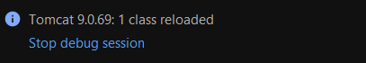
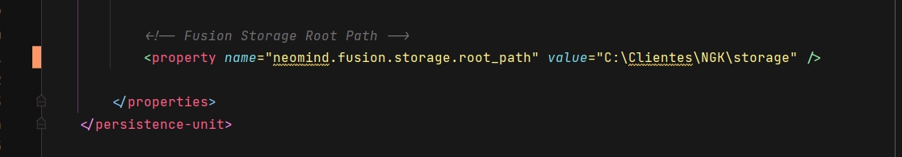
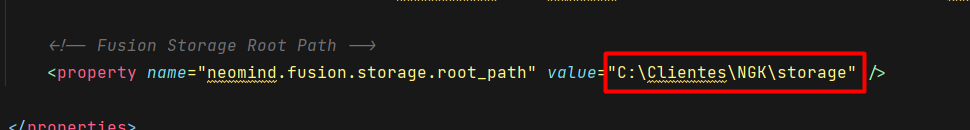
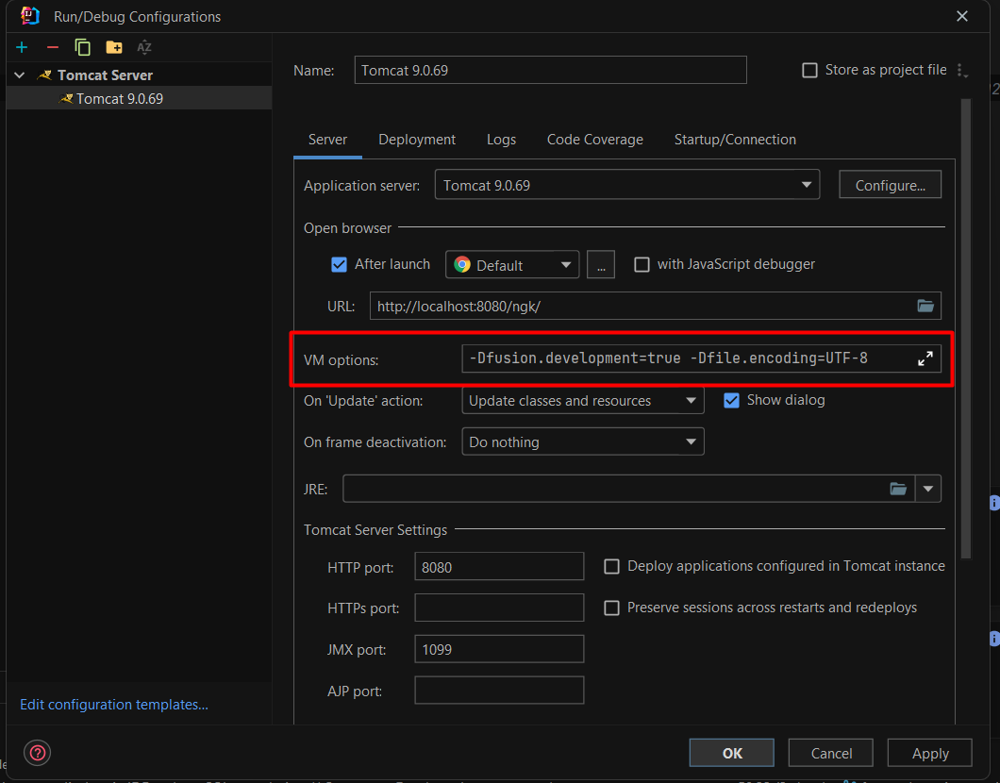
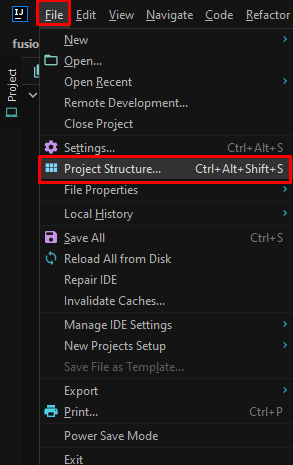

# 6. Dúvidas Frequentes
## 1. Alterei meu código e meu servidor não reconhece minha alteração, o que eu faço?

Sempre que fazermos alguma alteração via código, é essencial que façamos um update nas classes e nos arquivos.

Para fazer isso é bem simples, com o sistema rodando, basta clicar na baratinha (debug mode) e em seguida irá abrir um
menu, onde você irá selecionar a opção **Upload classes and resources**.


Em seguida recarregará e aparecer uma mensagem informando quantas classes foram atualizadas.



⚠️ **Atenção:**  
Se você estiver trabalhando com front end instale a extensão clean cache no navegador e limpe também o cache de
navegador.

## 2. Como eu acho o caminho para limpar o cache de banco?

Esse caminho você pode estar verificando da seguinte forma:

Com o seu projeto aberto, procure pela neo-persist em **src > main > resources > META-INF > neo-persist.xml**.

Após isto, procure pelo comentário **Fusion Storage Roth Path**



Em seguida, dentro de **value** é onde estará o caminho para sua pasta storage.



## 3. Meu ambiente não funciona o debug

Lembrando que sempre que você queira debbugar em tempo real de execução, é necessário inicializar no modo debbug.

Termine a execução atual clicando no icone de **Stop tomcat**.

Em seguida inicialize novamente, porém no modo debbug. Para subir o ambiente no modo debbug basta clicar no icone com a
baratinha.


## 4. Não aparecem logs no terminal do Intellij, o que eu faço?

Procure onde foi configurado o **Tomcat** dentro do Intellij, que fica nessa opção aqui:

Segue a imagem da localização desta opção:


Com essa nova aba aberta, siga os seguintes passos:

Na opção **VM Options** precisaremos adicionar esse texto:

```text 
-Dfusion.development=true
-Dfile.encoding=UTF-8
```

Copie e cole lá dentro.



Em seguida clique em **OK**, caso você esteja com o ambiente rodando, será necessário reiniciar para poder aplicar as
modificações.

## 5. Meu ambiente subiu com o enconding errado, o que eu faço?

Procure onde foi configurado o **Tomcat** dentro do Intellij, que fica nessa opção aqui:

Segue a imagem da localização desta opção:


Com essa nova aba aberta, siga os seguintes passos:

Na opção **VM Options** precisaremos adicionar esse texto:

```
-Dfile.encoding=UTF-8
```

Copie e cole lá dentro.


Em seguida clique em **OK**, caso você esteja com o ambiente rodando, será necessário reiniciar para poder aplicar as
modificações.

## 6. Não obtive build succes, deu build failure, o que eu faço?

Se por algum no final do build do **Maven** aparecer a mensagem de **BUILD FAILURE**, verifique se o Intellij está
apontando para o SDK correto.

Para ver isto basta:

Procurar pela aba **File** no Intellij e em seguida clique em **Project Structure**



Vá até a aba **Project** e verifique se já tem um SDK do java que você instalou, caso não tenha, você terá que adicionar
para funcionar.


E tente novamente.
