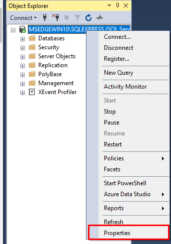

Agora que temos nosso manager configurado, vamos iniciar a utilizar no Microsoft SQL Server.

## 1. Abra o Microsoft Sql Server

Em seguida irá aparecer uma tela para logarmos, esse login por enquanto não teremos que mudar ainda. 

Basta clicar em **Conectar**.

## 2. Habilitando o login pelo sa

Essa é a tela inicial do nosso Microsoft SQL Server

Ainda precisamos configurar algumas coisas para que as coisas funcionem corretamente. E para fazer isso precisamos habilitar o usuário **sa** que vai ser utilizado para fazer o login no banco de dados e para realizar as conexões.

Para fazer isso vamos seguir o seguinte caminho de abertura de pastas: **Segurança > Logons** e clique duas vezes no usuário **sa**, veja que ele está com um *x*, isso se da pelo motivo de que ele não foi habilitado ainda.

Em seguida irá abrir um menu onde iremos mudar a senha, clicando em **Senha** e depois confirmando a senha em baixo.

!!! warning 
    **Essa senha, é a que você vai utilizar para logar e fazer as conexões futuras no banco de dados, então escolha uma senha fácil de lembrar**.

Após a criação da senha, por fim, iremos habilitar esse usuário.

Dentro do mesmo menu que você está, clique em **Status** e verifique se a opção **Logon** está como *Habilitado*, caso não esteja, peço que habilite!

Clique em OK.

## 3. Mudando a forma de logar no Microsoft SQL Server

Para fazer isso precisamos ir clicar no nosso usuário conectado com o botão direito do mouse e clicar em **Propriedades**

Em seguida irá abrir um menu, dentro dele iremos clicar em **Segurança** e procurar pela opção **Autenticação do servidor**.

Ela vai estar marcado com o **Modo de autenticação do windows**, precisaremos trocar para a opção **Modo de autenticação do SQL Server e do WINDOWS**.

Clique em **OK**.

## 4. Logando com usuário SA

Agora iremos logar com o usuário que sempre utilizaremos para manipular nosso banco de dados.

!!! warning
    *De agora adiante, será sempre com esse usuário que logaremos em nosso SQL.*

Para fazer isso, precisamos desconectar da sessão atual em que estamos logados com o windows, basta procurar pelo ícone de uma ponta de um cabo com um x.

Em seguida iremos mudar a forma de como vamos logar no SQL, basta mudar os seguintes campos:

- **Autenticação**: Autenticação do SQL Server
- **Login**: sa
- **Senha**: *coloque a senha que você criou anteriormente*.

Clique em **Conectar**.

Após essas etapas, você estará com tudo pronto para criar um banco de dados.

Como [criar um banco de dados](create-bda.md)