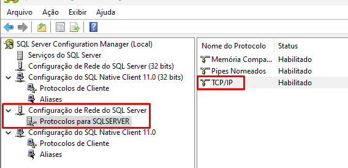
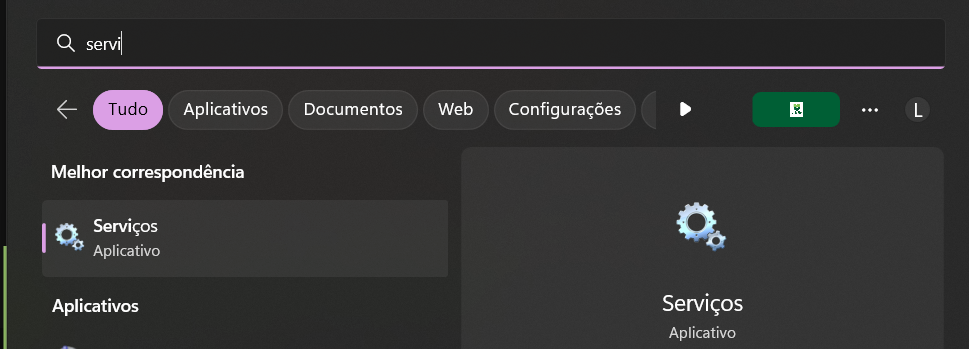

## 1. Configurando o SQL Server Configuration Manager

Para começar a configuração basta abrir o aplicativo **SQL Server Configuration Manager**, basta procurar esse nome na aba de pesquisa que irá aparecer esse:

Quando você abrir, essa será a tela inicial dele:

### 1.1 Verificando se está tudo habilitado

#### 1.1.1 Configuração do SQL Native Client

Procure pelo primeiro **Configuração do SQL Native Client**.

Em seguida expanda ele e clique em **Protocolos de cliente**

Verifique se essas 3 opções estão marcadas como **Habilitada(Enabled)**, caso não esteja, clique duas vezes e habilite!

#### 1.1.2 Configuração de Rede do SQL Server

Procure por **Configuração de rede do SQL Server**.

Logo após clique em **Protocolos para SQLSERVER**

Verifique se essas 3 opções estão marcadas como **Habilitada(Enabled)**, caso não esteja, clique duas vezes e habilite!

#### 1.1.3 Configuração do proximo SQL Native Client

Procure pelo próximo **Configuração do SQL Native Client**. E sim tem dois desse, porém um está mais a cima(Já configuramos) e por fim temos que configurar este também.

Em seguida expanda ele e clique em **Protocolos de cliente**

Verifique se essas 3 opções estão marcadas como **Habilitada(Enabled)**, caso não esteja, clique duas vezes e habilite!

## 2. Configurando as portas

Precisamos também habilitar e definir algumas portas para o nosso banco funcionar corretamente.

Procure por **Configuração de rede do SQL Server**.

Logo após clique em **Protocolos para SQLSERVER**

E em seguida dê dois cliques em **TCP/IP**, irá abrir um menu para configurarmos.

Vá até a aba **IP Addresses**.

Veja que temos *IP1, IP2, IP3 e etc...* Cada um desses IP tem o campo **Enabled e TCP Port** que é onde iremos configurar.

Todos que não estiverem Habilitados, habilitem!

E aqueles que estão sem o TCP Port, adicione a porta **1433** que é do Microsoft Sql Server.

E bem no fim, teremos um **IPAll**, nesse basta adicionarmos a mesma TCP Port: 1433.

Clique em **OK** e nosso manager estará configurado corretamente!

### 2.1 Reiniciando o serviço do banco de dados

!!! warning
    Esse passo é fundamental para os próximos passos.

Aperta a tecla do **Windows** e pesquisa por *"Serviços"* no campo de pesquisa, em seguida clique nele.

Irá abrir uma tela com diversos serviços, porém precisamos pesquisar pelo serviço do **SQL Server**.

Achando esse serviço clique nele e veja que irá abrir ao lado esquerdo um menu onde tem algumas opções.

Precisamos clicar na opção **Reiniciar**.

Em seguida ele irá reiniciar o serviço e aguarde a inicialização do mesmo para darmos continuidade

[Habilitando o usuário SA](config-bda.md)