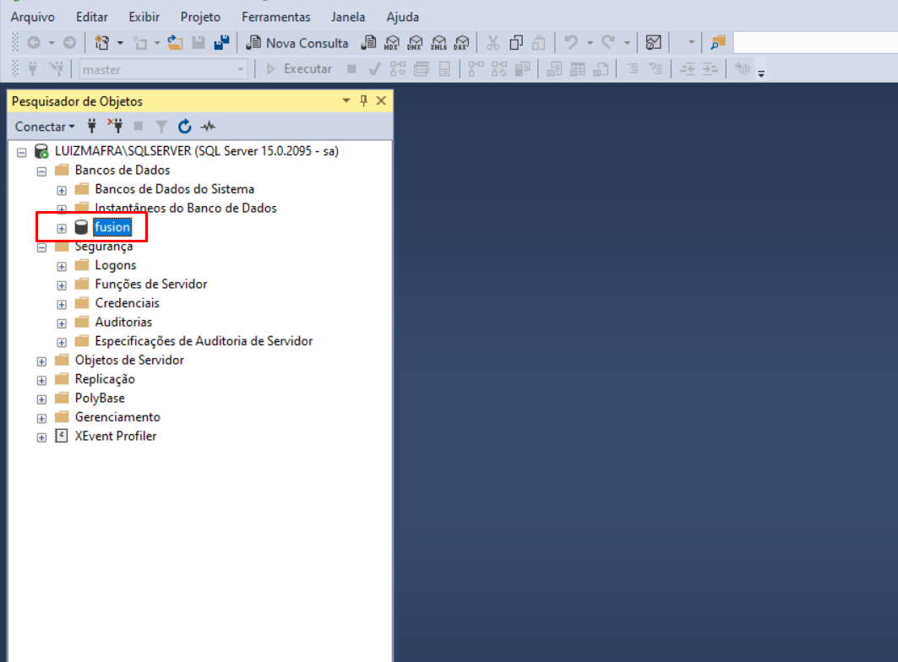

Para criar um banco de dados é bem simples, após estarmos logados no SQL Server com o usuário **sa**, precisaremos clicar com o botão direito do mouse em **Banco de dados** e clicar na opção **Novo banco de dados**.

Em seguida irá abrir um menu para realizarmos a criação do nosso banco. De forma sucinta basta apenas darmos um nome ao nosso banco.

O padrão que seguimos para o banco de dados do seu ambiente de desenvolvimento é o nome **fusion** apenas, então iremos criar um banco com esse nome para usarmos futuramente.

Clique em **OK**.

Em seguida será possível expandir o **Banco de dados** e ver teremos o nosso banco chamado *fusion* criado.

