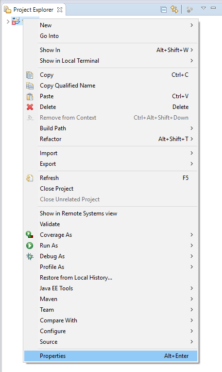
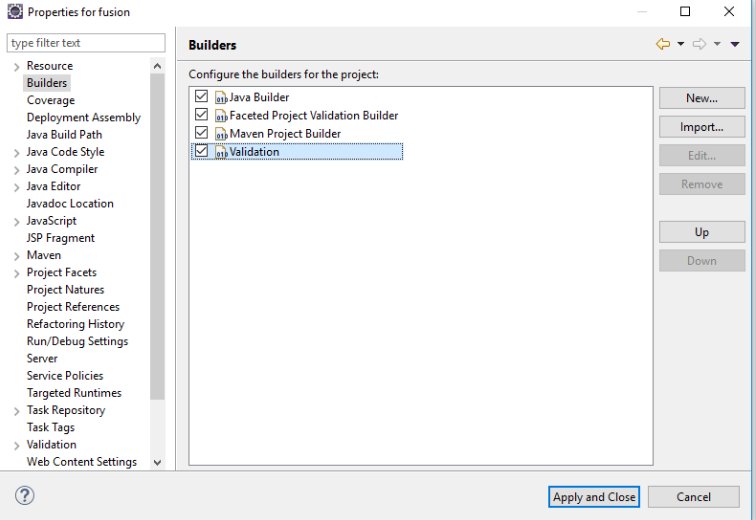
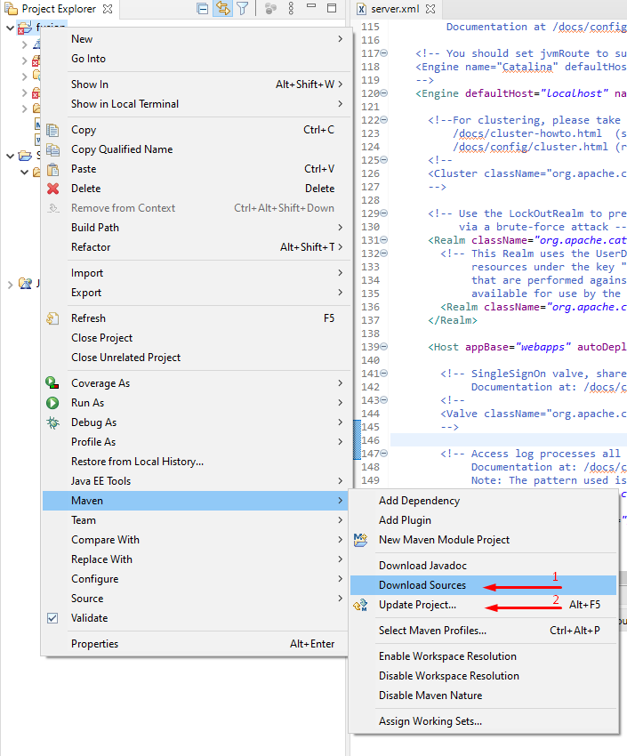
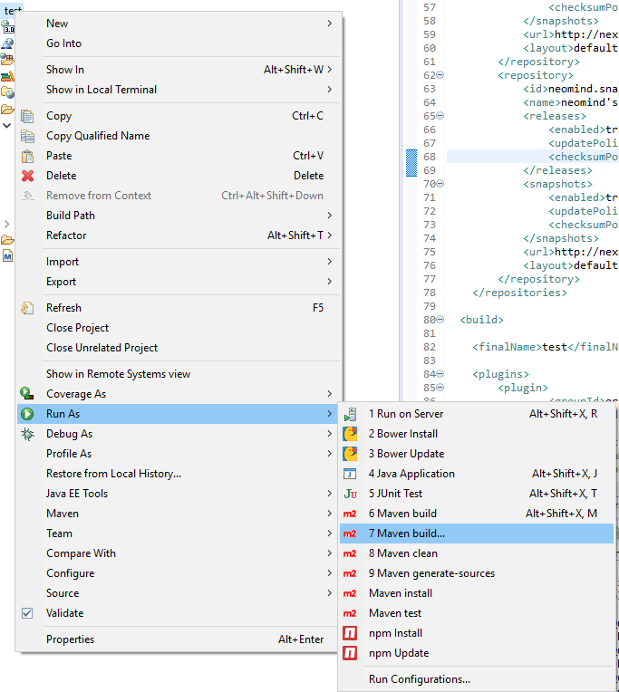
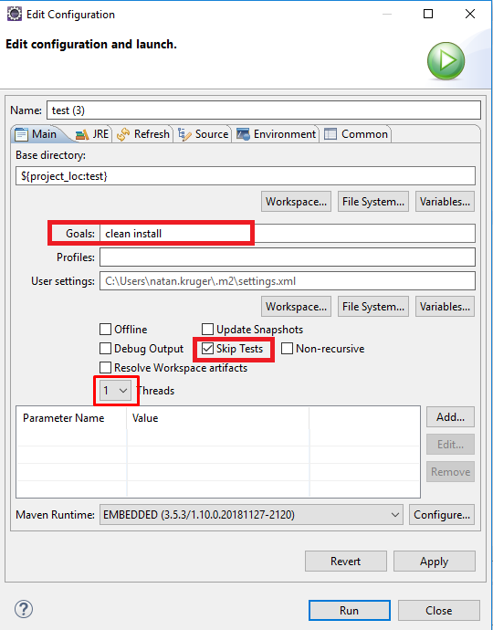

#Build do Projeto

Após baixar seu projeto, será necessário fazer outras configurações, baixar as dependências e buildar o seu projeto. 

##Configurações

Verificar no Java Build Path do projeto, em Order and Export se a JRE está acima do maven. A ordem correta consiste em: 

![build-path]./images/java-build-path.png)

Para desabilitar a opção de desnecessárias de validation, clique com o botão direito sobre o projeto: 

Na opção Builders desabilitar o checkbox de Validation e aplicar as alterações. 

##Download Sources e Update project

Após obter o projeto, clique com o botão direto do mouse em cima do projeto, vá até Maven e selecione Download Source. Quando finalizar o download das dependências, repita o caminho e selecione Update Project e aguarde. 

##Clean install

Após baixar todas as dependências será necessário realizar o clean install para, enfim, buildar o seu projeto. Novamente com o botão direito do mouse, vá até Run As e selecione a opção 7. 

Digite clean install, selecione skip test e aumente o número de threads ao máximo. 

Após o clean install, se ocorrer tudo bem irá aparecer BUILD SUCCESS no console. 
Se aparecer BUILD FAILURE será necessário verificar qual erro ocorreu, nesse caso, verifique o tópico de Dúvidas Frequentes.

Ocorrendo o BUILD SUCCESS você poderá criar o servidor e subir sua aplicação. Para verificar como criar o seu servidor, visualize [esse o tópico](/docs/dev/eclipse/frequent-problems/#como-criar-um-novo-server-apache-tomcat)  
