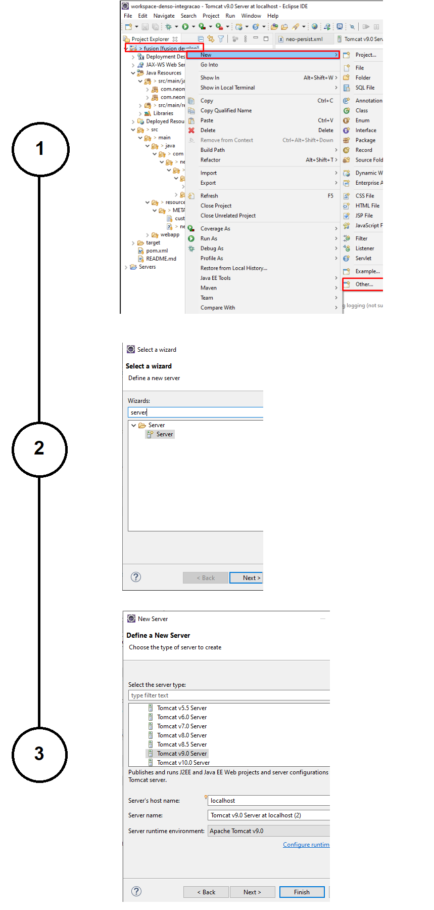
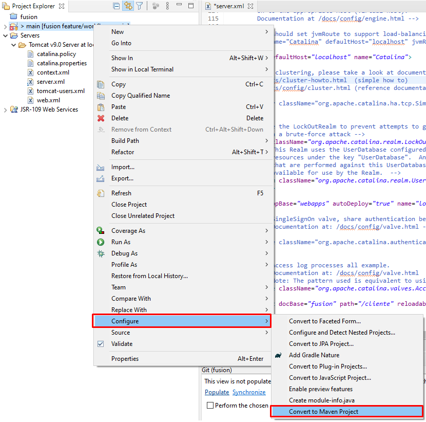
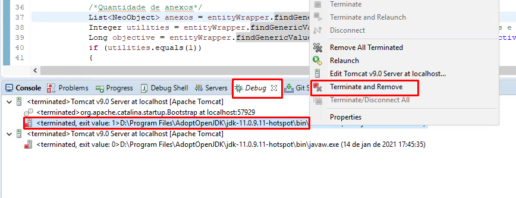
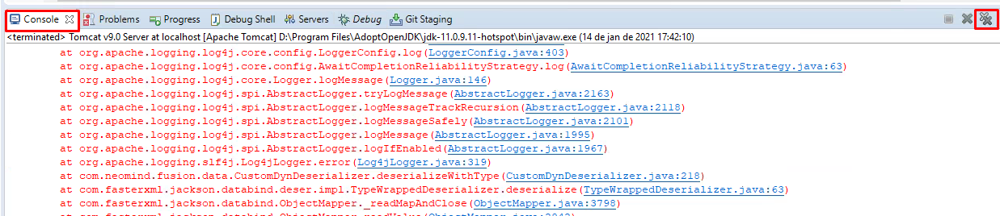
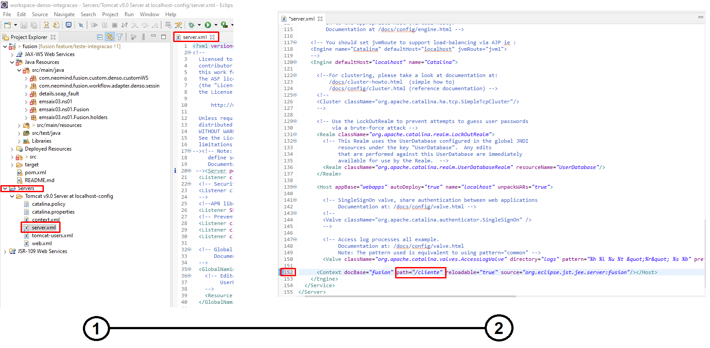

# Dúvidas Frequentes

Em um primeiro contato com a IDE do Eclipse não sabemos todos os atalhos e como utilizar as ferramentas para resolver os problemas que enfrentamos, por esse motivo, listamos as dúvidas mais frequentes com relação à IDE.

## Qual a versão do Eclipse posso utilizar?
Conforme a equipe de [Inovação](/docs/development/eclipse/eclipse/): Versões acima da 2018-12 (4.10.0) não estão funcionais por conta da modularização do Java e não devem ser utilizadas.

## Como criar um novo *server* Apache Tomcat?
Depois que você fez Upload Project e já realizou o Clean Install você pode criar o server seguindo os passos a passos abaixo:

## Eclipse não reconheu como um projeto Maven
Isso ocorre caso você tenha importado como um *general project*, para converter para um projeto Maven é só fazer a configuração demonstrada abaixo.

## Problemas ao iniciar/parar o server

Confira se o serviço realmente parou, terminando na aba Console e removendo o que ficou na aba Debug.

- Terminated and Remove na Aba Console

- Close na Aba Console

## Quais os melhores atalhos? 

- CTRL+Espaço - autocompletar 
- CTRL+S - para salvar as alterações;
- CTRL+B - para buildar as classes e fazer deploy das alterações; 
- CTRL+H - para fazer uma pesquisa em toda workspace;
- CTRL+O - em uma classe para ver todas funções que essa classe tem; 
- CTRL+L - para pular para uma linha específica do fonte; 
- CTRL+SHIFT+O - remove todas as dependências não utilizadas na classe;
- CTRL+SHIFT+F - corrige a formatação do código fonte;
- CTRL+D - exclui linha;
- CTRL+/ - comenta a linha;
- Alt+seta esquerda - volta pra função anterior;

## Como descobrir o *context* para acessar a URL da minha aplicação?

Você encontra qual o *path* da sua aplicação seguindo os seguintes passos. A url seria localhost:8080/cliente

## Não encontro algumas abas na interface
Você pode utilizar a opção Window > Perspective > Reset Perspective que irá restaurar todas as abas como Console, Debug, Servers entre outros. 