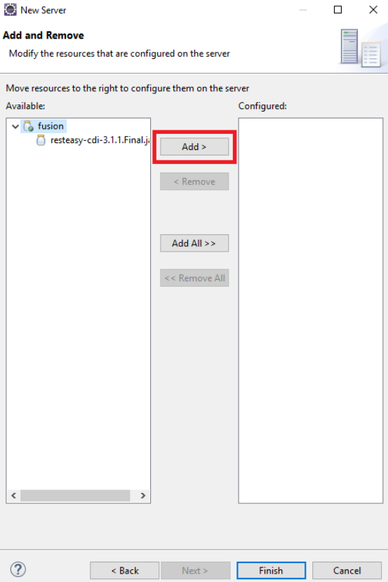
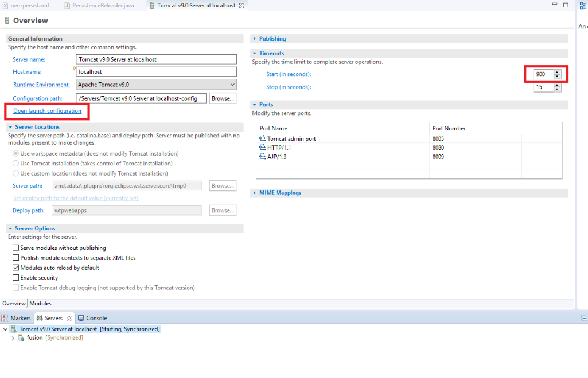
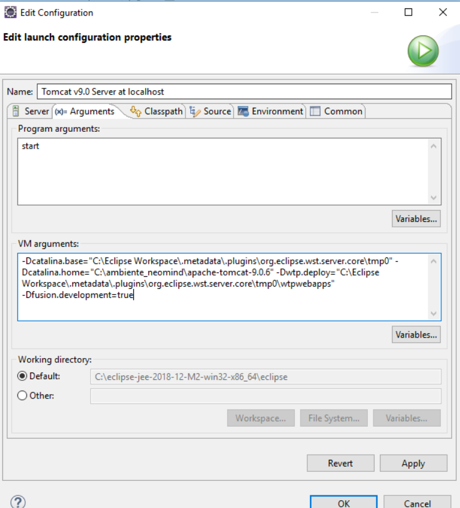
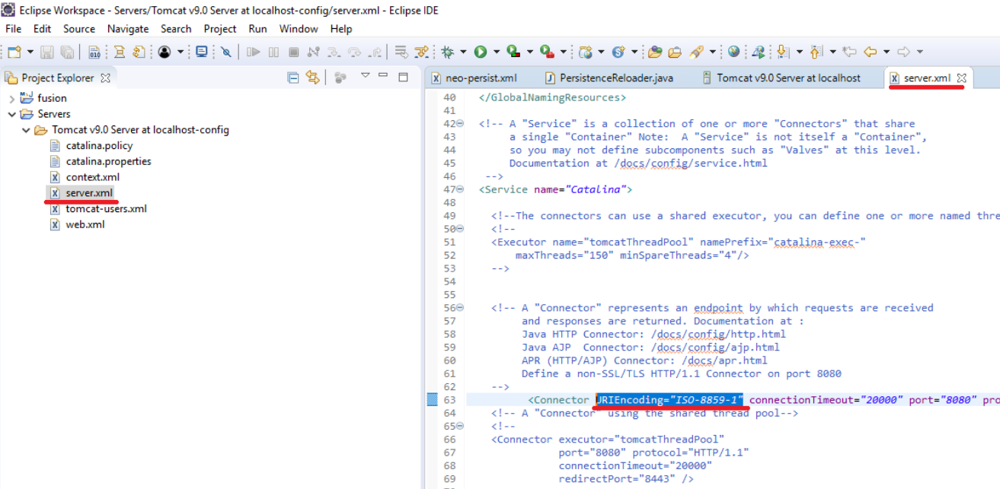
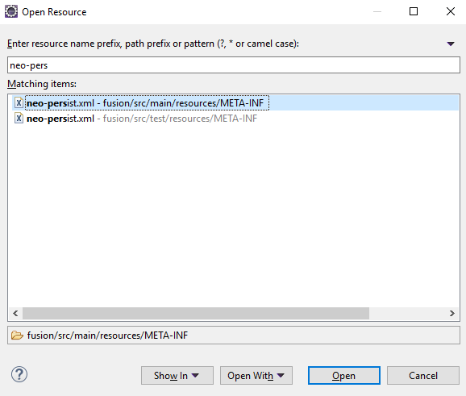
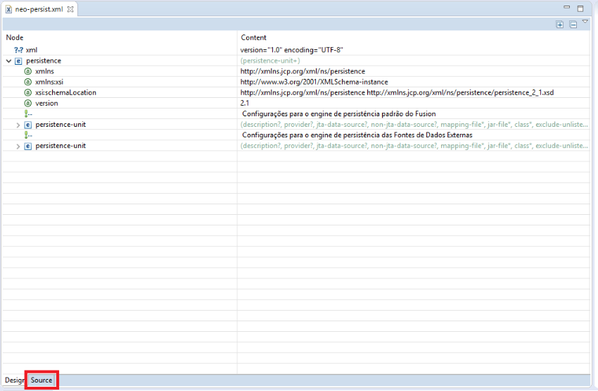
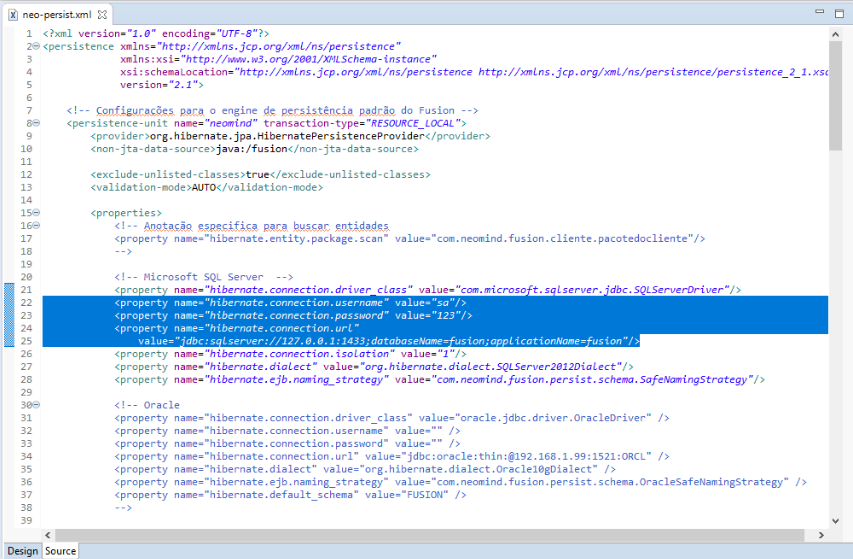
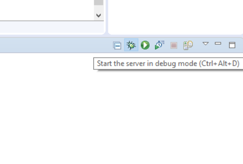
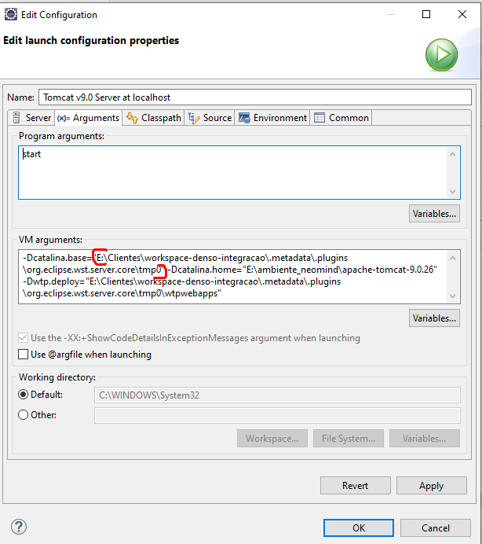

#Criar Servidor

Após o build realizado você pode criar o servidor para subir a aplicação.

##Criando servidor

Acesse a aba Servers do Eclipse:

![aba-server]./images/aba-server.png)

OU clique com o direito sobre o projeto e vá em New > Other > Server > Tomcat.

Adicione o artefato ao tomcat e clique em finish:

Seu servidor está criado! Agora é necessário configura-lo antes de iniciar. 

Clique duas vezes com o botão esquerdo do mouse para abrir as configurações do server, na aba de timeout adicione um número grande o suficiente conforme a imagem. 
Após isso clique em *Open launch configuration* para adicionar parâmetros do servidor. 

Vá até a aba Arguments e adicione os seguintes parâmetros e pressione Ok: 

-Dfusion.development=true
-Dfile.encoding=UTF-8

Abra a pasta Server criada na modal onde estão os arquivos do projeto, acesse o server.xml e adicione o parametro RIEncoding="ISO-8859-1".

Sua aplicação está quase configurada! Você irá precisar configurar o neo-persist para conectar no seu banco de dados. 

##Configurando neo-persist

Pressione Ctrl + Shift + R e encontre o arquivo neo-persist.xml dentro da pasta main.

Clique em Source para ver o arquivo na integra e poder alterar os parâmetros de conexão. 

Altere os parâmetros de usuário, senha e url de conexão do banco. 

Tudo pronto, hora de subir o ambiente:

Acompanhe o que ocorre enquanto sobe sua aplicação na aba console do tomcat ou encontre o caminho da instância do seu tomcat para consultar os logs.
A instância do seu tomcat você encontra clicando duas vezes sobre o servidor > open launch configuration > arguments copie o caminho indicado e cole no Explorador de Arquivos. Acesse a pasta logs e monitore-os.

