# Como montar um ambiente local utilizando o projeto do cliente no git

## Introdução
Esse guia tem o objetivo de auxiliar em seus passos iniciais na IDE Eclipse a partir de um projeto de cliente no git ou template.

!!! warning
    pré-requisito para essa leitura são os padrões de uso do git para a equipe de Serviços. Acesse Procedimentos > [Iniciando Projeto](/docs/quick-guide/start/).

## Configurações inciais necessárias

- Todas as intalações do tópico anterior: *Ambiente*. 
- Configuração da variável de ambiente JAVAHOME
- Aplicativo do git para desktop: [git for windows](https://gitforwindows.org/)

## Como clonar um repositório do Git usando o Eclipse

Quando abrimos um novo projeto no eclipse, por padrão ele nos mostra um conjunto de opções na aba Project Explore.
Podemos iniciar o nosso **import** de duas formas:
1. Clicando no último item de opções **Import Projects**
   
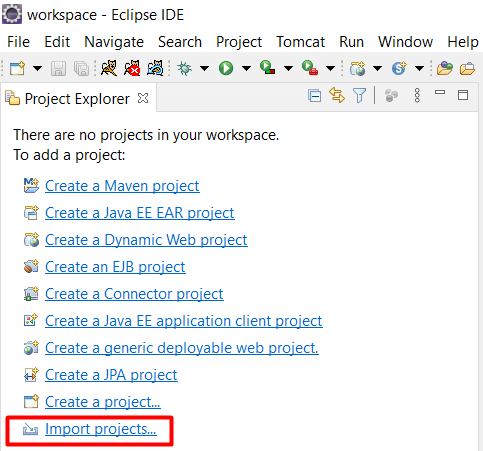

2. acessar pelo menu **File > Import**

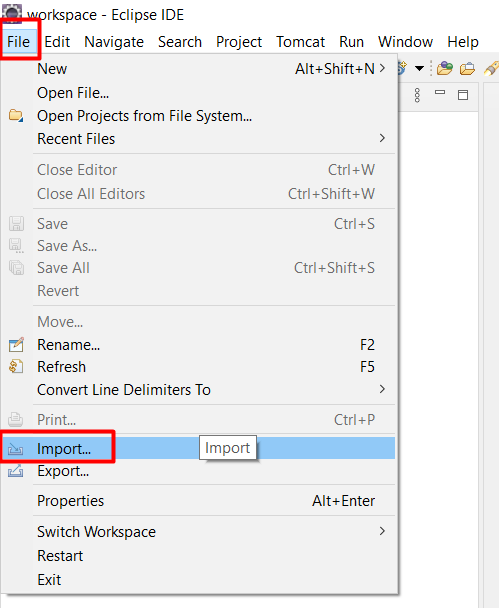

Ambas as opções você será direcionado esta janela onde você irá buscar pela opção **Git > projects from Git (with smart import)** e clicar em **Next >**

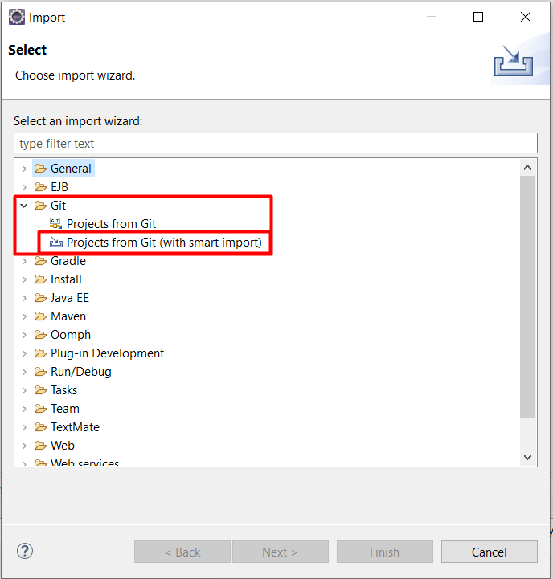

Selecionar a opção **Clone URI** e clique em **Next >**

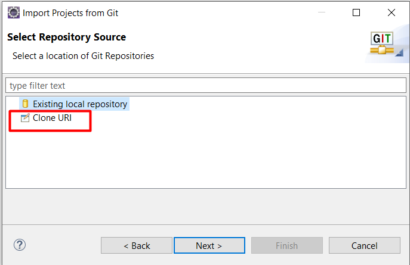

Agora você deve encontrar o repositório git desejado e acessar o menu **Clone** e copie a Url do campo **Clone with HTTPS**.

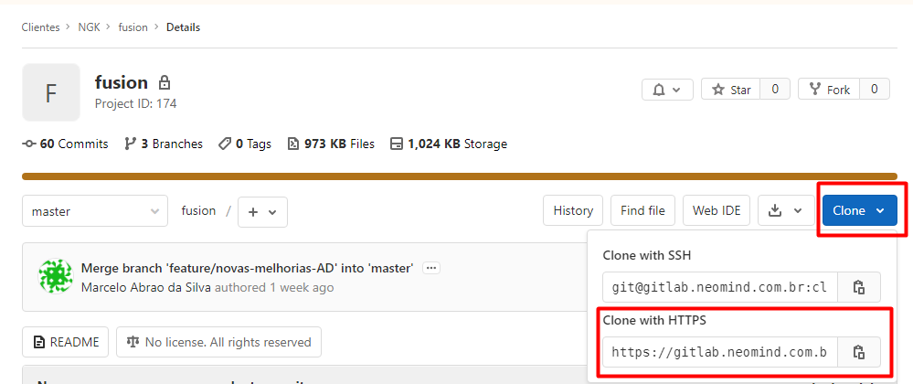

Em seguida Cole no campo **URI** na janela **Import Projects from Git**.

!!! tips
    Recomendo que adicione o seu usuário e senha do GitLab e marque a opção de Store in Secure Store Para que nos próximos imports e nas ações seguintes, não precise adicionar novamente o usuário e senha.
    
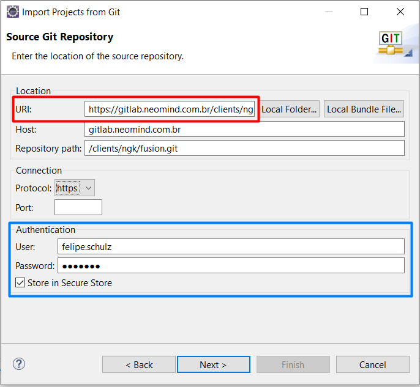

Selecione a Branch master para realizar o clone e clique em **Next >**.

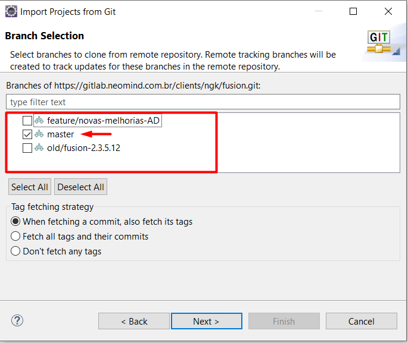

Nesta etapa, devemos criar uma pasta chamada Clientes e dentro dela uma nova pasta com o nome do cliente e apontar o diretório de destino para ela, posteriormente clique em **Next >**.

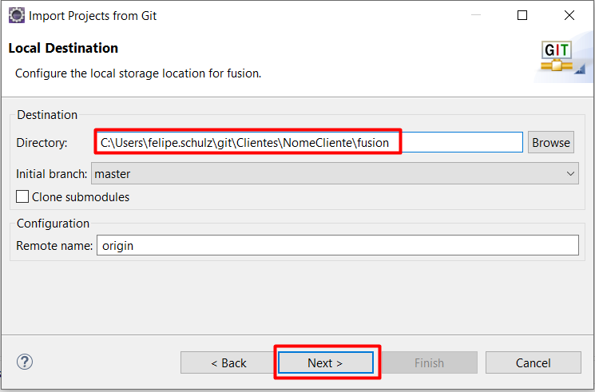

Clique em **Finish.**

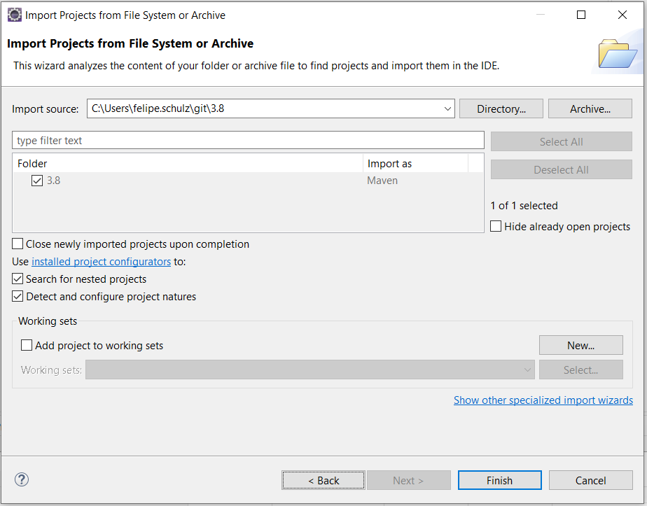

Quando terminar de adicionar todos os imports, será apresentado o projeto na aba de **Project Explorer**, agora devemos trocar a branch do nosso projeto.
Para de mais informações sobre branchs, versionamentos, commits entre outros assuntos, acessar no pages de serviços o post Iniciando Projeto no menu Procedimentos. 

## Como trocar a branch do projeto  

Para trocarmos de branch no eclipse, clique com o botão direito do mouse, no nome do projeto. 

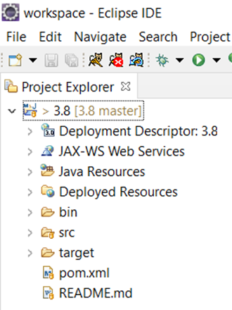

Acesse o **Team > Switch To > Other**.

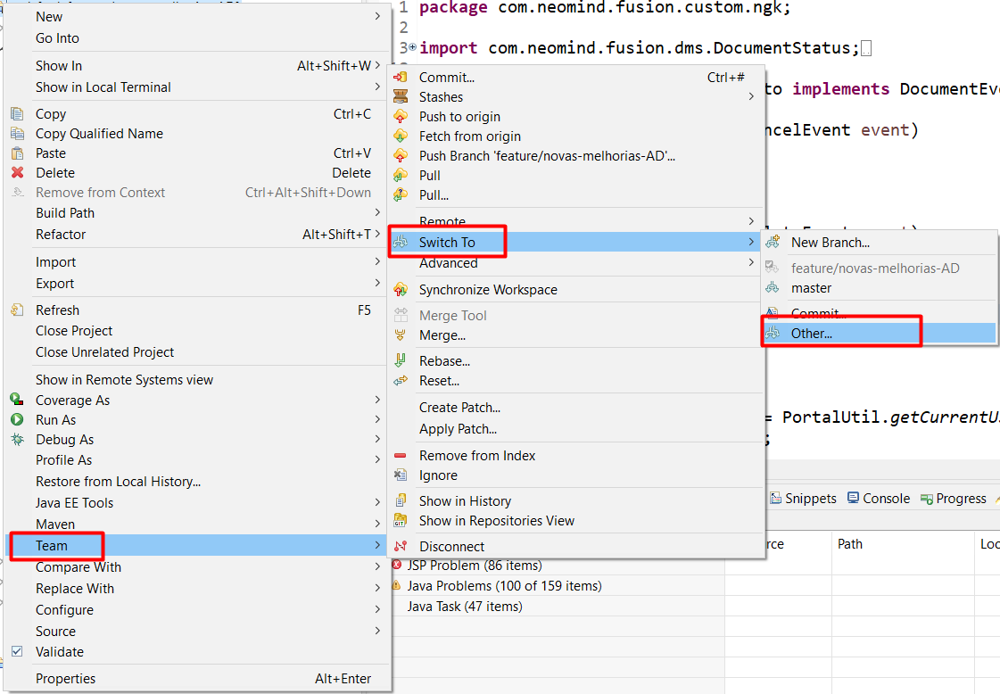

Selecione uma branch nova para este projeto, pois não deve ser feito commits nas branchs master e develop. Clique em **Check out**.

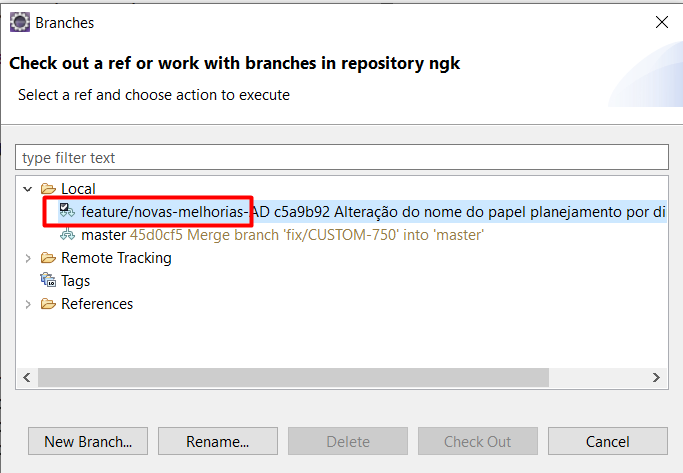

## Como fazer commit

Quando for realizar um commit, botão direito do mouse na pasta do projeto **Team > Commit**.

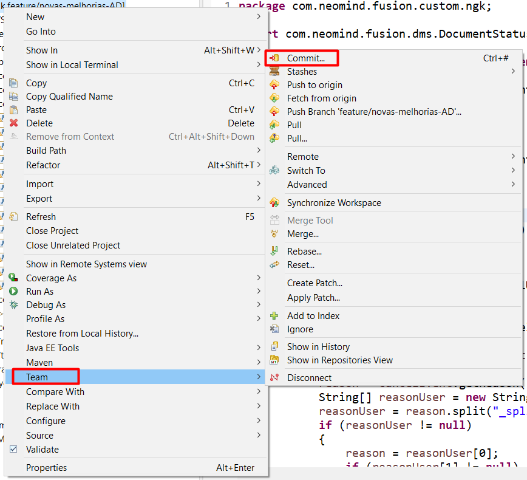

A aba Git Staging é usada para realizar o commit e push das alterações feitas no projeto.

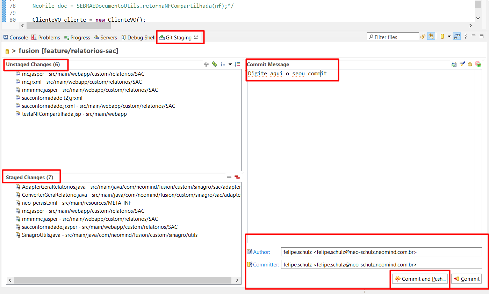

- **Unstaged Changes**: São as mudanças que não serão commitadas.
- **Staged Changes**: São as mudanças que serão commitadas.
- **Commit Message**: Um comentário acerca do foi realizado, sendo claro e objetivo.
- **Author, Committer**:  Nome de que está realizando o commit.
- **Commit and Push**: Realiza o commit e faz o push para repositório remoto do gitlab.
