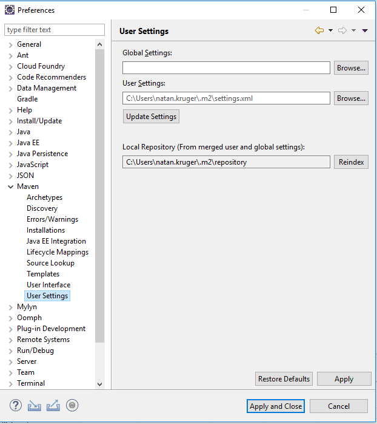
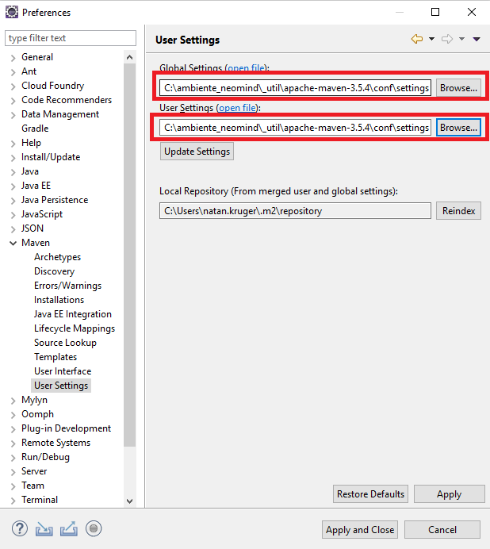
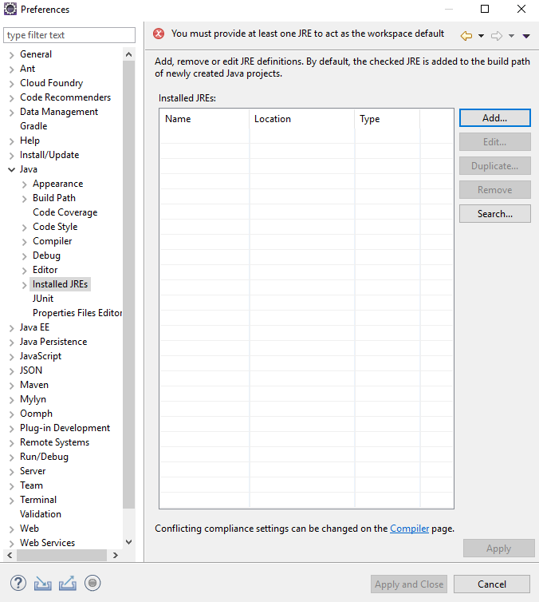
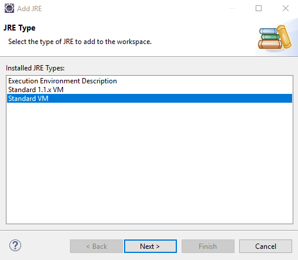
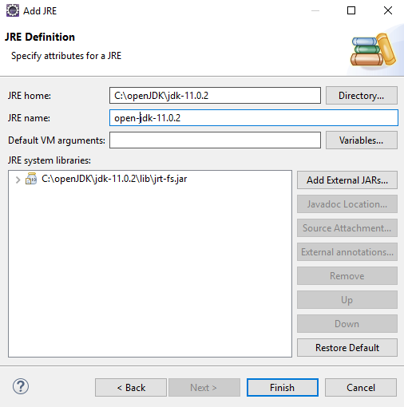
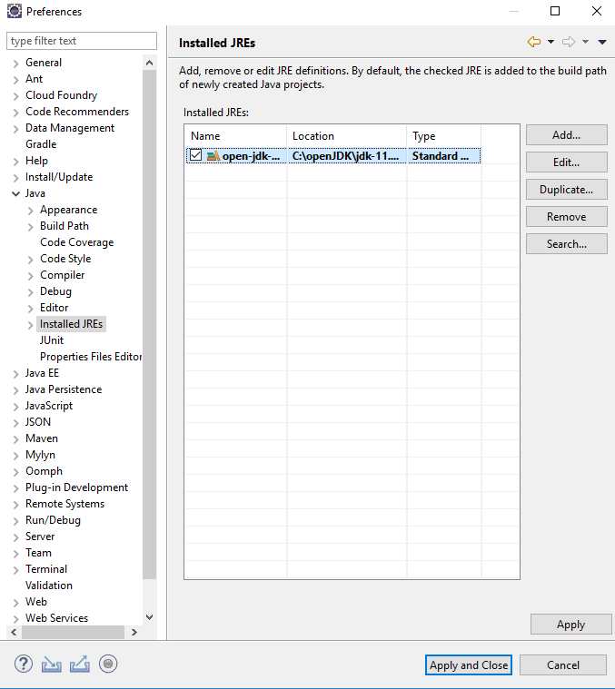
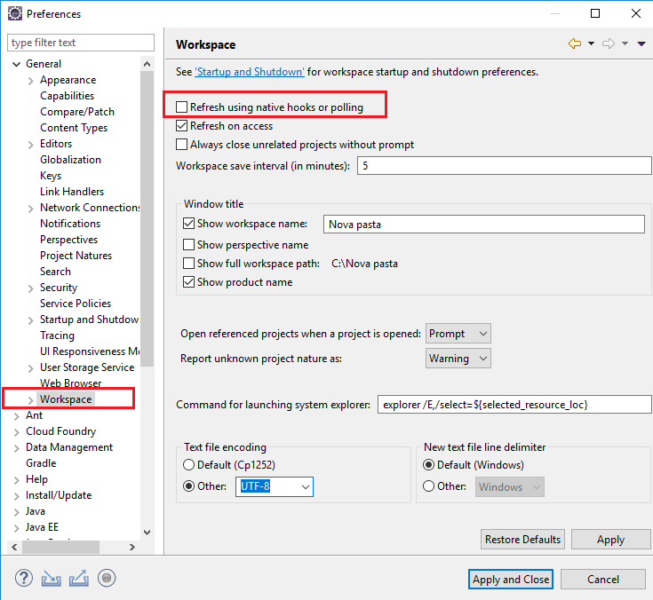
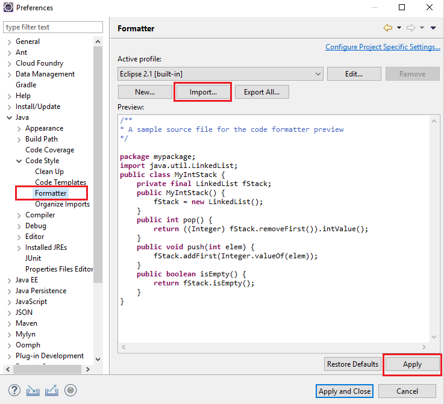

#Como montar meu ambiente eclipse do zero

Aqui você vai encontrar uma passo a passo de como configurar seu ambiente eclipse do zero. Caso tenha dúvidas no meio do caminho, consulte a seção de [Dúvidas frequentes](./frequent-problems).

!!! info
    O passo a passo deste manual foi obtido da documentação da equipe de Inovação e adaptado para a realidade de Serviços. 
    
#Instalações

Será necessário instalar:

1. Um banco de dados. Para uso local utilize o SQL Server, porém se precisar instalar outro banco verifique no manual de instalação do fusion quais versões são compatíveis. 
2. A versão JDK compatível com a versão do fusion que você irá utilizar. 
3. O Apache Tomcat compatível com a versão do fusion que você irá utilizar. 
4. Libre Office para conversor de documentos
5. GhostScript para visualização dos documentos
6. Maven para desenvolvimento local. 
7. Eclipse

Você encontrará as versões compatíveis com a versão do produto que você irá utilizar, no manual de instalação do Fusion. Acesse nosso portal, entre no GED e acesse Materiais do Fusion > Documentação. Escolha a versão, de preferência a mais recente, e verifique as configurações na seção Servidor Windows conforme print a baixo.  

O manual de instalação está voltado para aplicações que executam com serviço. Iremos configurar nesse manual, a aplicação para executar dentro de uma IDE de desenvolvimento. O manual não contempla a instalação do maven, que se faz necessário apenas em ambiente de desenvolvimento.

#Apache Maven

Faça download da última versão do apache maven no link e finalize a instalação. 

#Eclipse

Feito todas as instalações citadas acima, vamos instalar a IDE de desenvolvimento. 

Conforme a equipe de Inovação: Versões acima da 2018-12 (4.10.0) não estão funcionais por conta da modularização do Java e não devem ser utilizadas.

Faça download da IDE de inicie. 

#Workspace

Ao iniciar a IDE será sugerido uma pasta para configurar a sua Workspace. No Eclipse, vc pode criar vários projetos dentro de uma única Workspace, diferente do Intellij onde cada projeto precisa de sua própria workspace. 

Como boa prática de organização, sugere-se criar a estrutura de pasta C:\Clientes\MeuCliente. Pois você irá trabalhar com vários clientes nesse período e cada cliente possui seu próprio projeto.

### Configuração das Preferências

Acesse Windows > Preferences. Expanda a categoria Maven e clique em User Settings.

Altere o caminho da Globas Seetings e User Settings para o caminho maven da sua máquina e aplique as alterações. 

Ainda nas preferências, expanda a categoria Java e clique em Installed JREs e depois em Add.

Adicione uma nova standard VM.

Adicione o caminho da JDK que você instalou anteriormente. 

Tenha certeza de deixa-la marcada e  APLIQUE as alterações.

Ainda em preferences, desabilite as validações globais e aplique as alterações. 

Ainda em preferences, configure o encode da sua workspace e aplique as alterações. 

Desabilitar *Refresh using native hooks or polling* para evitar o consumo de recursos da sua máquina. 

Ainda em preferences, configure o estilo de formatação da neomind. em Java > Code Style > Formatter adicione o arquivo.

No próximo tópico você aprenderá como baixar um projeto template de um cliente em sua workspace. Vá para Git e Eclipse. 
