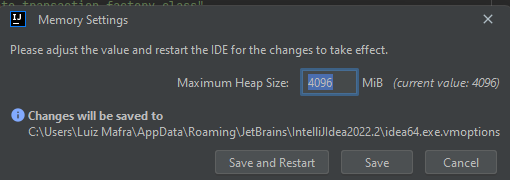

Para aumentar a perfomance do nosso queridinho Intellij, podemos fazer algumas configurações, entre elas podemos alocar mais memória para que não rodemos nenhum projeto com gargalo.

!!! warning
    **Não é recomendado alocar 2/3 de sua memória para este tipo de atividade, pois poderá ter perca de perfomance nas demais coisas.**

###Como alocar mais memória

Procure pela aba **Help** no Intellij e em seguida procure por **Change Memory Settings** e clicar nesta opção.

O valor que recomendamos mudar é para *4096* no **máximo**, para não afetar a perfomance restante da máquina.

Salve e reinicie o Intellij.