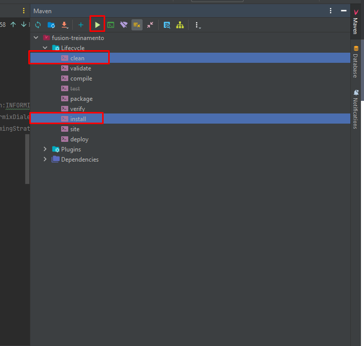

##1. Achando aba do maven no Intellij

Quandos abrimos um projeto um novo, uma das primeiras coisas que devemos fazer antes de rodar nosso projeto é baixar as dependencias do Maven, e para fazer isso basta localizar no canto direito do seu Intellij a aba escrita **Maven**, a localização exata segue na imagem abaixo:

!!! warning
    Agora que estamos na janela do maven, verifique se tem algum maven adicionado, caso não esteja siga o **Item 1.1**, caso contrário, pule direto para o **Item 1.2**
    

##1.1 Adicionando o maven

Para adicinar o maven é bem simples, basta clicar no icone com o sinal *"+"* e adicionar o seu pom.xml do projeto que está usando.

!!! info
    O Maven adicionado aqui dentro, seria o pom.xml.

Em seguida clique em **Ok**.

Feito isso, seu maven está adicionado e pronto para ser configurando no próximo item.

##1.2 Configurando o maven

Inicialmente devemos dar um *reload no nosso maven* para que ele possa carregar todas as dependências, e para fazer isso basta clicar em um circulo que tenha duas flechas torcidas apontando uma para a outra, conforme a imagem:

Basta esperar um pouco, mas geralmente não demora muito.

!!! info
    Para conferir se o maven foi recarregado, basta expandir a pasta e verificar se a pasta **Plugin** e **Dependencies** foram criadas.

###1.2.1 Clean and Install

Após o maven ter carregado as suas dependências, precisaremos dar um **Clean** e um **Install**. Para fazer isto, basta expandir a nossa pasta do Maven, expandir a pasta **Lifecycle** e com o teclado, segurar o **CRTL** e selecionar o **clean** e o **install**.

Em seguida basta, clicar no botão com o ícone de *play* e esperar.

Após o termino dessas duas aplicações o final da mensagem do console, deverá ser igual a: **BUILD SUCESS**

!!! info
    **É comum demorar um pouco nessa parte, não se preocupe.**