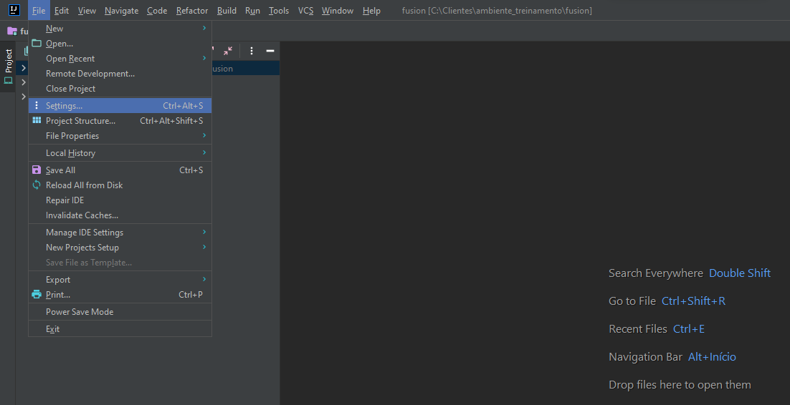
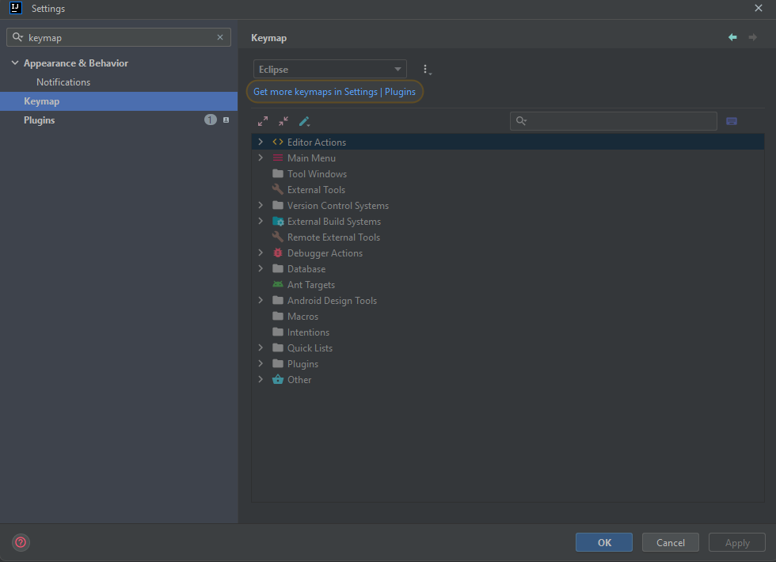
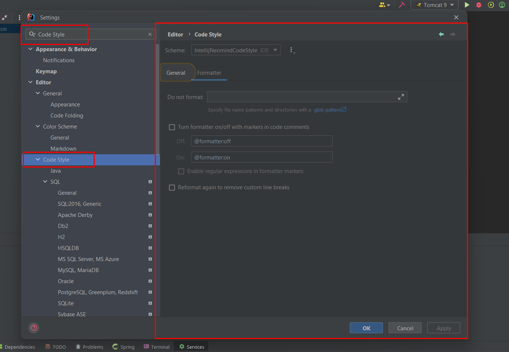
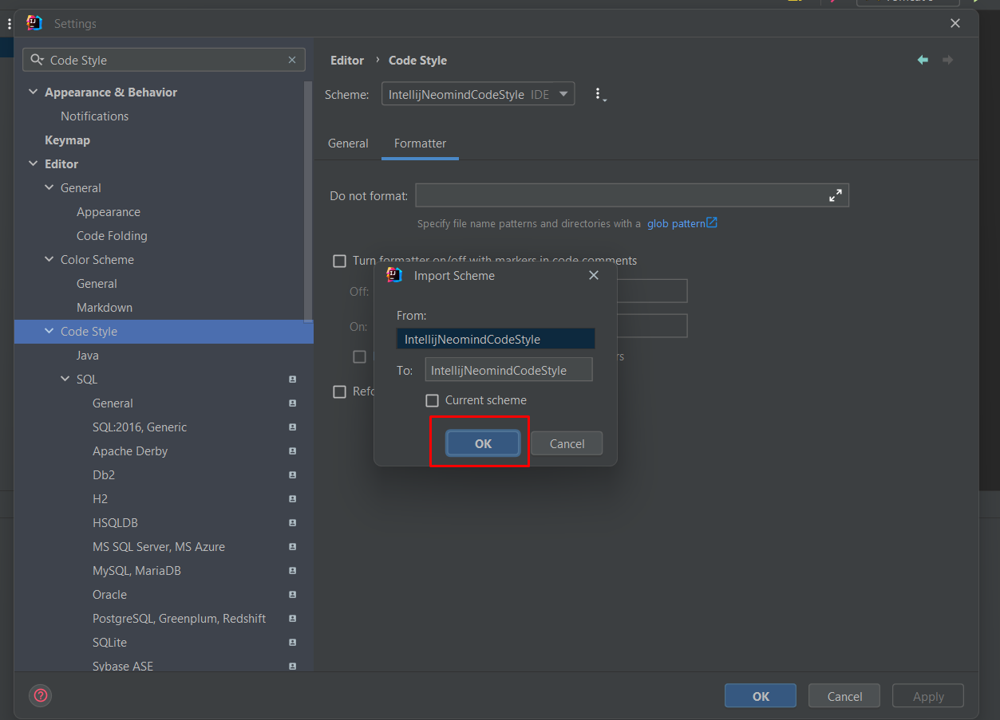

#Configurando Keymap e indentação

##Keymap

Inicialmente precisaremos configurar a padronização de mapeamento de atalhos e a indentação que é utilizada pela Neomind. Com um projeto aberto(Qualquer um) precisamos procurar por **File** e clicar na opção **Settings**, conforme imagem abaixo: 

Em seguida irá abrir uma sub-tela, onde estará disponivel uma lista de configurações possiveis que você poderá fazer dentro de seu Intellij. No canto superior à esquerda, estará visível uma lupa com um espaço para digitar, nesse espaço você irá digitar por **Keymap** e selecionar a mesma, conforme imagem abaixo:

Após isto, você deverá verificar qual o Keymap que está configurando, se está Windows, Netbeans, Visual Studio ou outro. Se a opção selecionada não for a do Eclipse, pedimos para que clique sobre a caixa de opções, selecione o Eclipse e clique em **Apply**.

O motivo de usar esse Keymap, é porque a maioria dos nossos programadores utilizam os atalhos do Eclipse, sendo assim, quando precisar de alguma ajuda, as teclas de atalho estarão idênticas.

Segue abaixo a imagem de como deverá ficar:

##Indentação

Para realizar a indentação conforme o padrão Neomind, a primeira coisa a fazermos é baixar esse arquivo [aqui](https://drive.google.com/u/0/uc?id=1FgbLfEhGRtTdXplkEwt58V5gVuMOHAgH&export=download).

Após download do arquivo, vamos acessar nosso *Intellij*, ir até a **Settings** e vamos digitar no campo de busca por **Code Style**. E então selecionar a opção *Code Style* conforme a imagem abaixo:

Logo após onde está escrito *Schema* tem um campo de opções e ao lado 3 pontinhos, clique nesses pontos e prossiga por **Import Schema > Intellij IDEA code style XML**, que nem na imagem:

Em seguida procure, e selecione o arquivo que você abaixou há minutos atrás (lembrando que o arquivo é um XML).

Irá aparecer uma outra tela, nela basta apenas você apertar em **Ok**

!!! warning
    Verifique se o Schema selecionado é o que você importou! 

Clique em **Apply** e em **Okay** para salvar as configurações feitas.