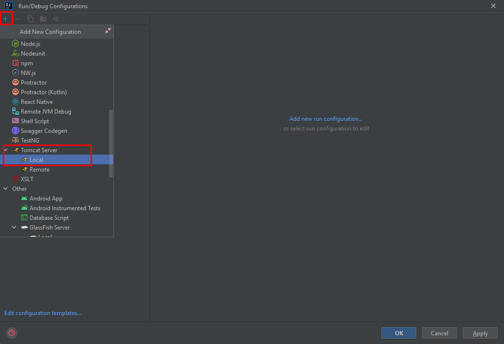

##1. Abrindo menu de configuração

Para configurarmos o tomcat server dentro do Intellij é bem simples, precisamos inicialmente procurar onde configuramos para rodar nosso projeto, a localização dessa opção fica no canto superior um pouco a direita nosso Intellij.

!!! info 
    É bem provável que apareça como **Current file**, porém se não aparecer com esse nome, não tem problema.

Em seguida, clique sob esse campo e irá expandir algumas opções, daí basta escolher a opção **Edit Configurations..** que irá abrir uma nova aba.

Segue a imagem da localização desta opção:

##2. Adicionando o tomcat server

Com essa nova aba aberta, siga os seguintes passos:

1. Clicar no ícone de '+' par adicionar;
2. Procurar por Tomcat Server;
3. Selecionar o Local;

Em seguida ao lado direito será aberto um menu para configurarmos o nosso tomcat. A configuração que temos que fazer aqui dentro são mínimas, portanto será bem rápidinho.

###2.1 Vm Options

Na opção **VM Options** precisaremos adicionar esses textos:

*-Dfusion.development=true -Dfile.encoding=UTF-8*

Copie e cole lá dentro.

###2.2 Deployment

Adicione o fusion.war atráves do ícone de '+', após isso irá abrir algumas opções onde deveremos escolher a opção **Artifact** e em seguida devemos selecionar a opção que contem o **exploded** no final.

!!! warning
    **É de extrema importância sempre selecionar o exploded como o deploy!!**

Procure pelo campo **Application context** onde podemos apagar o *_war_exploded* e deixar apenas o **fusion**

!!! info
    O Application context é o parâmetro que é passado para acessar o nosso fusion no link Http, como por exemplo **localhost:8080/fusion** invés de **localhost:8080/fusion_war_exploded**

###2.3 Update action

Logo após vamos na opção **On 'Update' action**, onde iremos marcar a opção *Update classes and resources*.

!!! info
    Deixamos essa opção para que quando a gente for debbugar nosso projeto ao adicionar um adapter novo, que ele apenas faça um reload das classes e dos recursos, invés de reiniciar o sistema inteiro.

##3. Executando o projeto

Em seguida para dar um *play* no nosso projeto, sempre rode ele em modo debbug.

E para rodar em modo debbug, basta dar um run em um ícone que parece uma baratinha:

!!! info
    Caso você não rode em modo debbug, não irá ter nenhnum problema com a execução dele, porém caso você queira adicionar algum breakpoint para buscar valores durante execução, isso será impossivel sem estar no modo debbug.