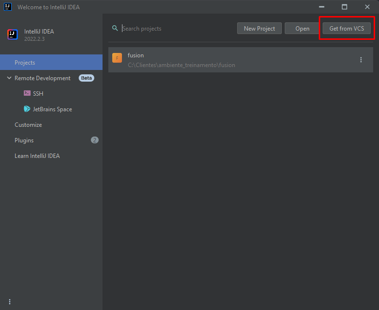
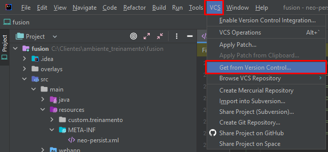
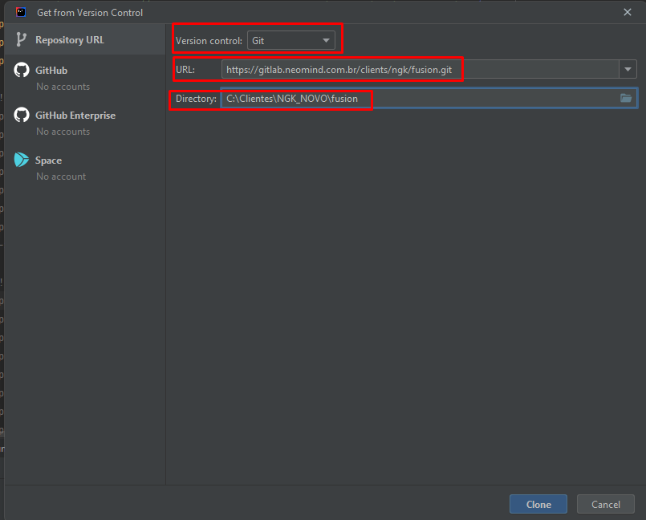
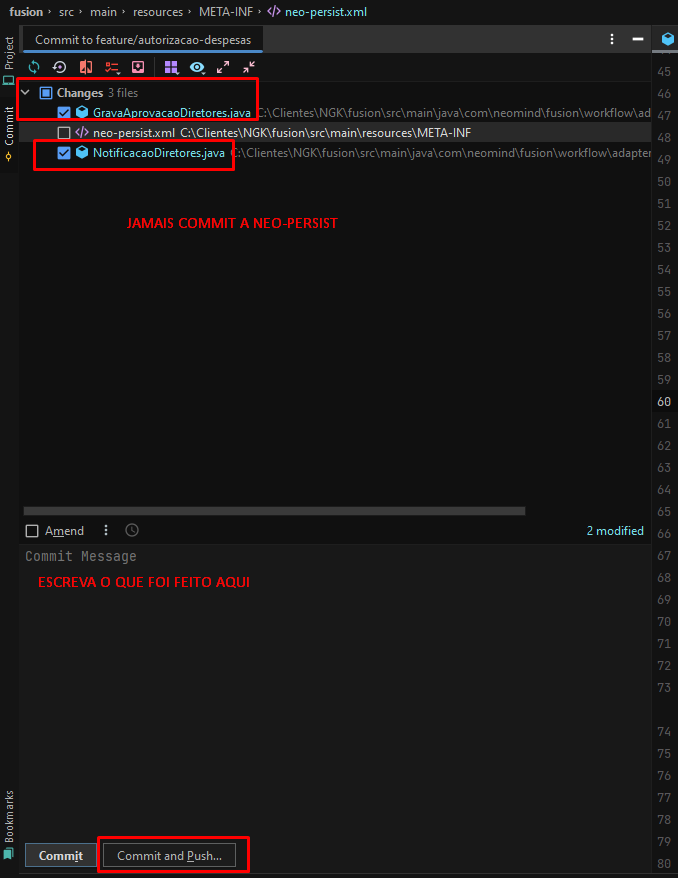

## 1. Como clonar um projeto do git no Intellij

Primeiramente, procure no GitLab da neomind o cliente na qual você está trabalhando.

[Link Gitlab Neomind](https://gitlab.neomind.com.br/)

Para pesquisar basta ir até o campo de pesquisa e digitar o nome do cliente, note que ao terminar de digitar irá aparecer duas opções, uma para pesquisar o cliente no geral e a última opção provavelmente será uma que tem um **Groups** como título e em seguida estára assim:

- *Clientes / 'nome do cliente'*.
  
Essa é a opção em que você deve pesquisar para chegar na página principal do seu cliente.

### Pasta para cada cliente (Não obrigatório)

Antes de iniciarmos a clonagem, por questões de organização caso você não tenha a estrutura de pasta de **Clientes**, eu recomendo criar uma pasta no seu disco principal com esse nome, dentro dela irá ficar uma pasta destinada para cada cliente.

!!! info
    **Não é obrigatório fazer dessa forma, mas fica a dica para uma melhor organização!**

!!! warning
    **Lembrando que dentro dessa pasta do cliente, você deverá criar as seguintes pastas:**
    
    - fusion
    - storage
    
    
### Pegando o link do clone do git

Após encontrar o projeto no git e selecionar a branch na qual você irá clonar, procure pelo botão escrito **Clone** ao clicar nele irá abrir algumas opções, você irá copiar o **Clone with HTTPS** que logo em seguida será utilizado para fazer o clone no seu ambiente local.

### 1.1 Utilizando o Git Bash

Para utilizarmos o Git bash para clonar o ambiente do cliente para o nosso é bem simples. Tudo que precisamos fazer é acessar a pasta **Clientes** que criamos(Ou onde você vai armazenar a pasta do cliente) e acessar a pasta do cliente escolhido, como por exemplo: **SEBRAE**.

Em seguida, clique com o botão direito na pasta **fusion** e clique em **Git bash here**.

!!! warning
    **Caso você não tenha essa opção, verifique se você instalou o Git Bash em sua máquina.**

Após isso, irá abrir uma tela do Git Bash e dentro dela você irá escrever

- **git clone 'linkHTTPS-clone-git'**
 
O link HTTPS é aquele que você copiou na pagina principal do git do cliente.

Em seguida aperte ENTER aguarde até o fim do clone.

Irá começar a fazer o download e após o término, você poderá acessar a pasta **fusion** e verificar que foi criado alguns arquivos e pastas. Isso significa que deu tudo certo!

### 1.2 Utilizando o Upload Version Control do Intellij

#### 1.2.1 Primeira forma
Há também uma outra possibilidade de clonar o projeto do git, direto pelo Intellij, para fazer isso precisamos procurar uma opção no Intellij chamada **Open VCS**. Há duas formas de encontrar essa opção no Intellij.

A primeira forma seria dar um close project no projeto que você está utilizando no Intellij e em seguida irá abrir uma outra tela do Intellij, onde contém todos os projetos que você ja inicializou no Intellij.

E para abrir abrir o VCS basta clicar em **Get from VCS** e irá abrir um menu do VCS.

#### 1.2.2 Segunda forma

A segunda forma não precisa fechar o projeto que você está utilizando, basta procurar aba **VCS** e em seguida clicar em **Get from Version Control** e irá abrir um menu do VCS em seguida.

### 1.3 Clonando o projeto

Na opção **Version control** deixe selecionado como Git. 

Dentro do campo **URL** cole o link HTTPS que você copiou do Gitlab do cliente.

E por fim no campo **Directory** iremos selecionar a Pasta *Clientes/nomeCliente/fusion* que é onde os arquivos serão clonados.

## 2. Colocando a branch corretamente e Checkout

Uma das coisas mais importante e que nunca devemos é de selecionarmos a branch em que iremos fazer a modificação para o cliente, e esse para fazer isso basta:

- Procurar o selecionador de branch dentro do Intellij, essa opção está localizada no cano inferior a direita no Intellij

- Em seguida iremos clicar e selecionar branch em que iremos aplicar as nossas modificações 

- Após acharmos a branch que iremos usar, click nela e selecione a opção **Checkout**. Isso serve para atualizarmos os arquivos da nossa pasta para os mesmos arquivos que estão naquela branch publicado no Git.

O Intellij após clicar nessa opção irá começar a atualizar os arquivos da nossa pasta atual para os mesmos arquivos que estão no git.
   
!!! warning
    É muito importante fazermos isso antes de iniciar as nossas modificações!

## 3. Configurando a neo-persist

!!! warning
    **Atenção máxima nessa parte, é de extrema importância configurar corretamente, pois clonamos o projeto do cliente, e a configuração da neo-persist deles está configurando para a máquina deles, então teremos que configurar para a nossa máquina.**

Para localizar a neo-persit basta seguir esse caminho dentro das pastas: **src > main > resources > META-INF > neo-persist.xml**.

- Após você abrir se atente a configurar a **conexão do banco de dados** para o seu banco local.

Lembre-se que como pegamos o projeto direto do cliente, a parte de banco vai vir configurada para a máquina deles, então altere as configurações para rodar em sua máquina. Atente-se ao confirmar qual Banco de dados o cliente está utilizando também.

- E também se atente a configurar o caminho especifico da pasta **storage**.

Salve e estará configurado a nossa neo-persist.

## 4. Build Maven

Para fazer a build do maven, acesse aba [Build Maven](build-project-maven.md).

## 5. Configurando tomcat server

Parta fazer a configuração do tomcat dentro do Intellij, acessa aba [Configurando o Tomcat](config-tomcat-server.md).

## 6. Executando o projeto

Em seguida para dar um *play* no nosso projeto, sempre rode ele em modo debbug.

E para rodar em modo debbug, basta dar um run em um ícone que parece uma baratinha:

!!! info
    Caso você não rode em modo debbug, não irá ter nenhnum problema com a execução dele, porém caso você queira adicionar algum breakpoint para buscar valores durante execução, isso será impossivel sem estar no modo debbug.

## 7. Commitando na branch

Após concluir nossas modificações e testar em nosso ambiente, é necessário commitar no git para depois aplicar o pacote no cliente.

No canto superior a direita, perto da onde configuramos nosso Tomcat, temos a um campo chamado git e ao lado desse campo terá alguns ícones, procure pelo o que terá uma flecha e ao passar o mouse por cima do mesmo, deverá aparecer **Commit**.

Em seguida no lado esquerdo abrirá uma aba especifica de commit, nela você irá precisar fazer duas coisas importantes:

- Selecionar os arquivos que você modificou e quer commitar no git. **(Nunca adicione a neo-persist para commitar)**

- Descrever o que foi feito no campo disponível.

E por fim, após fazer esses dois passos, clicar em **Commit and Push**.

!!! warning
    **Antes de fazer um commit, sempre verifique se você está com a branch correta para commitar e não se esqueça que a neo persist não pode ser commitada.**

