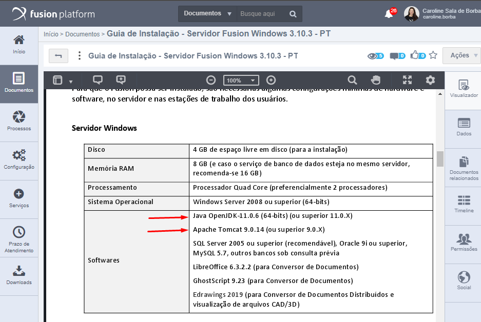
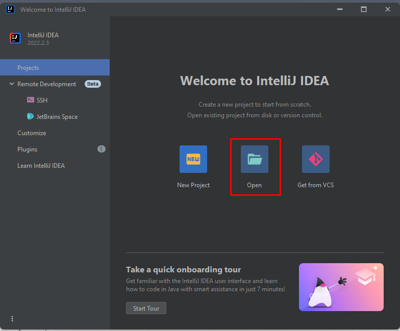
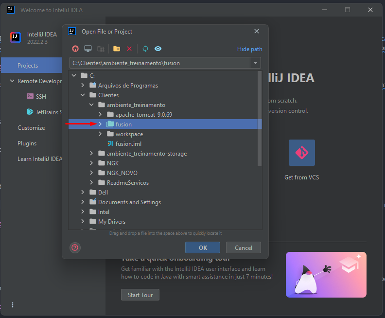
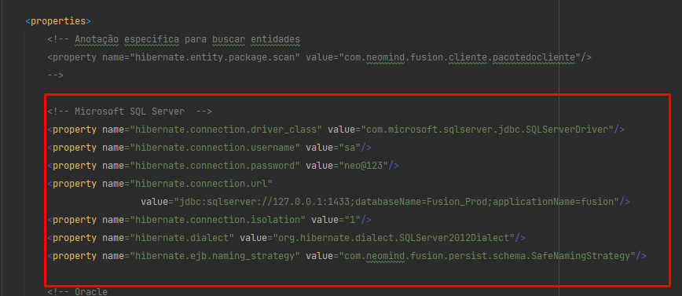
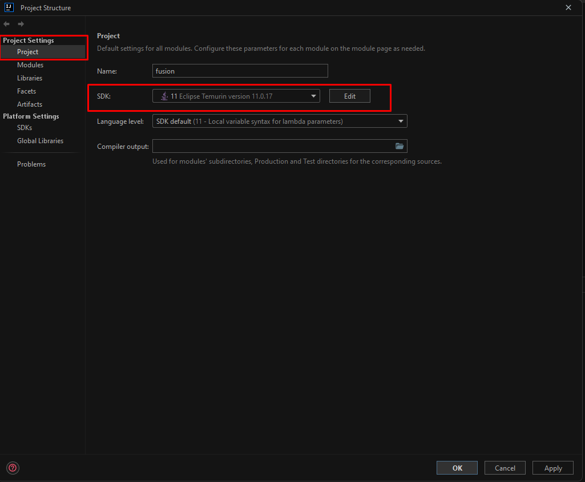

# Como montar meu ambiente Intellij do zero

Aqui você vai encontrar uma passo a passo de como configurar seu ambiente Intellij do zero. Caso tenha dúvidas no meio do caminho, consulte a seção de [Dúvidas Frequentes](duvidas.md)

!!! info
    O passo a passo deste manual foi obtido da documentação da equipe de [Inovação](/docs/development/eclipse/eclipse/) e adaptado para a realidade de Serviços. 
    
# Instalações

Será necessário instalar:

1. Um banco de dados. Para uso local utilize o SQL Server, porém se precisar instalar outro banco verifique no manual de instalação do fusion quais versões são compatíveis. 
2. A versão JDK compatível com a versão do fusion que você irá utilizar. 
3. O Apache Tomcat compatível com a versão do fusion que você irá utilizar. 
4. Libre Office para conversor de documentos
5. GhostScript para visualização dos documentos
6. Maven para desenvolvimento local. 
7. Intellij IDEA

Você encontrará as versões compatíveis com a versão do produto que você irá utilizar, no manual de instalação do Fusion. Acesse nosso [portal](https://www.neomind.com.br/fusion/), entre no GED e acesse Materiais do Fusion > Documentação. Escolha a versão, de preferência a mais recente, e verifique as configurações na seção Servidor Windows conforme print a baixo.  

O manual de instalação está voltado para aplicações que executam com serviço. Iremos configurar nesse manual, a aplicação para executar dentro de uma IDE de desenvolvimento. O manual não contempla a instalação do maven, que se faz necessário apenas em ambiente de desenvolvimento.

# Apache Maven
Faça download da última versão do apache maven no [link](https://maven.apache.org/download.cgi) e finalize a instalação. 

!!! warning 
    **Caso você ja tenha Maven e o Tomcat instalado, não é necessário baixar novamente!!**

# Intellij Idea
Feito todas as instalações citadas acima, vamos instalar a IDE de desenvolvimento.

!!! info
    Caso você faça faculdade e tem um email seu com o dominio da instituição, você consegue solicitar uma licença premium do Intellij basta clicar [aqui](https://www.jetbrains.com/community/education/#students).

Faça download da IDE e a inicie.

# 1. Abrindo o seu ambiente de treinamento pela primeira vez

A primeira vez que abrir o Intellij, irá aparecer essa tela onde você tem opção de criar ou abrir um projeto. Neste momento, iremos clicar na opção **Open**. 

Quando clicamos em Abrir, irá aparecer uma explorador de arquivo dentro do Intellij, note que nesse momento você deverá encontrar a pasta em que seu ambiente de treinamento está.

Depois de ter encontrado a pasta principal onde está o *pom*, no meu caso a pom está dentro desta pasta *fusion*, iremos selecionar essa pasta (**Note que essa pasta que contém o pom, ela tem uma cor diferente. Caso não esteja com uma cor diferente, revise o caminho do seu projeto**).

E clique em **Ok**.

###Configurando neo-persist

Em seguida iremos procurar pela nossa neo-persist.xml para confirmarmos as configurações. Para encontrar a nossa neo-persist teremos que seguir o seguinte caminho dentro das pastas: **src > main > resources > META-INF > neo-persist.xml**

Você irá modificar as seguintes configurações:

- Após você abrir se atente a configurar a **conexão do banco de dados** para o seu banco local.

Como configuramos em nossa banco de dados, o **username** deverá ser o **sa** e a senha, aquela que criamos.

Onde está escrito **databaseName** coloque igualzinho ao nome do banco que você criou no Microsoft Sql.

- E também se atente a configurar o caminho especifico da pasta **storage**.

Caso você não criou a pasta storage, crie ela para poder referenciar.

Salve e estará configurado a nossa neo-persist.

!!! warning
    Confirmar as configurações da neo-persist é de extrema importância!!

# 2. Configurando o SDK do projeto

Procure pela aba **File** no Intellij e em seguida clique em **Project Structure**

Vá até a aba **Project** e verifique se já tem um SDK do java que você instalou, caso não tenha, você terá que adicionar para funcionar.

!!! info
    Geralmente o Intellij reconhece automaticamente, mas as vezes pode bugar e não reconhecer.

# 3. Build Maven

Para fazer a build do maven, acesse aba [Build Maven](build-project-maven.md)

# 4. Configurando servidor tomcat

Parta fazer a configuração do tomcat dentro do Intellij, acessa aba [Configurando o Tomcat](config-tomcat-server.md)

# 5. Executando o projeto

Em seguida para dar um *play* no nosso projeto, sempre rode ele em modo debbug.

E para rodar em modo debbug, basta dar um run em um ícone que parece uma baratinha:

!!! info
    Caso você não rode em modo debbug, não irá ter nenhnum problema com a execução dele, porém caso você queira adicionar algum breakpoint para buscar valores durante execução, isso será impossivel sem estar no modo debbug.