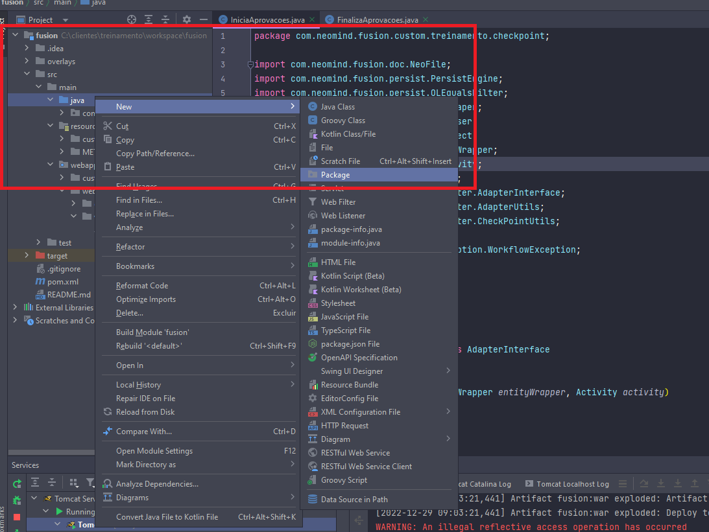
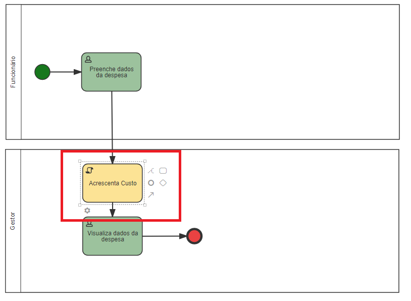

# Adapter de Interface

Os [adapters de interface](../../Adapters/Custom-adapter-interface/Understanding-about.md) são inseridos nos campos de adapters das atividades de *Script* em modelagens de
processos, a maioria das customizações são feitas por adapters de interface, sendo assim, essa funcionalidade será priorizada no treinamento.

*Exemplo de adapter de script em modelagem de processos.*

## 1. Criando um adapter de interface

- Para exemplo, assumiremos um processo em que um funcionário deve enviar um tipo de gasto com o valor para a visualização de seu gestor.

*Modelagem de Envio de Gasto.*

Imaginemos que nosso processo precisa de uma customização. Assim que fosse enviado o gasto, deve ser acrescido um valor de 10% ao custo da despesa. Para efetuar essa customização
iremos utilizar um *Adapter de Interface*.

Nosso formulário principal do processo terá 2 campos:

- Valor: Tipo número decimal.

- Tipo de Despesa: E-Form selecionável, sim, lista não.

*Formulário de Envio de Despesa.*

Para criá-lo prescisamos:

- Criar uma classe java que será responsável pela nossa customização.
- Criar uma atividade Script do tipo classe Java.

### 1.1 Criando a Classe Java

Para a organização de nosso código, devemos definir certos padrões, uma boa prática é fazer customizações separadas em diferentes pacotes. Iremos então criar um novo pacote para
nossas customizações do processo de envio de despesa.

Crie então um novo pacote no caminho **fusion>src>main>java** com o nome de **com.neomind.fusion.custom.envioDespesa**.

*Caminho para criação de pacotes.*

*Pacote criado.*

Agora dentro deste pacote criaremos nossa classe.

*Classe AcrescentaCusto criada.*

A seguir, precisamos implementar uma interface do Fusion na nossa classe. Essa interface se
chama [AdapterInterface](../../Adapters/Custom-adapter-interface/Understanding-about.md), e obriga a nossa classe a utilizar 2 métodos, *start* e *back*.

*Classe AcrescentaCusto implementando AdapterInterface.*

Vamos implementar nosso adapter na modelagem do processo.

*Adicionando o adapter na modelagem.*

Agora temos que vincular a atividade de script criada com a nossa classe java, para isso temos que:

- Copiar o caminho da classe desejada.

*Copiando o caminho da classe java.*

- Vincular esse caminho no nosso adapter na modelagem do processo.

*Adicionando o caminho da classe java na modelagem.*

- Salvar, validar e liberar o processo.

