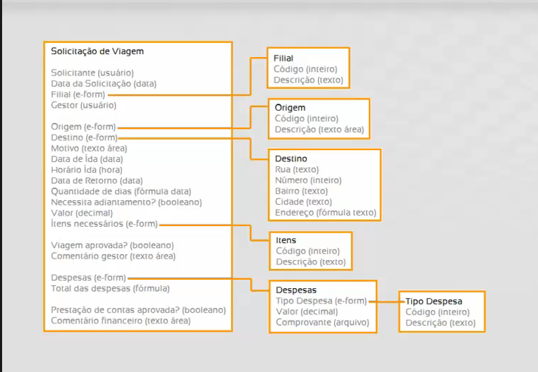

# Exercício

### 1. Proposta

Agora para praticar o que foi visto no módulo I, realize uma customização no processo de **Solicitação de Viagem** via adapter de interface que:

- Receba a data de ida.
- Receba a data de volta.
- Calcular a diferença das datas de ida e volta.
- Inserir a diferença em um novo campo do tipo **Texto**.

!!! info
Lembrando que as datas no Fusion são objetos da classe **GregorianCalendar**, essa classe não é própria do Fusion, facilitando a pesquisa a respeito dela. Para acessar a
documentação da classe **GregorianCalendar** clique [aqui](https://docs.oracle.com/javase/7/docs/api/java/util/GregorianCalendar.html)

### 2. Documentos de Apoio

*Modelagem da Solicitação de Viagem.*

*Formulários da Solicitação de Viagem.*