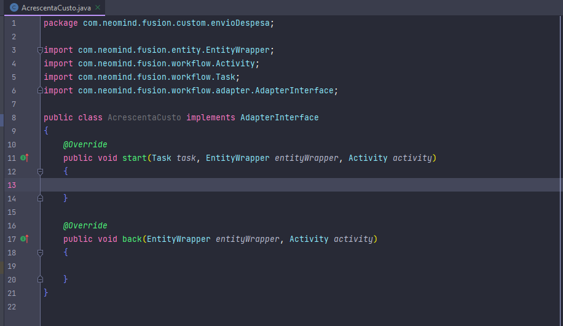

# EntityWrapper

O EntityWrapper pertence ao Fusion, mas se assemelha muito ao próprio wrapper do Java. Um dos parâmetros do nosso método start é um objeto *EntityWrapper*. EntityWrapper é a
entidade(formulário) do nosso processo encapsulada em uma classe java. Tornando-se um objeto, é possivel trabalharmos com nosso formulário no java.

*Parâmetro EntityWrapper.*
