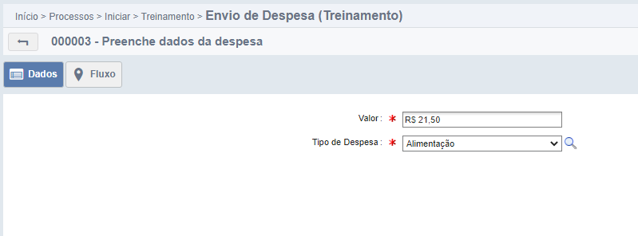

### 1. FindGenericValue()

Um objeto [EntityWrapper](EntityWrapper.md) possui o método *findGenericValue* que recebe o código de um campo do formulário como parâmetro e retorna o valor
armazenado nesse campo.
Assinatura do método é:

")

*Assinatura do método findGenericValue().*

perceba que o findGenericValue:

- Recebe uma string como parâmetro, o **código** de um campo (o código do campo, não o nome!).

- Retorna um objeto, que é o valor contido no campo passado como parâmetro.

Para visualizar o funcionamento do *findGenericValue()* vamos voltar a nossa classe. Podemos trazer os valores do processo para dentro do nosso código.

*Trazendo valor para o código.*

Executando o processo:

*Funcionário preenche dados.*

Como o fluxo do processo ainda não chegou no adapter, só será printado o valor no console quando o funcionário enviar a atividade.

*Fluxo do processo.*

Após enviar:

*Print do valor no console.*

### 2. Tipos do Fusion no Java

Campos **Arquivo** são NeoFile no Java.

Campos **Booleano (Sim/Não)** são Booleanos no Java.

Campos **Data** são GregorianCalendar no Java.

Campos **E-form** são NeoObject ou List&lt;NeoObject&gt; no Java.

Campos **Hora** são java.sql.Time no Java.

Campos **Lista de Opções** são Integer no Java.

Campos **Número Decimal** são BigDecimal no Java.

Campos **Número Inteiro** são Long no Java.

Campos **Texto** são String no Java.

Campos **Usuário** são NeoUser no Java.

!!! Warning
Utilize os tipos com letras maiúsculas no Java. Por exemplo, não utilize long e sim Long. A diferença é que com maiúsculo é um objeto e não um tipo primitivo, e, portanto, permite
valores nulos. 

