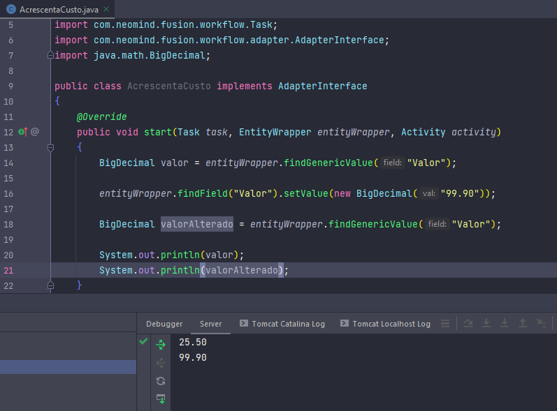
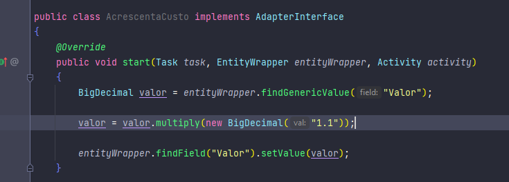
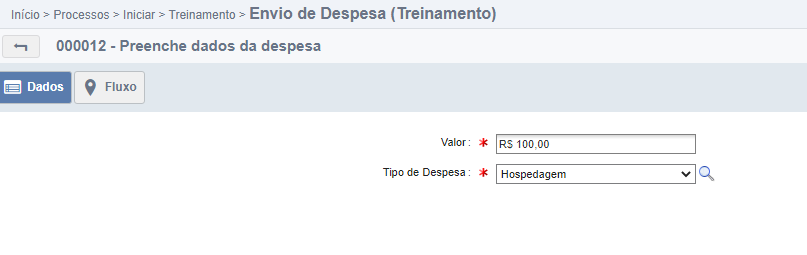
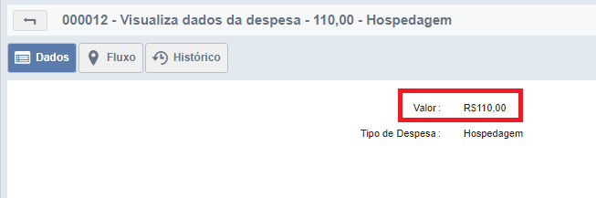

# FindField().setValue()

Veremos agora outros dois métodos dos objetos de tipo formulário, o findField() e o setValue(). Esses métodos são geralmente utilizados em conjunto para atribuir um novo valor a um
campo.

### 1. Funcionalidades

- findField(): retorna o campo passado como parâmetro.
- setValue(): recebe como parâmetro um valor e insere no campo.

### 2. Implementação

*Setar um novo valor.*

Repare que:

- O campo **Valor** é recebebido na variável valor.
- O campo **Valor** é alterado com o findField().setValue().
- O campo **Valor** é recebido novamente na variável valorAlterado.
- São printadas as duas variáveis 'valor' e 'valorAlterado'.

Com isso, é possivel perceber a troca de valor do campo **Valor** do nosso formulário.

Agora voltando ao objetivo original, vamos acrescentar 10% ao valor da despesa. Lembrando que valores numéricos do tipo decimal no fusion são objetos BigDecimal, e não aceitam
operações com operadores comuns do java, sendo nescessários os métodos da classe BigDecimal, para acessar a documentação da classe BigDecimal
clique [aqui](https://docs.oracle.com/javase/7/docs/api/java/math/BigDecimal.html)

*Incrementar 10%.*

Repare que:

- Recebemos o valor
- Multiplicamos o valor por 1.1 (utilizando o método *multiply* da classe BigDecimal)
- Inserimos esse valor alterado no campo **Valor** do nosso formulário

Ao executar o processo obtemos o seguinte resultado:

*Processo iniciado pelo funcionário.*

*Atividade recebida pelo gestor.*