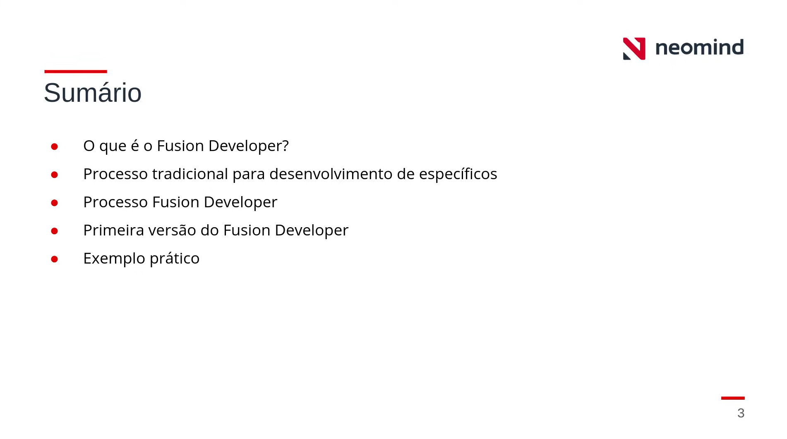
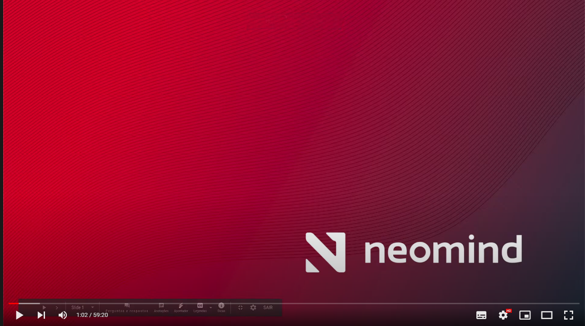
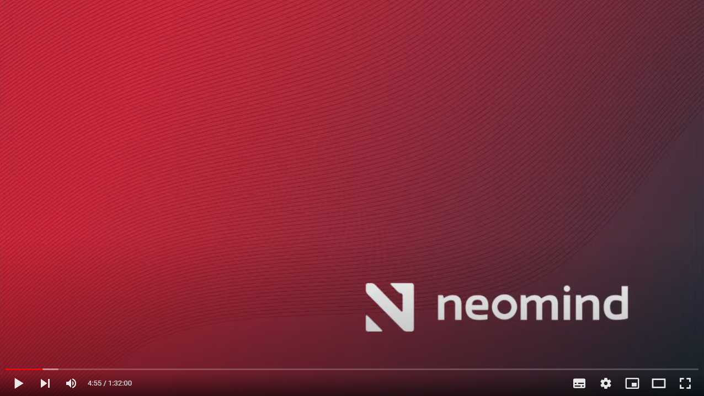
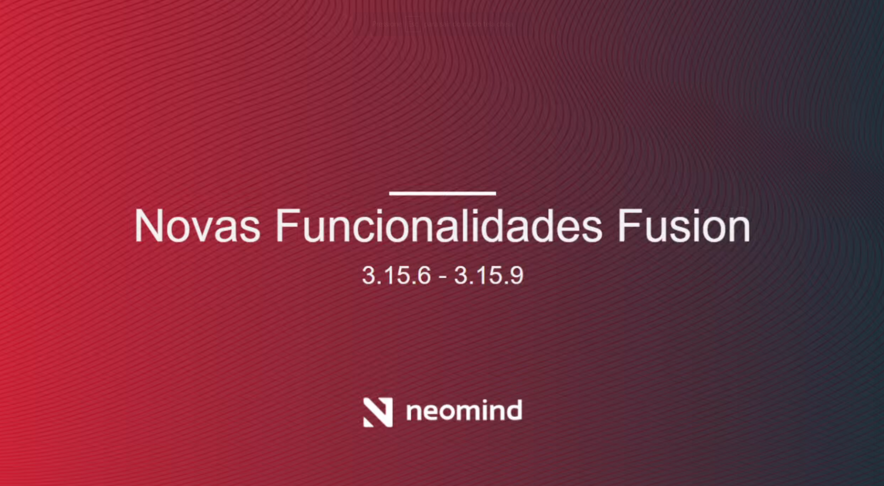

# Links de Conteúdo

## Fusion Developer 
Abaixo estão os links para o repasse técnico e funcional do fusion developer.  
O Fusion Developer foi liberado na versão 3.10 do Fusion e serve como um ambiente de desenvolvimento sem a necessidade de uma configuração inicial.  

 
 
### Repasse Funcional
Esse repasse é destinado a todos que tenham interesse em entender e aprender como utilizar o Fusion Developer.  

Conteúdo do repasse:  

  
  Clique na imagem para assistir o vídeo  

### Repasse Técnico
O Repasse técnico é destinado às equipes que precisarão dar suporte a função e também à todos que tem interesse em saber como o Fusion Developer funciona internamente.  
Conteúdo do repasse:  

- Arquitetura
     - Frontend
     - Backend

- Criação
    - Web Editor
    - LSP
    - Armazenamento

- Execução
    - Compilação em memória
    - Classpath
    - Segurança  

  Clique na imagem para assistir o vídeo  

## Analytics
O repasse do Analytics pode ser acessado através do portal corporativo Fusion.  
O caminho para a pasta que contêm os repasses de Pré Release do Analytics é Tecnologia > UX > Repasses de Projetos.  
 
Você também pode acessar o vídeo [Clicando aqui!](https://www.neomind.com.br:443/fusion/portal/action/Link?link=https%3A%2F%2Fwww.neomind.com.br%3A443%2Ffusion%2Fappfusion%2F%23%2Fged%2FneoDocument%2F28016980%3FmodeView%3Dview%26hideBreadcrumb%3Dtrue%26showBackButton%3Dtrue&layout=false)

## Importador e novidades na versão 3.15 do Fusion
O repasse funcional das novidades disponibilizadas no Fusion Platform com o lançamento da versão 3.15

Conteúdo do repasse:  
  
- Importador de Registros de Formulários e Solicitações de Processos (3.15)  

- Assinatura Eletônica (3.15)  
  
- Impressão de Formulários (3.15.1)  

- Configuração de DPI do conversor de arquivos (3.15.2)

  
    Clique na imagem para assistir o vídeo  
  
## Checkin e Checkout de Documentos
Repasse funcional das novidades disponibilizadas na versão 3.15.6 e 3.15.9 do Fusion Platform.  
  
Conteúdo do repasse:  

- Check-in e Check-out de Documento via Processo (3.15.6)
  
- Transferir Atividades para Qualquer Usuário (3.15.9)
  
- Transferir Pendências ao Inativar Usuário (3.15.9)  

 Clique na imagem para assistir o vídeo  
