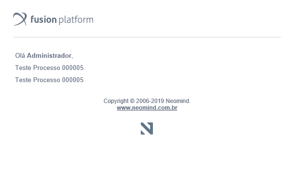

## O que é?


O tamplate de e-mail nada mais é que um JSP (Java Server Pages), que utiliza tags em HTML  com java
embutidos no código fonte. Abaixo podemos ver como é a estrutura dele.

```jsp
<%@ page contentType="text/html; charset=ISO-8859-1" pageEncoding="ISO-8859-1" %>

<%@ taglib uri="/WEB-INF/mail.tld" prefix="mail" %>
<%@ taglib uri="/WEB-INF/workflow.tld" prefix="wf" %>
<%@ taglib uri="/WEB-INF/portal.tld" prefix="portal" %>
<%@ taglib uri="http://java.sun.com/jstl/core" prefix="c" %>

<%

    /*
     * Aqui é onde fica a parte do "backend" do JSP 
     */

%>

<jsp:include page="/mail/top.jsp"/>

<mail:title title="<%= "Titulo do Email" %>"/>

    <p class="titulo_1" style="font-family: Helvetica, Arial, sans-serif; color: #6b7486; line-height: 25px;">

        <%--
        Aqui é onde todos os codigo em HTML vão ficar para serem renderizados ao enviar o email
        --%>


<jsp:include page="/mail/bottom.jsp"/>
```

Agora um exemplo do e-mail renderizado:



## Como funciona?

Para construir um template customizado, é necessário montar uma classe java que faz 
a chamada do envio de e-mail. Esta classe pode ser do tipo: AdapterInterface, EntityAdapter, etc.


A seguir temos a montagem de um e-mail simples apenas para mostrar como é o funcionamento do
backend em Java, e como é feito para passar os parâmetros para o JSP:

```java
public class EnviarEmailAdapter implements AdapterInterface
{
	@Override
	public void start(Task origin, EntityWrapper processEntity, Activity activity)
	{

		String eMail = "";
		HashMap<String, Object> paramMap = new HashMap<>();

		String tituloAssunto = (String) processEntity.findValue("TituloAssunto");
		String informativo = (String) processEntity.findValue("Informativo");

		paramMap.put("tituloAssunto", tituloAssunto);
		paramMap.put("informativo", informativo);

		List\<NeoObject\> neoObjectList = (List\<NeoObject\>) processEntity.findValue("ListaDeUsuarios");

		for (NeoObject xTo : neoObjectList)
		{
			if (xTo instanceof NeoUser)
			{
				NeoUser noUsuario = (NeoUser) xTo;
				eMail = noUsuario.getEmail();
				paramMap.put("targetName", noUsuario.getFullName());
			}

			MailEngine.getInstance().sendEMail(eMail, "mail/GenericTemplate.jsp", paramMap);
		}
	}

	@Override
	public void back(EntityWrapper processEntity, Activity activity)
	{
	}
}
```


### Como enviar as informações para o JSP?

Através de um HashMap vamos mapear cada informação que seja necessária passar para o JSP.
No exemplo acima temos 3 informações principais:

 - Titulo do Assunto
 - Informativo 
 - O nome do usuário que será enviado o e-mail
 
Agora que sabemos o que passar no e-mail, temos que criar a chamada da Engine de emails do Fusion:
 
```java
MailEngine.getInstance().sendEMail(eMail, "mail/GenericTemplate.jsp", paramMap);
```

Existem 2 informações vitais na chamada do método acima que são obrigatórias:

 - O primeiro parâmetro é o destinatário nesse parâmetro podemos passar dois tipos de informações
  o e-mail ou até mesmo o NeoUser.
 - O segundo parâmetro é o template que será usado para enviar.
 - O terceiro(opcional) é o HashMap ele não necessariamente precisa estar na chamada do método.
 (Mas como queremos passar informações para o JSP vamos deixar)
 
No JSP vamos pegar as informações do backend via ``request``:

```jsp
<%@page import="com.neomind.fusion.i18n.I18nUtils" %>
<%@ page contentType="text/html; charset=ISO-8859-1" pageEncoding="ISO-8859-1" %>

<%@ taglib uri="/WEB-INF/mail.tld" prefix="mail" %>
<%@ taglib uri="/WEB-INF/workflow.tld" prefix="wf" %>
<%@ taglib uri="/WEB-INF/portal.tld" prefix="portal" %>
<%@ taglib uri="http://java.sun.com/jstl/core" prefix="c" %>

<%
    String titleEmail = "Portal Corporativo - Email de Notificação";
    String titleAssunto = (String) request.getAttribute("tituloAssunto");
    String informativo = (String) request.getAttribute("Informativo");
    String targetName = (String) request.getAttribute("targetName");
%>

<jsp:include page="/mail/top.jsp"/>

<mail:title title="<%= titleEmail %>"/>

<p class="titulo_1" style="font-family: Helvetica, Arial, sans-serif; color: #6b7486; line-height: 25px;">

    <%=I18nUtils.getString("hello")%> <span style="font-weight: bold"> <%= targetName %></span>,
    <br/>
    <%=titleAssunto%>
    <br/>
    <%=informativo%>
    <br/>
</p>

<jsp:include page="/mail/bottom.jsp"/>

```

Agora o e-mail renderizado:


### Como anexar documentos?

Para anexar documentos usaremos a mesma forma de envio, apenas será adicionado uma classe
custom que será a responsável por todo envio do email:

Nossa classe ``EnviarEmailAdapter`` ficou assim:

```java
public class EnviarEmailAdapter implements AdapterInterface
{
	@Override
	public void start(Task origin, EntityWrapper processEntity, Activity activity)
	{

		String tituloAssunto = (String) processEntity.findValue("TituloAssunto");
		String informativo = (String) processEntity.findValue("Informativo");

		List\<NeoObject\> neoObjectList = (List\<NeoObject\>) processEntity.findValue("ListaDeUsuarios");

		CustomSendMailUtils.SendMail(processEntity, neoObjectList, tituloAssunto, informativo, "ListaDeAnexos", "Anexo");
	}

	@Override
	public void back(EntityWrapper processEntity, Activity activity)
	{

	}
}
```

A nova classe CustomSendMailUtils:

```java
public class CustomSendMailUtils
{

	private static Log log = LogFactory.getLog(CustomSendMailUtils.class);

	public static void SendMail(EntityWrapper wrapper, List\<NeoObject\> to, String title, String text, String attachsFieldName, String attachFieldName)
	{

		String eMail = null;

		Map<String, Object> paramMap = new HashMap<>();
		paramMap.put("title", title);
		paramMap.put("texto", text);

		if (attachsFieldName != null && attachFieldName != null)
		{
			List attachs = getAttachedDoc(wrapper, attachsFieldName, attachFieldName);

			if (attachs.size() > 0)
			{
				paramMap.put("attachList", attachs);
			}
		}


		for (NeoObject xTo : to)
		{
			if (xTo instanceof NeoUser)
			{
				NeoUser noUsuario = (NeoUser) xTo;
				eMail = noUsuario.getEmail();
				paramMap.put("targetName", noUsuario.getFullName());
			}

			MailEngine.getInstance().sendEMail(eMail, "mail/GenericTemplate.jsp", paramMap);
		}

	}
```

A unica diferença é que se você deseja colocar um anexo no HashMap você precisa passar como
parametro o "attachList" com uma lista do neoId dos anexos.

```java
	private static List getAttachedDoc(EntityWrapper wrapper, String attachsField, String attachFieldName)
	{
		List<String> finale = new ArrayList<>();

		List\<NeoObject\> listAnexos = wrapper.findGenericValue(attachsField);

		if (listAnexos != null && listAnexos.size() > 0)
		{
			for (NeoObject objAnexo : listAnexos)
			{
				EntityWrapper wrapperAnexo = new EntityWrapper(objAnexo);
				String nomeArquivo = ((NeoFile) wrapperAnexo.findGenericValue(attachFieldName)).getName();
				log.info(nomeArquivo);
				NeoFile doc = PersistEngine.getObject(NeoFile.class, new QLRawFilter("name = '" + nomeArquivo + "'"));
				if (doc != null)
				{
					finale.add(String.valueOf(doc.getNeoId()));
				}
			}
		}
		return finale;
	}
}
```

Este exemplo é um geral que temos como parâmetro o EntityWrapper, o attachsField que é o campo
lista no formulário principal e o attachFieldName que é o campo onde o anexo está localizado:

```java
CustomSendMailUtils.SendMail(processEntity, neoObjectList, tituloAssunto, informativo, "ListaDeAnexos", "Anexo");
```

No caso "ListaDeAnexos" é a nossa lista, e o "Anexo" é o campo arquivo dentro da nossa
"ListaDeAnexos".
