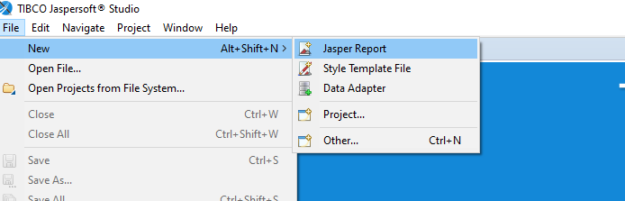
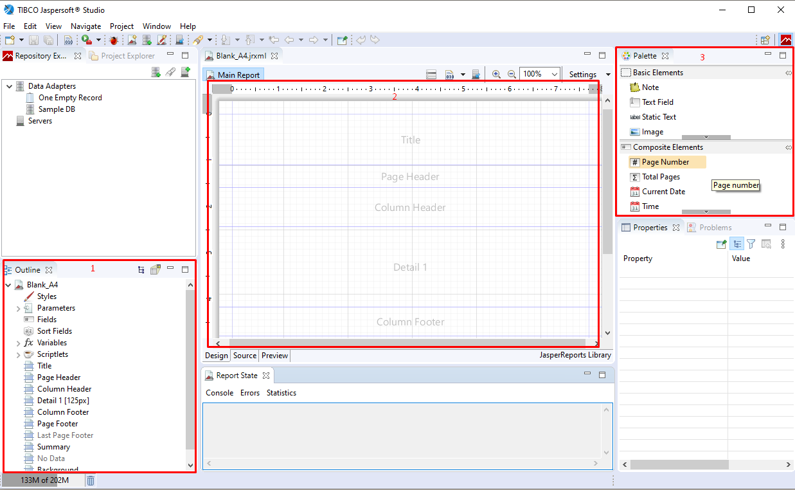
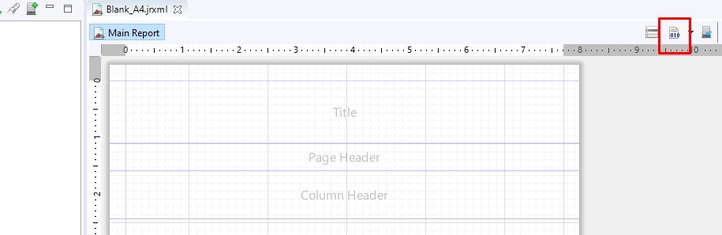

# Primeiros Passos

O IReport possui uma interface intuitiva cujo os elementos podem ser arrastados para modelar o relatório. 

!!! info
    As demonstrações serão feitas no IReport versão 3.6.14.

## Iniciando documento
Para abrir o IReport e iniciar um novo documento você pode seguir os passos: 

  

## Modelagem do relatório
Assim que iniciado a tela do editor, você verão uma IDE com todas as funcionalidade de customização disponíveis.

Na imagem existem 3 áreas destacadas. 

(1) Lista todos os elementos inseridos no relatório, os principais são:

- **Parameters**: lista todos os códigos criados para os campos que são estáticos e não se repetem. Esses códigos serão usados para enviar a informação via código. Os campos devem estar com o conteúdo **$P{codigoParametro}**.
- **Field**: lista todos os códigos criados para campos que se repetem, como uma lista. Via código é enviado uma collection de dados. Os campos devem estar com o conteúdo **$F{codigoField}**. 

(2) As áreas delimitam onde os conteúdos serão dispostos, as principais são:

- **Title ou Page Header**: área que será modelado cabeçalho do documento, exemplo imagens, título do documento, e eoutros.
- **Detail**: área que contêm todo o conteúdo do documento, dependendo da complexidade do relatório pode ser criados vários details. Cada lista de itens deve estar em um detail separado. 
Exemplo: lista de campos que repetem e campos estáticos.
- **Page Footer, Column Footer e Summary**: área onde será modelada as informações de rodapé do documento ou da última página do documento podendo ser configurado para aparecer em todas as páginas ou somente na última. 

!!! info 
    Essa divisão é necessária pois o formulário é dinâmico, ou seja o detail pode expandir, e essa área específica faz com que o desenvolvedor possa estabeler o que será impresso na última página.     
    

(3) Uma paleta com todos os itens disponíveis para inserir no relatório, os mais utilizados são.
 
- **Text Field**: insere um campo que recebe informações via código. 
- **Static Field**: insere uma label que identifica um campo dinâmico ou títulos nos documentos.
- **Image**: permite inserir uma imagem no documento estática ou dinâmica.

!!! info
    O IReport possui uma variedade de ferramentas de customização, você pode **investigar e testa-las**. É possível editar as propriedades dos campos e das labels, permitir ajuste de tamanho automático dos campos. 
    Possui também alguns parametros automáticos como a paginação, data atual, horário, entre outros. 
    
## Buildar IReport
Depois de modelar seu IReport você precisará efetuar um build para que ele gere a versão compilada que será utilizada via código. 
Para buildar você precisa clicar no botão da Figura. A IDE informará se terá algum erro na compilação ou se compilou com sucesso. 

