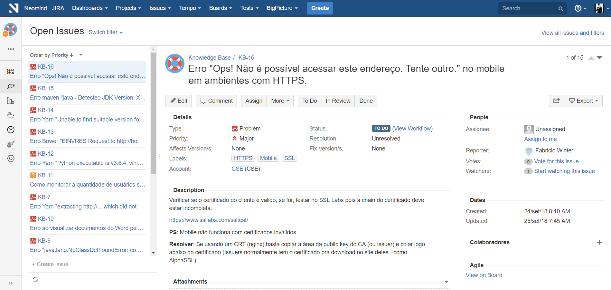
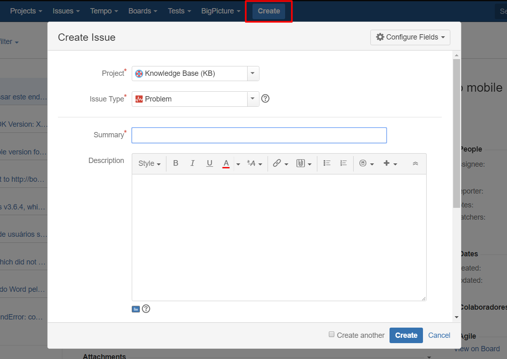

# Knowledge Base - KB

O Knowledge Base, mais conhecido como **KB** é um projeto no JIRA (ferramenta que permite o monitoramento de tarefas e acompanhamento de projetos) da Neomind.

### Objetivo

Semelhante ao [Stack Overflow](https://stackoverflow.com) seu principal objetivo é facilitar a resolução dos problemas enfrentados no **ambiente de desenvolvimento** do Fusion Platform através de *Perguntas x Respostas*, bem como erros técnicos.

### Não Confundir

KB não tem como função resolver problemas da Aplicação, mas sim facilitar a resolução de problemas enfrentados no ambiente de desenvolvimento.

## Como deverá ser utilizado?

Por hora, os usuários deverão cadastrar seus problemas e soluções juntamente na Issue criada que enfrentou dificuldades para solução. 

Dessa maneira, iremos gerar uma centralização de erros comuns onde as novas pessoas que entram na Neomind (bem como as antigas) podem ter onde consultar os erros referente ao ambiente de desenvolvimento sem que possa interromper alguém para auxiliar na solução.

## Como Funciona?

1. Abra o [Knowledge Base](http://jira.neomind.com.br:8300/projects/KB/issues/).
2. Efetue o loguin utilizando as credenciais da rede.
3. Clique no botão [Create](http://jira.neomind.com.br:8300/secure/CreateIssue!default.jspa) na barra superior centralizada.
4. Informações que deverão ser preenchidas: 
    1. **Project** = Knowledge Base
    2. **Issue Type** = Tipo do caso (Questão ou Problema)
    3. **Summary** = Título do Problema.
    4. **Description** = Descrição do problema.
    5. **Labels** = Para facilitar a pesquisa.
    6. **Attachment** = Caso queira incluir anexo.
    7. **Linked Issues** = Linkar com outra questão aberta.
    8. **Assignee** = Usuário responsável.
    9. OBS: Campos **_Project, Issue Type, Summary e Description_** são obrigatórios.

