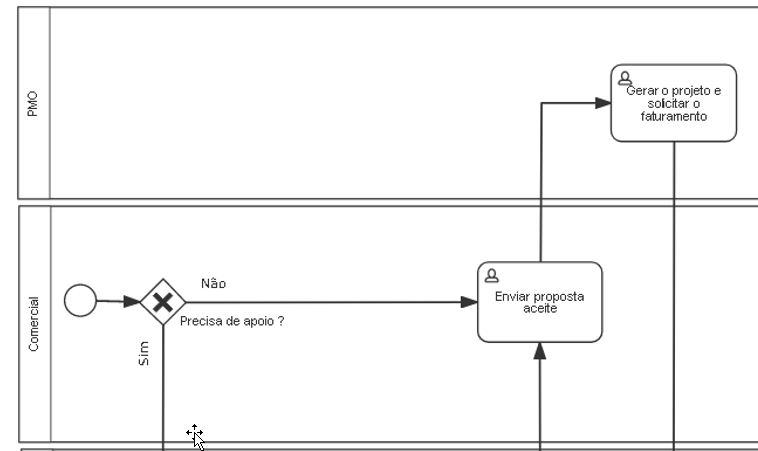
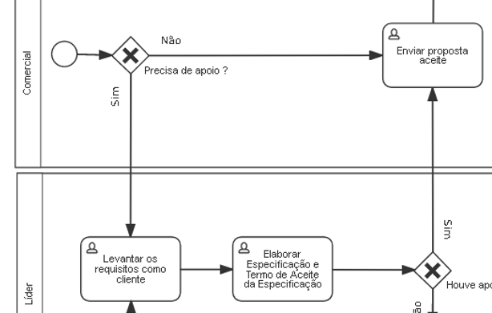
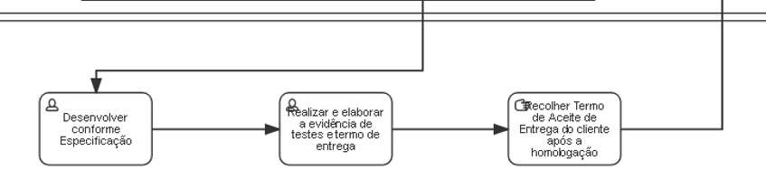

## Visão geral do processo

## Do início dos serviços
Os trabalhos em serviços somente serão iniciados diante da apresentação de documento oficial pelo Departamento Comercial (OS ou Proposta assinadas).

Com este documento e mão, o processo de Serviços se inicia com a criação de um projeto e estabelecendo a liderança do projeto, bem como, a providencia do faturamento conforme descrito em proposta

## Do apoio ao comercial (definir o projeto e orçamento)
Quando o Departamento Comercial busca apoio à Serviços o consultor designado deverá realizar, juntamente com um representante do Departamento Comercial, um entendimento das necessidades do cliente e elaborar a Especificação estimando as horas de cada atividade para que o Departamento Comercial realize a elaboração da Proposta.

Antes da elaboração da Proposta, o cliente deverá avaliar cada etapa da Especificação e retornar um “de acordo”.

Após a proposta aprovada e assinada pelo cliente, a mesma segue os caminhos indicado no item 4.2.

O consultor deverá apontar as horas gastas no projeto de Apoio ao Comercial.

## Da elaboração das Especificações e Termo de Aceite das Especificações
O líder que receber o projeto para acompanhamento, deverá realizar um contato com o cliente para o entendimento das necessidades e baseado neste entendimento, deverá elaborar as Especificações (Anexo I) e um Termos de Aceite das Especificações. Estas especificações precisarão ficar com um descritivo claro de forma que tanto o cliente, possa entender e dar o aceite, quanto o desenvolvedor tenha a mesma compreensão para poder executar o serviço.

Uma vez tendo em mão o aceite das Especificações pelo cliente, o líder deverá anexar no projeto, na aba “documentos” a Especificação e o Termo de Aceite da Especificação, criar uma atividade para o desenvolvedor e fazer o repasse da demanda para o desenvolvedor.

## Do desenvolvimento e entrega
O desenvolvedor deverá realizar todo o desenvolvimento conforme o documento de Especificação, buscando sempre procurar cumprir os prazos determinados.

Após os desenvolvimentos, o desenvolvedor deverá elaborar o Termo de Aceite de Entrega, onde neste documento deverá constar o que está sendo entregue, as evidências de testes (prints), informações complementares e as orientações para que o cliente possa aplicar as implementações no ambiente de produção.

O desenvolvedor deverá recolher o aceite do cliente, que pode ser uma assinatura no documento ou um print de um e-mail enviado pelo cliente e deverá encaminhar tanto o Termo de Aceite quanto o aceite do cliente para o líder para que estas evidências sejam anexados ao projeto antes da sua finalização.

## Anexos
