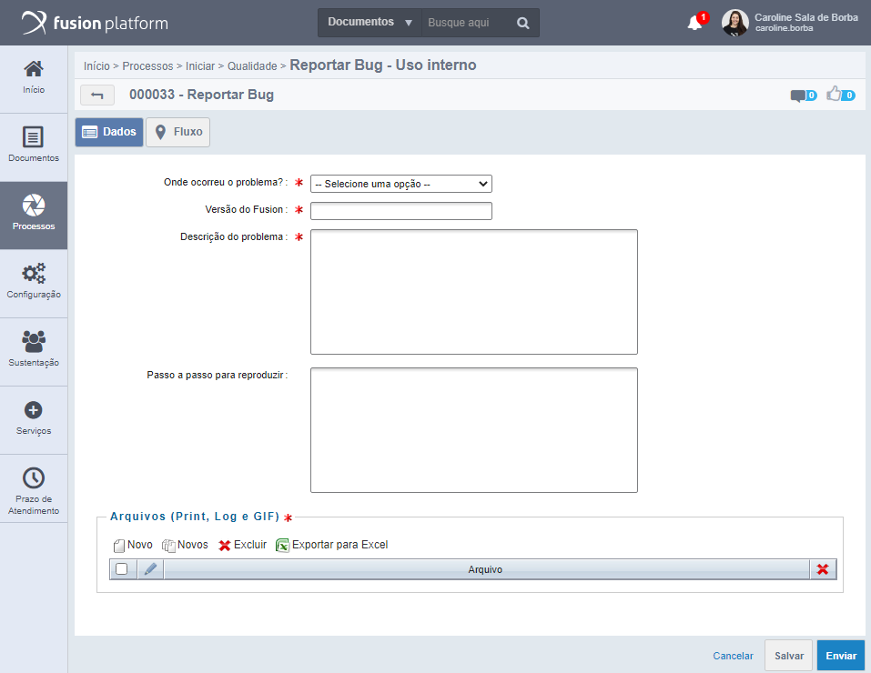
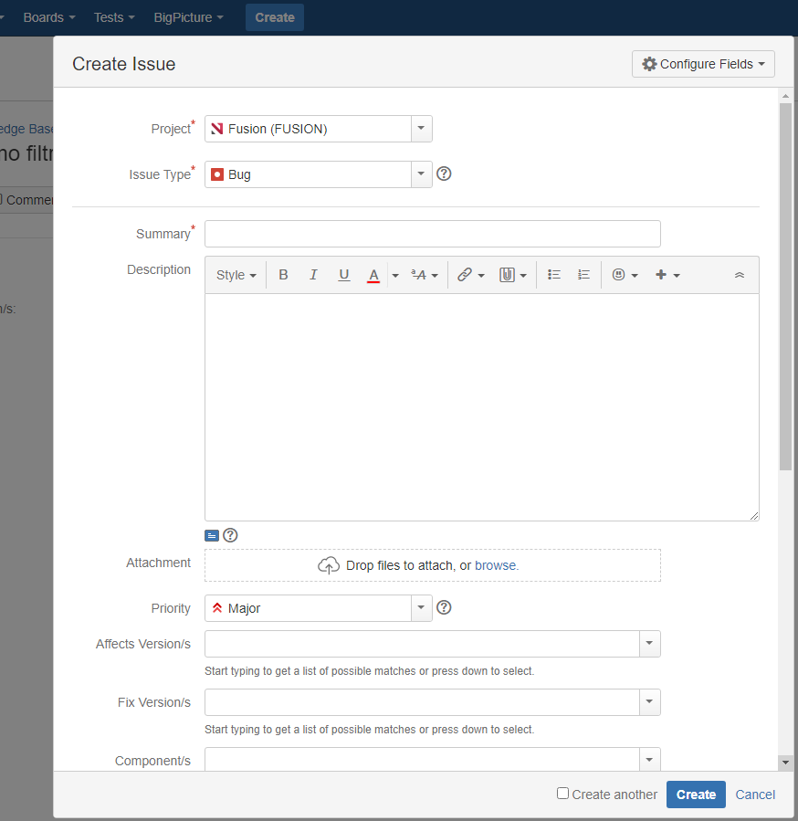

# Reportando bugs

Encontrei um bug/erro/comportamento inesperado em algum versão do produto padrão, o que devo fazer? Hoje existem alguns procedimentos para auxiliar o retorno de erros encontrados nas versões liberadas do sistema. 
Existem dois cenários que possuem tratativas diferentes: se o erro encontrado impacta a entrega do projeto ou se não. 

## O erro encontrado não impacta o projeto que estou desenvolvendo 

Se você encontrou o erro de maneira inesperada e esse erro não é um impeditivo para que você realize suas entregas para o cliente, o indicado é abrir o fluxo "Reportar Bug - Uso interno" desenvolvido pela equipe de qualidade e disponível para todas as pessoas da empresa. 
Para realizar a solicitação será preciso:

- selecionar onde ocorreu o problema;
- qual a versão do sistema;
- uma descrição do problema;
- o passo a passo para reproduzir o erro, se for simulável;
- anexos que incluem: prints, exportação do processo que deu problema, gifs, vídeo explicativo e outros.

A solicitação será triada pela equipe de qualidade, que irá verificar se o erro já foi mapeado ou não e, posteriormente, irá encaminhar para a equipe de Inovação que fará a correção.
Esse fluxo gera um feedback mantendo o solicitante informado do que ocorreu com a sua solicitação.  

Fluxo para reportar bugs no sistema:

## O erro encontrado impacta na entrega do meu projeto

Nessa situação, entende-se que o problema é crítico e mais pessoas devem ser acionadas para reduzir os impactos no projeto. Recomenda-se:

- acionar alguém do comitê técnico de serviços, que irá realizar uma análise do bug e orientar para a abertura do chamado diretamente pelo Jira;
- se confirmado como um bug, o procedimento padrão é abertura de chamado no Jira e os integrantes do comitê técnico irão agir para solicitar a prioridade na correção.

Interface do Jira para abertura de chamados:

Qualquer dúvida a respeito dos procedimentos, entre em contato pelo skype ou pelo e-mail: cts@neomind.com.br    

