# Iniciando projeto

Antes de começar um projeto, verifique no [repositório de clientes no git](https://gitlab.neomind.com.br/clients), se existe um grupo 
referente ao cliente, para todo grupo existe um projeto dentro chamado `Fusion`, onde é aguardado os especificos desse cliente:

* Caso não exista solicite para algum `maintainer` criar o grupo do cliente para você, depois faça o commit inicial do projeto, use como base os [Templates](https://gitlab.neomind.com.br/neomind-servicos/templates) conforme a versão do Fusion;

* Caso exista, antes é necessário de uma branch para trabalhar em cima.

!!! info
    Para todas as demonstrações a seguir do Guia Rápido será usado como exemplo o cliente [Saint Gobain](https://gitlab.neomind.com.br/clients/saint-gobain) do Gitlab Neomind.

## Criando branch

Para criar é simples, clique em `Branchs`, depois `New Branch`, digite o nome desejado e por fim clique em `Create Branch`.

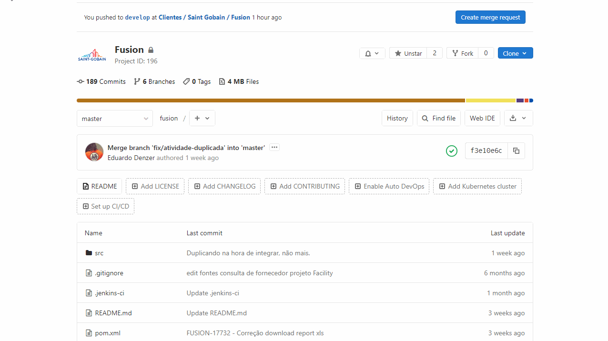

Quanto ao nome da branch é muito importante seguir o padrão, crie uma `branch` cópia da `master`, seguindo a estrutura abaixo:

Nome da Branch              | Quando usar
--------------              | -----------
`feature/nome-do-projeto`   | Projeto novo ou melhoria em desenvolvimento
`release/nome-do-projeto`   | Pacote pronto para homologação pós Code Review
`fix/numero-chamado`        | Quando for corrigir algo em garantia ou chamado
`upgrade/fusion-3.8.0`      | Quando for migrar o ambiente do cliente
`statement`                 | Branch de homologação
`master`                    | Branch de produção

!!! warning
    Nunca desenvolva em cima da branch `master` ou `statement`, deve somente abrir um `merge` para um `maintainer` 
    aprovar as suas alterações.

## Clonando Projeto

Para clonar o projeto do cliente para o seu PC local, antes é necessário definir em que pasta vai armazenar, crie uma pasta para o cliente.

!!! tips
    Crie uma pasta nomeada **clientes** no seu PC e dentro dela crie subpastas para cada cliente conforme o nome do grupo no GIT.
    **Exemplo:**
    
    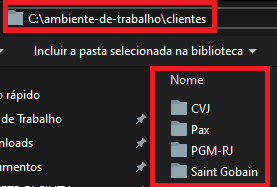

No projeto Fusion do GIT do cliente desejado, copie o link do HTTPS conforme a imagem abaixo:

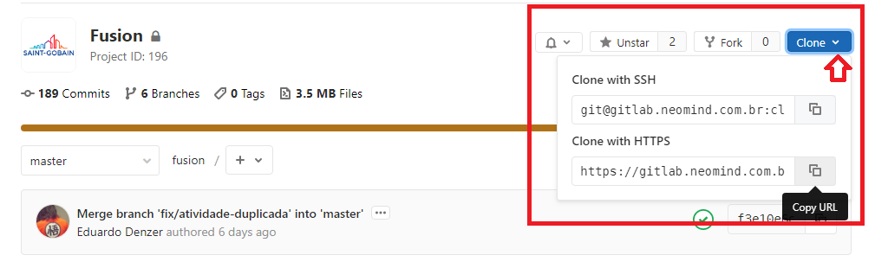

Abra o CMD na pasta do Cliente desejado, execute, usando o link, o seguinte comando:
```powershell
git clone https://gitlab.neomind.com.br/clients/saint-gobain/fusion.git
```


## checkout entre branchs

Verifique sua branch `origin`, que representa a branch atual que mexa no projeto do cliente.

Abra o CMD na pasta do Cliente desejado, execute os seguintes comandos:
```powershell
git status
```
```powershell
git checkout branch-name
```
Para ver se funcionou rode o comando `git status` novamente e verfique sua `origin`.

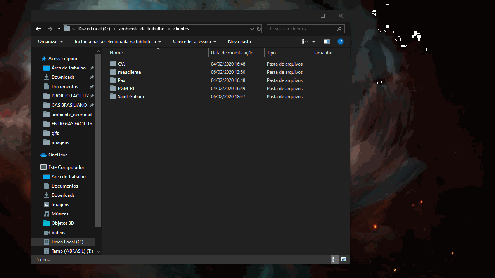

## commit and push

O mais importante antes de salvar algo no repositório é atualizar a sua `origin`.

Faça o `pull` antes do `push` e use o `stash`, para isso abra o CMD na pasta do cliente desejado, execute os seguintes comandos:

```powershell
git stash
```
```powershell
git pull
```
```powershell
git stash pop
```

Lembrando que se não tem alterações no seu ambiente local, basta executar o `git pull`.

Após isso resolva os conflitos na sua ferramenta de desenvolvimento, recomendo fazer o commit e push na sua IDE, mas segue os comandos:

Adicione o arquivo caso seja novo.
```powershell
git add <file_name>
```
```powershell
git commit -m 'Sua mensagem de commit aqui'
```
```powershell
git push origin 'branch-name'
```

##Versionamento

Versionamento de projeto cliente é feito no `pom.xml`.
 
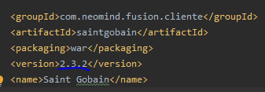 

Antes do commit and push final, seja migração, projeto novo ou correção(fix), mude a versão no pom.xml, conforme:

Veja o a estrutura de exemplo, `x.y.z` e observe agora a tabela abaixo:
 
Ponto de versão | Quando usar
-------         | -------------
`x`               | Cada migração sobe um nível começa em 1
`y`               | Cada projeto novo sobe um nível começa em 0
`z`               | Cada fix novo sobe um nível começa em 0
 
Exemplo: 2.3.2, passou por uma migração, foi realizado 3 projetos e foi ajustado 2 fixes.

### SNAPSHOT

Sempre quando criar uma branch seja feature, fix ou upgrade do fusion, de imediato alterar 
a versão do fusion conforme a explicação acima e adicionar o `-SNAPSHOT` e fazer o commit inicial
do projeto, exemplos na tabela abaixo:

Branch | Exemplo
-------         | -------------
`1.1.0`               | master
`1.2.0-SNAPSHOT`               | feature/integracao-sap
`1.1.1-SNAPSHOT`               | fix/ajuste-filtro-tela
`1.2.1-SNAPSHOT`               | statement (em quanto os duas branchs estiverem em dev)
`1.2.0` | master (depois de mergear liberar feature/integracao-sap)
`1.2.1` | master (depois de mergear fix/ajuste-filtro-tela)

 

## Code Review

Terminando o desenvolvimento dos requisitos da feature, necessita abrir um `Merge Request` para a `branch` de release, 
após isso um `maintainer` vai realizar o `Code Review` do seu código, conforme:

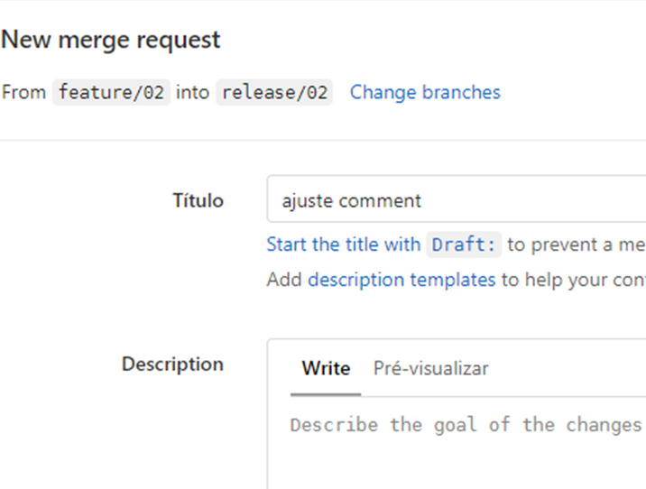

Coloque um título simples e direto relacionado a feature desenvolvida, e uma descrição breve, se necessário, é 
importante selecionar o Responsável e Reviewer direcionados anteriormente a você (Caso não tenha sido ainda, entrar em 
contato com um supervisor), além disso, devesse checkar as 2 opções no `Merge options`, `Delete source branch` e 
`Squash commits`, conforme:

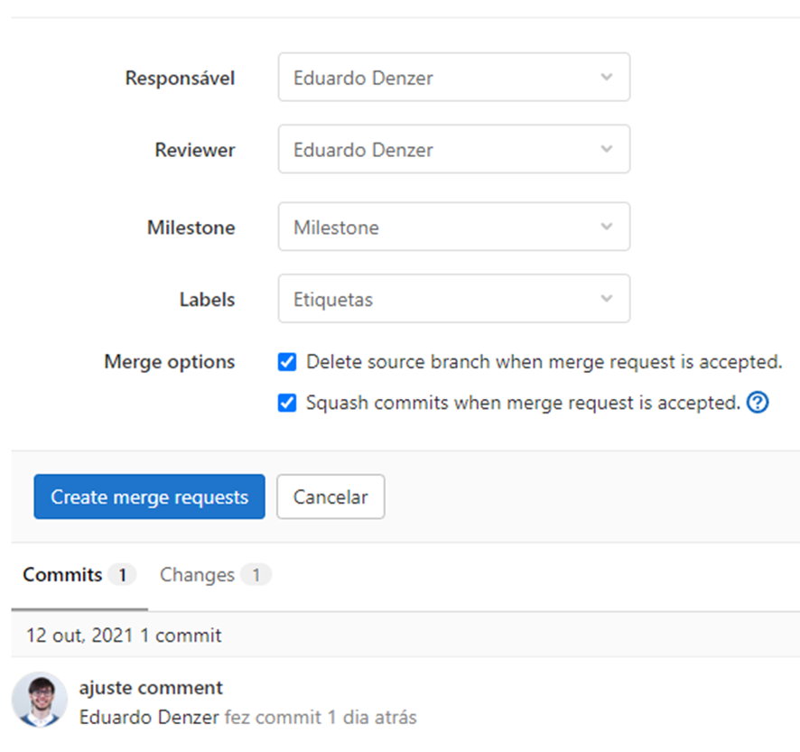

Após clicar em `Create merge requests`, é importante sinalizar o Responsável diretamente também, para agilizar o 
processo, e aguardar o retorno dele, caso necessite alterar algo na feature, basta abrir o MR feito por você e analisar 
item à item anotado pelo `maintainer`, ajustar localmente na mesma branch feature e commitar, após os ajustes, basta 
selecionar o Responsável no MR e avisar novamente, esse ciclo se mantém até o MR ser aprovado, lembrando que aqui é 
importante total envolvimento dos dois lados para agilizar a entrega mas também manter a qualidade. 

## Merge Request, gerando pacote do cliente

Após o `commit and push` final do projeto, caso aja `build success` é hora de gerar o pacote para atualizar o ambiente 
do cliente, tanto se for pra homologar ou se for para fazer go live em produção, para isso, basta verificar o status da 
pipeline, conforme:

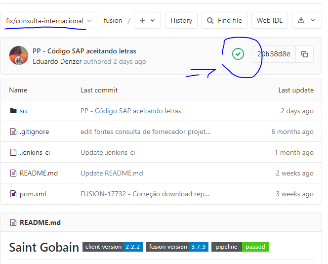 

Caso apresente o ícone verde de sucesso, conforme a imagem acima, significa que ocorreu tudo certo com o build, com isso você já pode solicitar 
um `Merge Request` para a branch desejada conforme:

Nome da Branch | Quando usar
-------        | -------------
`statement`    | Homologação, testar o projeto
`master`       | Produção, após homologado com o cliente

Para solicitar o `Merge Request` basta, clicar em `Merge Requests` no menu principal à esquerda, depois em `New Merge Request`, selecionar a sua branch de 
desenvolvimento para a branch desejada(`statement` ou `master`), não há necessidade de configurar nada após isso, somente finalizar clicando em `Submit Merge Request`.

Agora basta aguardar um maintainer aprovar o merge, após aprovado vai começar o build da branch que sofreu o merge.

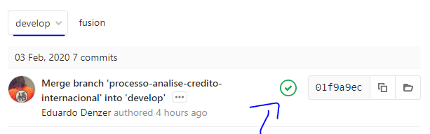 

Com `build success` pós merge, abra o [Nexus](https://nexus.neomind.com.br/nexus/), procure seu .war pelo nome do cliente na barra de pesquisa, verifique se a 
data e versionamento está correta, se sim, é so baixar no cliente e substituir o WebContent.

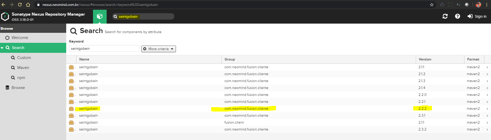
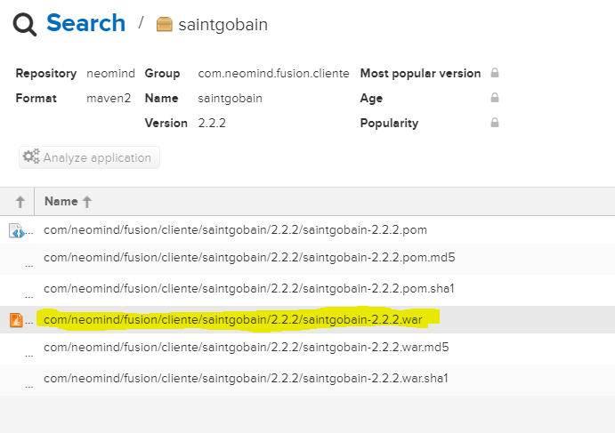  