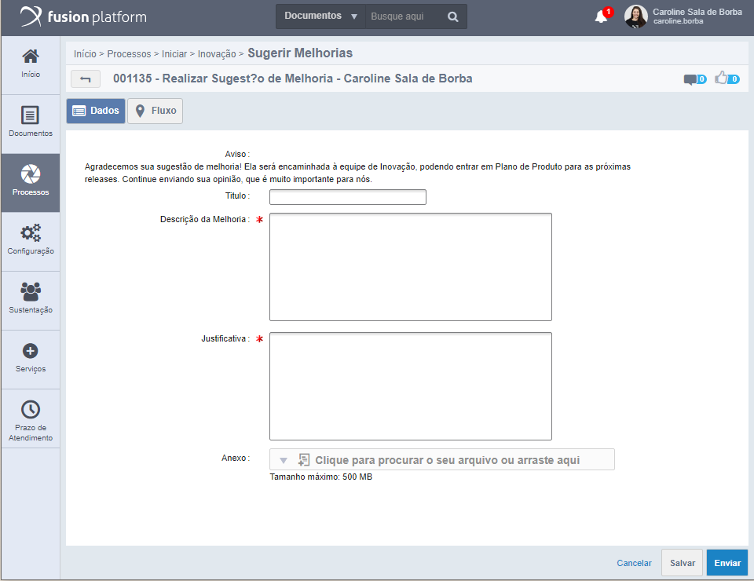

# Sugerir Melhorias

Quero sugerir uma melhoria para o produto padrão, o que fazer? 
As vezes, durante o dia a dia sentimos a falta de uma determinada funcionalidade ou função no produto e que 
poderia ajudar outras pessoas. Nesses casos você pode sugerir uma melhoria.

## Fluxo Sugerir Melhorias

Existe um fluxo interno desenvolvido especialmente para essas situações. Na central de tarefa inicie um fluxo **Sugerir Melhorias** e preencha os campos obrigatórios.

Após a solicitação, a equipe de atendimento irá analisar a sugestão e, se for validada, ela poderá ir para a próxima sprint da equipe de Inovação.

!!! info
    Lembrando que as melhorias solicitadas não necessariamente serão implementadas em produto, passa por uma avaliação e mesmo se aprovadas, as mesmas não tem prazo para serem implementadas.
    
Fluxo para sugerir melhorias:
 
