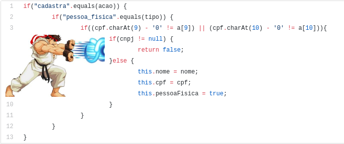

# Clean Code - Código nível Jedi

Então, o que é Clean Code e por que devemos seguir? Clean Code é um estilo de desenvolvimento que
tem por foco a facilidade para **escrever, ler e manter o código**.

Para ser um bom desenvolvedor de software em Java ou em qualquer outra linguagem além de estudar
bastante, deve-se dominar conceitos e convenções para deixar o código limpo legível e fácil de
ser mantido. Além disso, existem inúmeros motivos pelos quais se recomenda a adoção de boas
práticas no nosso dia-a-dia:

- Dificilmente um código será sempre mantido e evoluído pelo mesmo desenvolvedor.
Dessa forma, quanto melhor o código, menos tempo um segundo desenvolvedor gastará para entendê-lo;

- Produtividade da equipe aumenta! Facilitando a leitura, o entendimento e, certamente,
reduz a quantidade de treinamentos que deveriam ser feitos para alinhar o conhecimento;

- Reduz a quantidade de bugs, pois tende ser mais fácil de revisar e testar, além de fazer
o que promete, entregando valor ao cliente;

- Por fim, convenções padronizam um conjunto de práticas estabelecidas que são bem conhecidas
pelos desenvolvedores mais experientes na área ou até mesmo adotadas inconscientemente por
outros *devs*. Essas práticas servem de guia para os **Jovens Padawan**, a criar um corpo
de conhecimento e programar de maneira correta.

Sem mais delongas, seguem algumas dicas importantes e bem simples para manter seu código nível **Jedi**:

## 1. Nomear variáveis e métodos de forma descritiva

Para termos um código limpo, devemos nomear variáveis, funções, parâmetros, classes ou métodos de
acordo com suas funcionalidades. Isso é essencial para um bom entendimento do código. Logo, nada
de variável com nome *i* ou *x* para salvar a idade de uma pessoa ou de *aux* para nomear
uma variável com papel de auxiliar.

**Na definição, precisamos ter em mente dois pontos principais:**

- **Ser preciso:** precisamos passar a ideia central da nossa variável ou método, sem dar voltas,
sendo conciso e direto.

- **Tamanho dos nomes:** tente definir os nomes de forme descritiva, mesmo sendo um pouco grande
vai possibilitar melhor compreensão e futura manutenção do código.

*Obs: Não estrapole, mais de 50 caracteres pode se tornar um problema e pode não rodar
em alguns compiladores.

**Recomendação:**

- **Métodos ou Funções:** devem ter nome de verbos, para assim expressar quais são suas finalidades;
- **Classes e Objetos:** deve ser utilizado substantivos.

Além disso, não use “_” (underscore) em lugar algum exceto para constantes e valores de enums.
Não reuse o mesmo nome de variável na mesma classe em diferentes contextos. E outra coisa:
decida pelo uso de uma linguagem natural apenas, ou seja, só português ou só inglês.

Vamos a um exemplo, veja este código:

```java
BigDecimal a = b + c;
```

Ao visualizar esse código isoladamente não há como saber do que se trata. Ele está somando duas
variáveis com nomes que não fazem sentido e colocando seu valor em outra variável que também
não faz sentido.

Sempre utilize variáveis com nomes auto descritivos que se enquadram no contexto de seu código.
Exemplo:

```java
BigDecimal lucroLiquidoProduto = valorVendaProduto - valorCustoProduto;
```

**Obs: Evite nomes de classes genéricos**

Não usar nomes como: Processador, Utils ou Gerenciador por exemplo. Um nome genérico torna a
classe muito abrangente e isso pode gerar confusão quanto a sua responsabilidade, levando
os desenvolvedores a incluírem nela métodos que não deveriam estar ali. Já nomes
específicos tendem a gerar classes menores e mais organizadas.

## 2- Evite códigos "Hadouken". Simplifique-o

Quanto mais simples for, mais claro será o significado do que está sendo feito. Para termos um
código limpo, é necessário criar funções simples, pequenas, claras e com baixa complexidade,
evitando que o seu código parece ter sofrido um “Hadouken” (para quem não sabe,
é um código com muitos condicionais aninhados).



*Exemplo de código com condicionais aninhados. Favor, não seguir o exemplo.*

O nosso grande **Jedi** do Clean Code, Robert Martin, nos ensina o seguinte: as funções devem ter
apenas uma responsabilidade e que a cumpra da maneira mais simples possível. Assim um método
pode ser reutilizado quantas vezes for ser necessário em seu código, facilitando sua
manutenção à longo prazo.

## 3- Comente. Mas apenas o necessário!

Códigos são constantemente modificados, enquanto comentários, raramente. Assim, é comum um
comentário deixar de ter significado, ou pior ainda, passar um significado falso depois
de algum tempo. 

**Fato é:**

"*A maioria dos comentários serve apenas para justificar um trecho de código ruim. São como pedidos
de desculpas do desenvolvedor por não ter conseguido se expressar em código.*"

Portanto, pense duas vezes antes de escrever um comentário. Se você está prestes a explicar seu
código com comentários é porque, provavelmente, você fracassou em se expressar codificando.
Se isso for verdade, prefira refatorar. Deixe o código limpo e auto explicativo.

Não se explique com comentários:

```java
//Valida se o cliente possui benefícios
if ((cliente.Idade > 45 && cliente.Salario < enumValorSalarios.SalarioMinimo)
```

Se explique com código:

```java
if (cliente.PossuiBeneficios())
```

Entretanto, nem todos os tipos de comentários são ruins. Saber onde e quando aplicar um comentário
é uma ótima skill. Um comentário **bem** colocado pode salvar vidas.

Dois exemplos de bons comentários:

1º:

```java
//Essa importação demora algumas horas. Se iniciá-la, aguarde terminar,
//caso contrário a base de dados ficará inconsistente
ExecutaIntegracaoProdutosSAP();
```

2º:

```java
Regex regexTelefone = new Regex(@"^\(\d{2}\)\d{4}-\d{4}$"); // (99)9999-9999
Regex regexCPF = new Regex(@"^\d{3}\.\d{3}\.\d{3}-\d{2}$"); // 999.999.99
Regex regexCEP = new Regex(@"^\d{5}-\d{3}$"); // 99999-99
```

## 4- SOLID - Orientação a Objeto

**SOLID** é um acrônimo dos cinco primeiros princípios da programação orientada a objetos e design de código
identificados por Robert C. Martin. Introduzido por [Michael Feathers](https://michaelfeathers.silvrback.com)
após observar que os cinco princípios poderiam se encaixar nesta palavra. São eles:

  Letra | Sigla | Nome | Definição |
 -------|-------|------|-----------|
 S|SRP|Principio da Responsabilidade Única|Uma classe deve ter um, e somente um, motivo para mudar.
 O|OCP|Princípio Aberto-Fechado|Você deve ser capaz de estender um comportamento de uma classe, sem modificá-lo.
 L|LSP|Princípio da Substituição de Liskov|As classes base devem ser substituíveis por suas classes derivadas.
 I|ISP|Princípio da Segregação da Interface|Muitas interfaces específicas são melhores do que uma interface única.
 D|DIP|Princípio da inversão da dependência|Dependa de uma abstração e não de uma implementação.

Os princípios SOLID devem ser aplicados para se obter os benefícios da orientação a objetos, tais como:

* Seja fácil de se manter, adaptar e se ajustar às alterações de escopo;
* Seja testável e de fácil entendimento;
* Seja extensível para alterações com o menor esforço necessário;
* Que forneça o máximo de reaproveitamento;
* Que permaneça o máximo de tempo possível em utilização.

Utilizando os princípios SOLID é possível evitar problemas muito comuns:

* Código sem estrutura ou padrão;
* Dificuldades de isolar funcionalidades;
* Duplicação de código, uma alteração precisa ser feita em N pontos;
* Fragilidade, o código quebra facilmente em vários pontos após alguma mudança.

Os princípios SOLID deveriam ser aplicados por qualquer desenvolvedor experiente, porém pouquíssimos profissionais
preocupam-se em utilizá-los, para fins didáticos a criação de um sistema simples utilizando estes princípios
para treinar, será uma experiência gratificante.


## 5- DRY - Don’t repeat yourself

Para quem tem dificuldades com o inglês, essa expressão pode ser traduzida como *“Não repita a si
mesmo*”. Em outras palavras é “*Não copie e cole código indiscriminadamente*”. Logo,
não deve existir duas partes do *software* que desempenham a mesma função, ou seja,
o famoso copiar e colar no código.

O problema da repetição é que a medida que um sistema cresce, manter um código desse tipo gera
uma complexidade muito alta. O correto é utilizar o conceito de abstração no trecho de código
duplicado (extrair um método ou classe/interface, centralizando a implementação)
e reutilizá-lo onde for necessário.

## 6- Não usar negação no if se houver um else

É simples, você tem o seguinte código:

```java
if (!neoUser.isAdm())
    return "You have not permissions to see this content.";
```

Ele está perfeito. Entretanto surge a necessidade de alterá-lo, pois é preciso retornar uma outra
mensagem quando o visitante for administrador. Por ser a maneira mais intuitiva, normalmente
essa alteração seria feita da seguinte maneira:

```java
if (!neoUser.isAdm())
    return "You have not permissions to see this content.";
else
    return "Enjoy the content!";
```

É um detalhe simples, mas não há dúvidas (a não ser que você seja um adepto do
[Yoda Programming](https://en.wikipedia.org/wiki/Yoda_conditions))
que dessa maneira fica mais fácil de entender:

```java
if (neoUser.isAdm())
    return "Enjoy the content!";
else
    return "You have not permissions to see this content.";
```

## 7- Apenas uma responsabilidade por método

Exemplo: Um método chamado *checkPassword()* não deve validar um login ou iniciar uma sessão, e sim,
como o nome diz, apenas informar se a senha é válida ou não.

## 8- Otimize o código com recursos recentes da linguagem

Procure sempre estar atualizado com os recursos da versão mais atual da linguagem que você
trabalha. Especificamente em Java, que tem vários recursos e API’s que facilitam o
desenvolvimento e reduz a complexidade e o tamanho do código. Temos alguns ótimos
recursos que vale a pena ser comentados:

- **Lambda Expressions:** são recursos muito disseminados em linguagens funcionais e facilita muito
a vida do desenvolvedor. A grande vantagem das expressões lambda é reduzir a quantidade de código
necessária para se escrever funções. Basicamente, uma função lambda é uma função sem declaração,
isto é, não é necessário colocar um nome, um tipo de retorno e o modificador de acesso. A ideia
é que o método seja declarado no mesmo lugar em que será usado. Como exemplo, imagine um sistema
financeiro de uma empresa, em que precisamos ordenar as vendas do dia pelo número de parcelas.

```java
Comparator<Venda> comparador = (venda1, venda2) -> {
    return Integer.compare(venda1.getNumeroParcelas(), venda2.getNumeroParcelas()); 
};
```

Essa sintaxe utilizada no *Comparator* é a sintaxe do Lambda no Java 8.

- **Stream API:** traz classes e métodos novos para manipular coleções de maneira mais simples
e eficiente. Dentre as features mais interessantes da API de *collections* está o método
**stream()**, que possibilita encadear chamadas de métodos, dependendo das operações
que são necessárias para obter o resultado que queremos. Por exemplo, imagine o mesmo
sistema financeiro do exemplo acima, mas dessa vez precisamos filtrar todas as vendas à
crédito do dia.

Veja um exemplo de uma implementação com Java 7:

```java
public class TesteVendas {

  public static void main(String[] args){
    List<Venda> vendasDoDia = processaVendasDoDia();

    //Vendas do dia com apenas uma parcela
    for(Venda venda : vendasDoDia){
       if(venda.getNumeroParcelas() == 1) 
         System.out.println(venda.toString())
    }
  }
  
  private List<Venda> processaVendasDoDia(){
    
    List<Venda> vendas = new ArrayList<>();
    
    vendas.add(new Venda("PlayStation 4", 6)); //produto, numero de parcelas
    vendas.add(new Venda("Headset", 1));
    vendas.add(new Venda("Monitor", 3));
    vendas.add(new Venda("TV 40'", 10));
    
    return vendas;
  }
}
```

Agora, observe a mesma lógica feita com **stream()** do Java 8:

```java
public class TesteVendas {

  public static void main(String[] args){
    List<Venda> vendasDoDia = processaVendasDoDia();

    //Vendas do dia com apenas uma parcela
    vendasDoDia.stream().filter(venda -> venda.getNumeroParcelas() == 1).forEach(System.out::println);
  }
  
  private List<Venda> processaVendasDoDia(){
    
    List<Venda> vendas = new ArrayList<>();
    
    vendas.add(new Venda("PlayStation 4", 6)); //produto, numero de parcelas
    vendas.add(new Venda("Headset", 1));
    vendas.add(new Venda("Monitor", 3));
    vendas.add(new Venda("TV 40'", 10));
    
    return vendas;
  }
}
```

Consegue perceber que código fica bem mais enxuto?

- **Date and Time API:** lidar com datas nas versões mais antigas do Java nem sempre era uma tarefa
simples e no decorrer dos anos algumas boas bibliotecas foram criadas para contornar problemas
típicos de conversão e precisão. Na versão 8, uma API mais poderosa foi criada, baseada na famosa
biblioteca JodaTime. O novo pacote, denominado de **java.time**, possui várias classes para
trabalhar com objetos que armazenam apenas datas, horas ou mesmo ambos de forma simultânea.

Por exemplo, queremos representar uma data e hora no fuso horário de São Paulo.

```java
public class TesteDateTime{
  
    public static void main(){
      //Usamos o ZonedDateTime

      ZoneId fusoHorarioSP = ZoneId.of("America/Sao_Paulo");
      ZonedDateTime agoraSP = ZonedDateTime.now(fusoHorarioSP);
      System.out.println(agoraSP); //2019-07-26T20:15:57.838-03:00[America/Sao_Paulo]
    }
}
```

- ***Default Methods:*** introduz possibilidade de termos métodos concretos em interfaces, por meio
do uso do modificador *default*. Dessa forma, esses métodos podem ser herdados por qualquer classe
que implemente interfaces com essas características.
Veja a implementação da interface *TimezoneCliente*:

```java
public interface TimezoneCliente {
    
    default ZonedDateTime getZonedDateTime(String zona) {
        return ZonedDateTime.of(getLocalDateTime(), getZoneId(zona));
    }
}
```

Perceba que posso estender essa interface para criar outra para tratar casos em que o *timezone*
é inválido.

```java
public interface TimezoneInvalidaDoCliente extends TimezoneCliente{
    default public ZonedDateTime getZonedDateTime(String zona) {
        try {
            return ZonedDateTime.of(getLocalDateTime(),ZoneId.of(zona)); 
        } catch (DateTimeException e) {
            System.err.println("Timezone inválido: " + zona +"; utilizando o timezone default.");
            return ZonedDateTime.of(getLocalDateTime(), ZoneId.systemDefault());
        }
    }
}
```

## 9- Programação defensiva

Um bom desenvolvedor deve ser pessimista, sempre pensar no pior cenário e se preparar para lidar
com os problemas que eventualmente podem acontecer.

Em Java, os recursos mais comuns para lidar com erros são as **Exceptions** e a utilização do
**try-catch**.

### 9.1- Exceptions 

As exceptions são recursos que indicam que naquele método pode ocorrer um fluxo diferente do
previsto. Por exemplo, tentar atualizar um objeto em um trecho de código em que ele é nulo
ou tentar inserir uma variável do tipo texto em uma numérica.

### 9.2- try-catch

O try-catch serve para capturar as exceções. Uma boa prática em uma implementação com try-catch,
é utilizar o *finally*, principalmente se o seu trecho de código utiliza algum recurso de conexão
com o banco de dados ou utiliza *buffer* para leitura e escrita em arquivos, pois é muito útil
para liberar recursos do sistema. A função do *finally* é sempre executar o trecho de código
dentro dele, mesmo que uma exceção seja lançada.

Veja o exemplo a seguir:

```java
try {
  // código a ser executado
catch (Exception e) {
	// tratamento da exceção
    log.error(e.getMessage(), e);
} finally {
  //código a ser executado mesmo que uma exceção seja lançada
}
```

Para várias trativas podemos fazer o seguinte:

```java
try {
  // código a ser executado
catch (NoSuchMethodException e) {
	// tratamento da exceção
    log.error(e.getMessage(), e);
}
catch (IllegalArgumentException e) {
	// tratamento da exceção
    log.error(e.getMessage(), e);
}
catch (IllegalAccessException e) {
	// tratamento da exceção
    log.error(e.getMessage(), e);
}
catch (InvocationTargetException e) {
	// tratamento da exceção
    log.error(e.getMessage(), e);
}
finally {
  // código a ser executado mesmo que uma exceção seja lançada
}
```

### 9.3- retorno de null

Para evitar erros no seu código não utilize  “**null**”, tanto como parâmetro, quanto para retorno
em funções. Na maioria das vezes, essas implementações exigem verificações desnecessárias que,
uma vez esquecidas, provocam erros no processo.

Para melhor uso da Programação Defensiva leia o tópico de **API de Logs**

## 10- Refatoração

Refatoração é um processo que melhora o design e a estrutura interna de um código sem alterar seu comportamento externo.
Visa tornar o código mais limpo, tornando-o mais fácil de entender, mais barato e rápido de manter,
minimizando a chance de introdução de bugs.

Refatorar permite limpar o código com técnicas eficientes e bem controladas. Nesse processo, são realizados pequenos
passos em sequência que podem ter um efeito cumulativo de melhorar o design do código de forma significativa.
Com a refatoração é possível ir atingindo um design melhor de forma mais natural,
enquanto o software é construído e evoluído.

### 10.1- Por que refatorar?

Conforme as pessoas alteram o código sem ter um entendimento mais profundo do design, a estrutura do código vai
sendo quebrada. A cada nova manutenção o design vai se tornando mais pobre e a leitura do código vai ficando
mais complexa. Refatorar melhora continuamente o design do software,
não deixando ele se degradar ao longo de sua evolução.

Sendo assim, um dos pontos mais relevantes é que refatorar ajuda a evoluir o código mais rapidamente.
O desenvolvedor consegue entender mais rápido onde alterar o software e, como muitos bugs são evitados,
acaba perdendo menos tempo corrigindo bugs, logo, mais produtividade.

### 10.2- Quando a refatoração deve ser feita?

* **Quando for adicionar uma nova funcionalidade**: No processo de entendimento do código para adição de funcionalidades,
a refatoração auxilia agilizando o entendimento e evitando os impactos e efeitos colaterais no código.

* **Processo de correção ou ajuste**: O fato de ser encontrado um bug já demonstra que o código não possui a
legibilidade necessária para que o bug fosse visto anteriormente.

* **Quando for revisar o código**: A refatoração é uma das principais ferramentas para melhorar o entendimento
do código. Dessa forma ele facilita bastante o processo de revisão, aumentando o entendimento
e facilitando a busca por pontos de melhoria.

## 11- Pensamentos adotados

* Estar sempre atento a erros;

* Frontend menos dependende das libs do fusion;

* Testes, testes e mais testes;

* Alimentar o SDK de Serviços (para reaproveitamento das funções).

## 12- Perguntas que auxiliam  o clean code

O novo código…

* se adequa a arquitetura existente?

* segue SOLID, DRY ou outros paradigmas de projeto que o time adota?

* utiliza padrões de projetos adequados?

* está no lugar certo?

* reutiliza algo já existente no projeto ou introduz duplicação de código?

* adiciona complexidade desnecessária?

* Os nomes (campos, variáveis, parâmetros, métodos e classes) refletem no que eles representam?

* É possível entender o que o código faz apenas lendo ele?

* É possível entender e testar todas as partes do *software*?

## 13- Conclusão

**Citação para finalizar:**
```
“Tornar seu código legível é tão importante quanto torná-lo executável.” – Robert Cecil Martin
```

**Referências:**

1. Código Limpo: Habilidades Práticas do Agile Software (Robert C. Martin, 2011)

2. Java Code Conventions (http://www.oracle.com/technetwork/java/codeconventions-150003.pdf)

3. https://leanpub.com/whattolookforinacodereview

4. http://butunclebob.com/ArticleS.UncleBob.PrinciplesOfOod

5. https://martinfowler.com/books/refactoring.html

6. http://wiki.c2.com/?GangOfFour

7. https://www.sonarqube.org