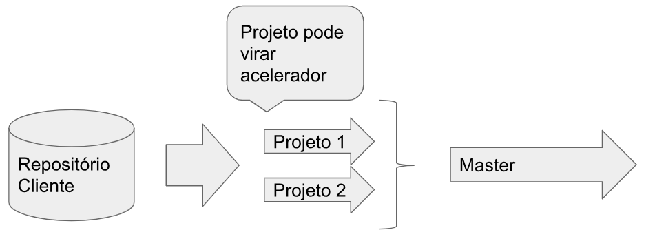
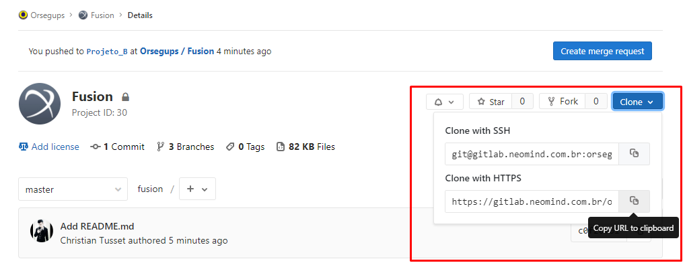
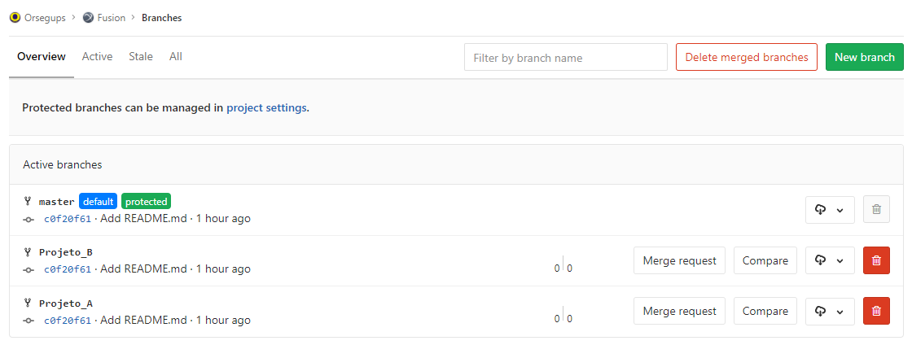

# Equipe de Serviços - Padronização e boas práticas

## Pré-requisitos

Para começar a utilizar o git, será necessário seguir os tópicos anteriores de 
instalação/configuração do ambiente e comandos básicos.

## Começando

Cada cliente deverá possuir um grupo no
[Git da Neomind](https://gitlab.neomind.com.br/).

Este grupo por sua vez terá todos os projetos referente ao cliente no repositório, incluindo o
projeto do `Fusion`.

## Estrutura dos Projetos

Na nova estrutura adotada por Serviços, existe algumas mudanças quando comparada a antiga:

* Master: é o projeto principal, o corpo de desenvolvimento, originando-se desde
o início do projeto até o mais recente. Importante ressaltar aqui que a **master deve ser a versão
mais estável**, ou seja, aquela que o cliente está utilizando em Produção.

* Branches: Uma cópia do código derivado de um determinado ponto da **Master**, onde é usado para
aplicar grandes alterações ao código, preservando a integridade do código no tronco. Se as
principais mudanças funcionarem de acordo com o planejado, elas devem ser mescladas
de volta a Master.

* Tags: Um ponto no tempo na Master/Branch que seja importante preservar. Este ponto pode existir
 por exemplo em uma mudança de Versão, onde a Master (da versão antiga) se torna Tag e a mais
  recente continua sendo a Master.


## Master Bloqueada?

Sim, a **Master** é bloqueada para Commits/Push, aceitando apenas 
[Merge requests](https://docs.gitlab.com/ee/gitlab-basics/add-merge-request.html).

Nos tópicos a seguir é explicado como deve ser o processo de desenvolvimento.

## Como desenvolver?

Agora que entendemos um pouco da estrutura, como funciona o processo de desenvolvimento?



## Clonando o projeto

Para iniciar, primeiramente clone o projeto desejado, clicando no botão *Clone > Clone por HTTPS
ou SSH*.



*Obs: No caso do SSH é necessário [Criar](https://docs.gitlab.com/ee/ssh/) e 
[Configurar](https://docs.gitlab.com/ee/gitlab-basics/create-your-ssh-keys.html) uma chave SSH.

Comando:

```powershell
git clone https://gitlab.neomind.com.br/cliente/fusion.git
```

## Criando/Editando o Projeto

Após o clone do projeto, será o desenvolvimento de uma nova funcionalidade (feature) ou Edição?

### Criação

* Crie uma [Nova Branch](https://docs.gitlab.com/ee/gitlab-basics/create-branch.html) com o nome
dessa nova funcionalidade;
* Desenvolva a função;
* Testes e Validação do Cliente;
* Merge Request para a Master.

Comando para criar nova branch:
```powershell
git checkout -b nome-da-branch
```

### Editar

* Faça o checkout da Branch desejada;
* Efetueu as alterações;
* Testes e Validação do Cliente;
* Merge Request para a Master.

Comando para editar uma branch em específico:
```powershell
git checkout nome-da-branch
```

## Resultado

O resultado será algo semelhante:

