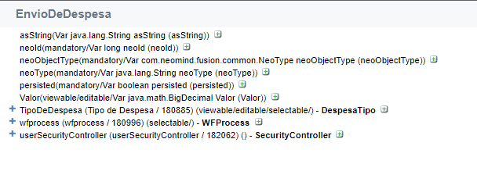
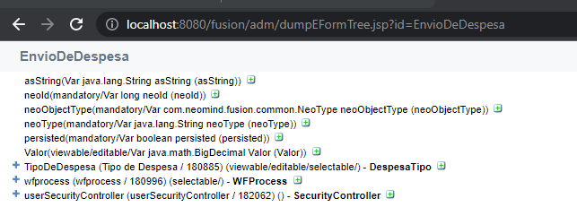
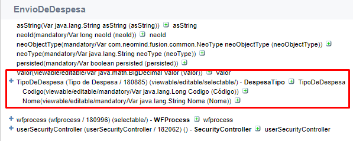
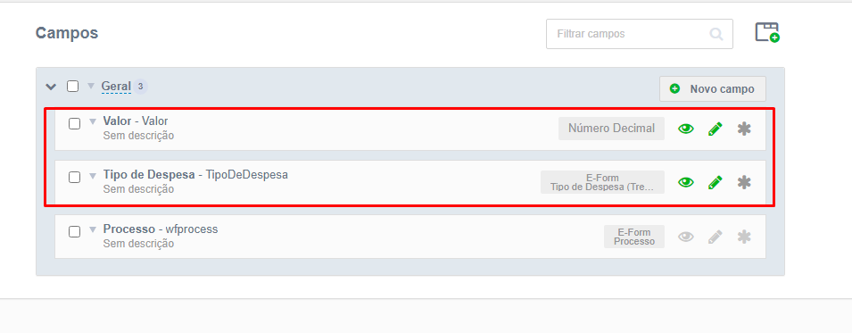
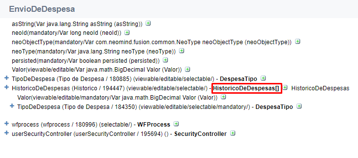

# Dump de formulários

### 1. Finalidade

O dump de formulário é um ótimo recurso visual para acessar os dados de um formulário, com ele é possível analisar todos os campos do formulário desejado, os tipos dos campos, se são listas ou não, as classes dos campos, entre outras coisas.

*Dump do formulário de envio de despesas.*

### 1.1 Como acessar

O acesso ao dump é feito via url, após o caminho raiz do fusion, acrescente */adm/dumpEFormTree.jsp?id={id do fomulário desejado}*. Por exemplo, se o endereço configurado do Fusion estiver como *http://localhost:8080/fusion/portal*, e você quiser acessar o dump do formulário de Envio de Despesa, a url seria *http://localhost:8080/fusion/adm/dumpEFormTree.jsp?id=EnvioDeDespesa*. 

*Exemplo de URL para acessar o dump.*

### 1.2 Analisando o dump

Os seguintes itens são padrões de todos os formulários, eles definem algumas configurações dos formulários:

*Campos de configurações dos formulários.*

Os outros 2 campos restantes representam os campos criados no formulário principal.

*Campos do formulário de Envio de Despesa.*

E compare com os campos do mesmo formulário na central de formulários

*Campos do formulário.*

Comparando as duas imagens é possível perceber que:

- Os dois campos do formulário de Envio de Despesa(**Valor** e **TipoDeDespesa** estão presentes)
- É possível analisar varias informações sobre os campos, como:
- Classe Java dos campos
- Se são visíveis, selecionáveis ou editáveis
- Nome e código

Também é possível verificar se campos são do tipo lista, pela representação de um par de colchetes (**[]**)

*Representação de campos tipo lista.*