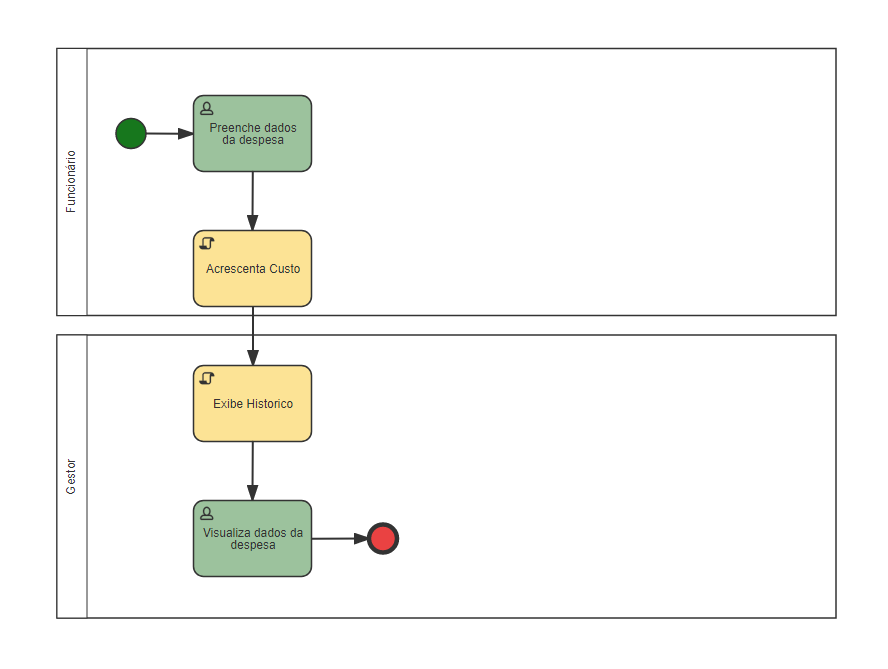
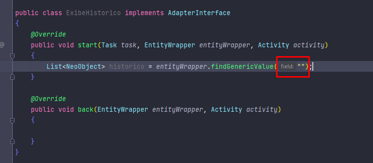
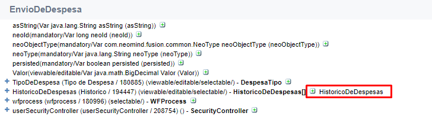
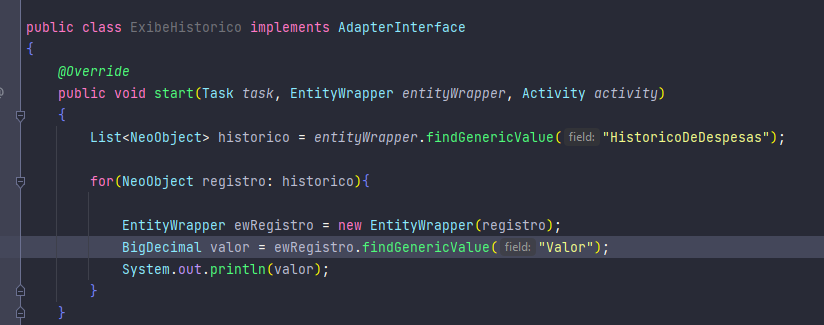
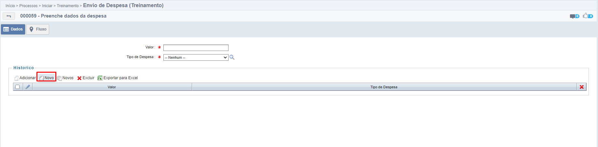
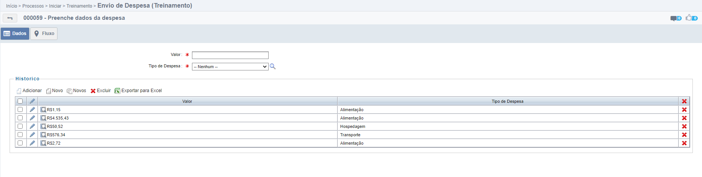
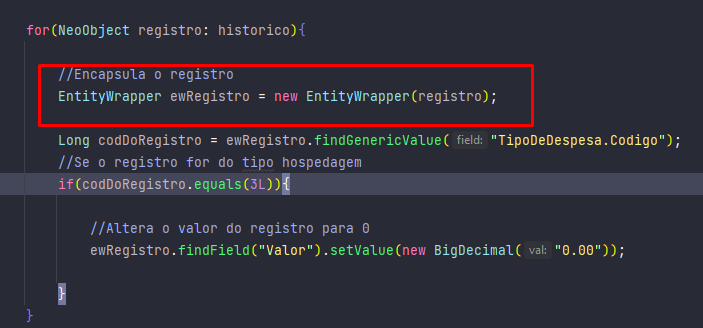

<!--# EntityWrapper

Para um melhor entendimento do EntityWrapper, a próxima funcionalidade do processo de Envio de Despesa será iterar sobre o campo de histórico e printar todos os registros do histórico no console, não se preocupe com a exibição dos dados no navegador por hora.

- Crie a atividade Script **Exibe Historico**.

- Crie a classe **ExibeHistorico**

- Insira o caminho da classe java **ExibeHistorico** no adapter

*Adapter Exibe Historico na Modelagem.*

Agora na classe java:

*Classe ExibeHistorico.*

E agora, qual era mesmo o código do campo de histórico do formulário principal?

Vamos utilizar o Dump para descobrir!

*Dump do EnvioDeDespesas.*

Pronto! Agora que temos o código do campo, vamos voltar ao histórico

*Classe ExibeHistorico.*

Então, para iterar sobre um campo tipo lista do formulário principal, é preciso:

- Receber o valor do campo através do método findGenericValue, e, como o campo é tipo lista, a variável no java também deve ser *List*.

- Ao iterar por cada NeoObject da lista, realizar o encapsulamento utilizando o método construtor da classe EntityWrapper, passando como parâmetro o objeto atual da lista

Após, recebemos o valor do campo **Valor** do objeto encapsulado, e em seguida printamos o valor

Execute o processo e insira alguns valores no campo historico.

*Adicionando registros ao histórico.*

*Registros adicionados.*

Ao enviar, é possível ver os resultados aparecerem no console da IDE.

*Valores no console.*

- Recebemos o **Valor** do nosso processo

- Verificamos se o valor é maior que 1000 utilizando o método [BigDecimal compareTo()](https://www.geeksforgeeks.org/bigdecimal-compareto-function-in-java/), pois como o valor é um objeto BigDecimal, não podemos utilizar operadores nativos **(<, >, ==, <=, e =>)**

- Se **Valor** > 1000, são recebidos os dados do formulário **Histórico de Despesas**

- Para cada registro no **Histórico de Despesas**, se o codigo do registro for **3 (Hospedagem)** 

- O valor desse registro será alterado para zero

Perceba como é usado o **new EntityWrapper** para encapsular cada registro dentro da lista de Histórico, dessa maneira podemos alterar cada registro separadamente conforme a necessidade, pois **NÃO** é possível trabalharmos com List EntityWrapper e nem setar wrappers em NeoObjects

*new EntityWrapper.*

-->