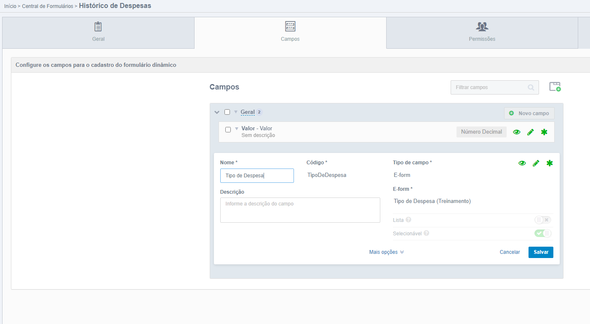
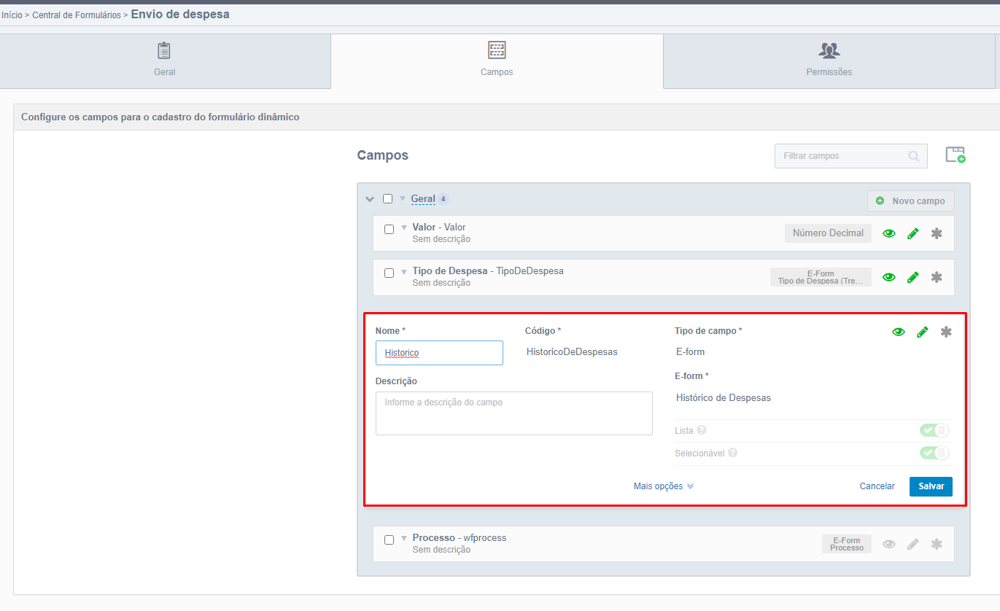
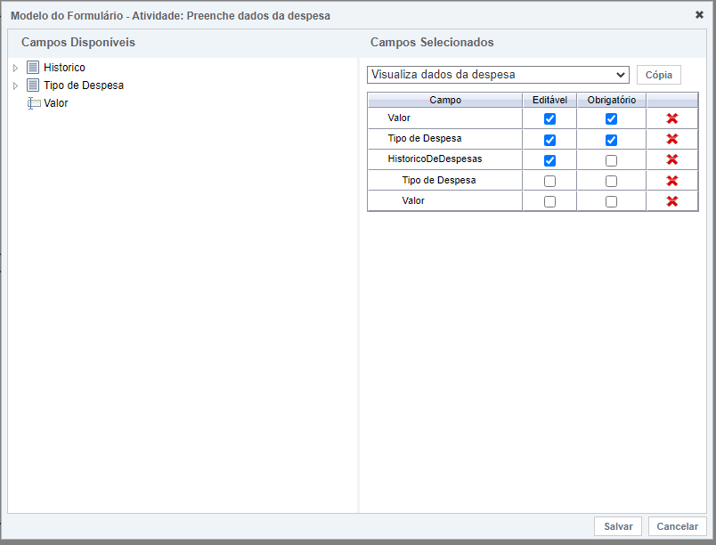

# Trabalhando com listas

## Criando um form do tipo lista
Para visualizar o funcionamento de campos tipo lista, vamos criar um formulário de histórico de despesas, que consiste em uma lista das despesas geradas, e a cada despesa salva, será criado um registro no histórico salvando essa despesa. Lembrando que os campos do formulário de histórico deve ter as mesmas configurações dos campos correspondentes do formulário de Envio de Despesas.

Então vamos:

- Criar o formulário de *Histórico de Despesas*



*Criando formulário de histórico.*

- Criar um campo no formulário principal do tipo E-Form *Histórico de Despesas*, lista sim, selecionável sim. 



*Criando campo do formulário de histórico.*

Agora na modelagem, vamos inserir o novo campo de histórico tanto na atividade **Preenche dados da despesa** como na **Visualiza dados da despesa**.



*Inserido o campo Histórico nas atividade de usuário.*

## Configurando processo 

Para um melhor entendimento do EntityWrapper, a próxima funcionalidade do processo de Envio de Despesa será iterar sobre o campo de histórico e printar todos os registros do histórico no console, não se preocupe com a exibição dos dados no navegador por hora.

- Crie a atividade Script **Exibe Historico**.

- Crie a classe **ExibeHistorico** no **java**.

- Insira o caminho da classe java **ExibeHistorico** no adapter


*Adapter Exibe Historico na Modelagem.*

## Utilização do entity wrapper

Agora na classe java:


*Classe ExibeHistorico.*

E agora, qual era mesmo o código do campo de histórico do formulário principal?

Vamos utilizar o Dump para descobrir!


*Dump do EnvioDeDespesas.*

Pronto! Agora que temos o código do campo, vamos voltar ao histórico


*Classe ExibeHistorico.*

Então, para iterar sobre um campo tipo lista do formulário principal, é preciso:

- Receber o valor do campo através do método findGenericValue, e, como o campo é tipo lista, a variável no java também deve ser *List*.

- Ao iterar por cada NeoObject da lista, realizar o encapsulamento utilizando o método construtor da classe EntityWrapper, passando como parâmetro o objeto atual da lista

Após, recebemos o valor do campo **Valor** do objeto encapsulado, e em seguida printamos o valor

Execute o processo e insira alguns valores no campo historico.


*Adicionando registros ao histórico.*


*Registros adicionados.*

Ao enviar, é possível ver os resultados aparecerem no console da IDE.


*Valores no console.*

## Como NÃO fazer

Não tente acessar um campo dentro da lista diretamente:

```
BigDecimal valor = entityWrapper.findGenericValue("HistoricoDeDespesas.Valor");
```

É necessário obter o campo lista em um array List\<NeoObject\> e iterar sobre ele para pegar a informação desejada.