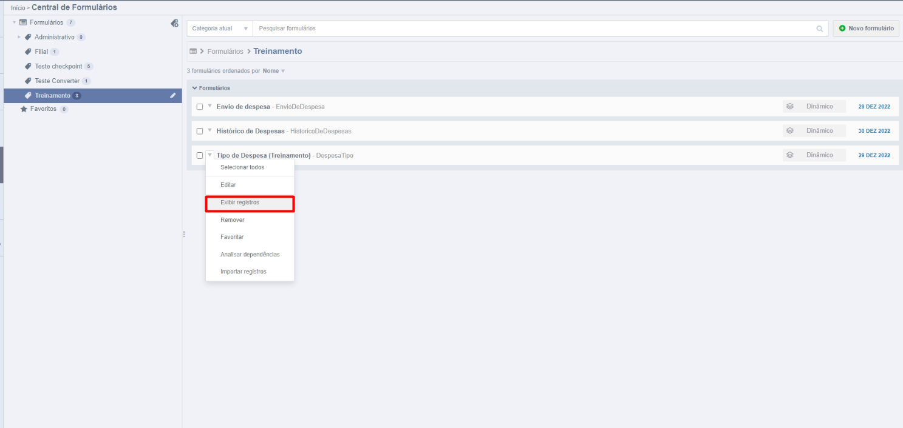
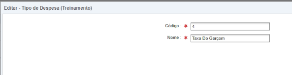
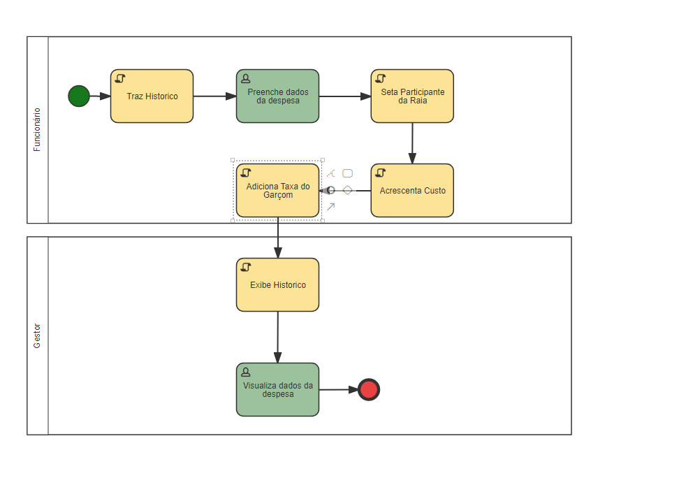
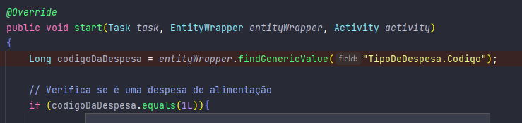
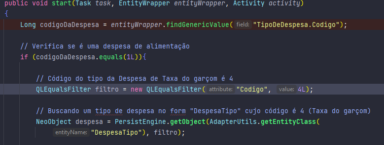
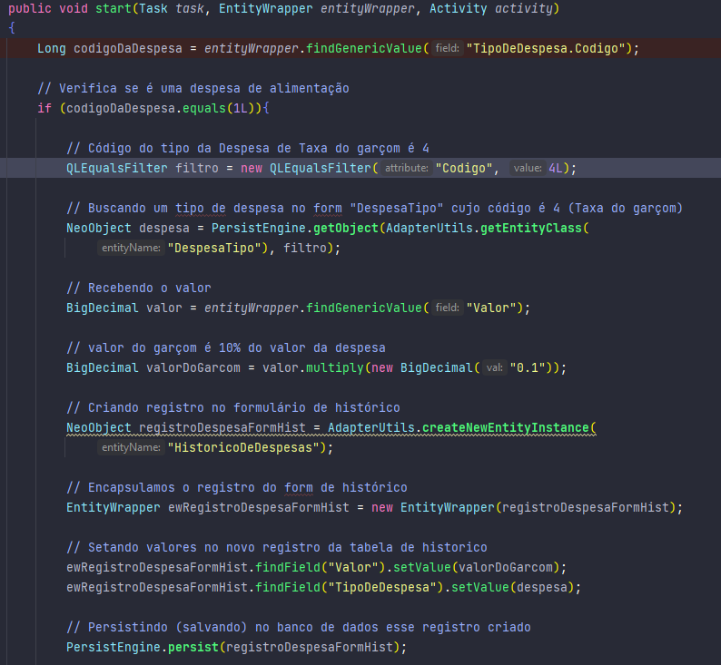

# Criando um Registro Via Adapter

Nosso proximo objetivo será criar uma despesa fixa, sempre que o funcionário enviar uma despesa do tipo alimentação, será enviada via adapter uma outra despesa junto, que é a taxa do garçom, de 10% do valor da despesa de alimentação.

## Configurarando um novo tipo de despesa no formulário

- Primeiramente vamos ao nosso formulário de tipo de despesas, e criar um novo tipo chamado "*Taxa do garçom*".

*Caminho para o form *Tipo de Despesa.*

*Criação do tipo de despesa "Taxa do Garçom".*

## Configurando a modelagem do processo

Agora vamos a modelagem do processo, precisamos então:

- Criar a atividade de script "*Adiciona Taxa do Garçom*".

- Criar a classe "*AddTaxaGarcom*" no **java**.

- Adicionar o caminho da classe *java* a atividade.

- Salvar, validar e liberar o processo

*Atividade de script de Taxa do Garçom na modelagem do processo.*

## Criando novo registro no java

Agora na classe Java:

*Validando o código do tipo da despesa.*

- Primeiramente, recebemos o valor do código do tipo da despesa. Para acessar valores de um campo de um E-form, basta acrescentar um "." após o nome do campo E-form, como no exemplo acima "*TipoDeDespesa.Codigo*", lembrando que números inteiros para o Fusion são objetos *Long*. 

- Verificamos se o tipo da despesa é alimentação (código = 1).

*Buscando o registro no banco.*

- Instanciamos um filtro de campo "*Codigo*" igual a "*4*", pois o registro que queremos criar é do tipo de despesa "*Taxa do Garçom*", cujo código é o 4.

- Trazemos o registro como um objeto do tipo NeoObject utilizando o *PersistEngine.getObject* passando como primeiro argumento o nome do formulário, e como segundo argumento o filtro criado acima. Utilizamos o *AdapterUtils.getEntityClass* pois a tabela não é uma tabela padrão do fusion.

*Obtendo taxa do garçom.*

- Obtemos a taxa do garçom multiplicando o valor do campo "*Valor*" do formulário principal por 0.1 (10%), utilizando o método [multiply](https://www.geeksforgeeks.org/bigdecimal-multiply-method-in-java/) da classe BigDecimal.

*Criando o registro no form de histórico.*

- Criamos o registro da despesa de taxa do garçom no formulário de histórico (*"HistoricoDeDespesas"*) utilizando o *AdapterUtils.createNewEntityInstance* passando como parâmetro o nome do formulário que desejamos criar o registro (*"HistoricoDeDespesas"*).

- Encapsulamos utilizando o construtor da classe *EntityWrapper* passando como parâmetro esse registro criado.

- Persistimos (salvamos) no banco de dados o registro criado.

Porém, não adicionamos o valor ao campo relacionado ao histórico, dessa maneira, quando o gestor receber a atividade, não poderá visualizar esse registro, então vamos adicionar o novo registro criado ao **campo** do histórico de despesas do formulário principal.

*Adicionando o registro ao campo do histórico.*

Agora execute o processo e veja que quando enviada uma despesa do tipo de alimentação, é criado um registro de 10% do valor da despesa tanto no formulário de histórico quanto no campo de histórico.