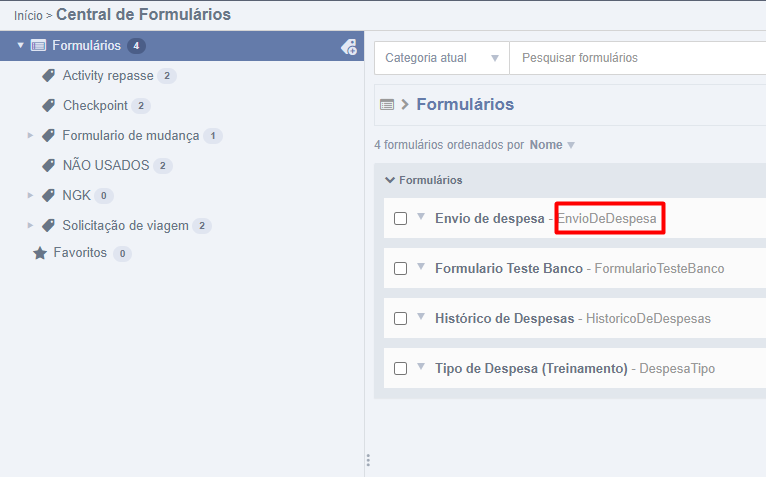
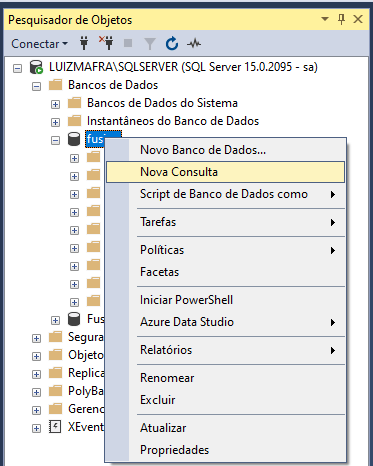
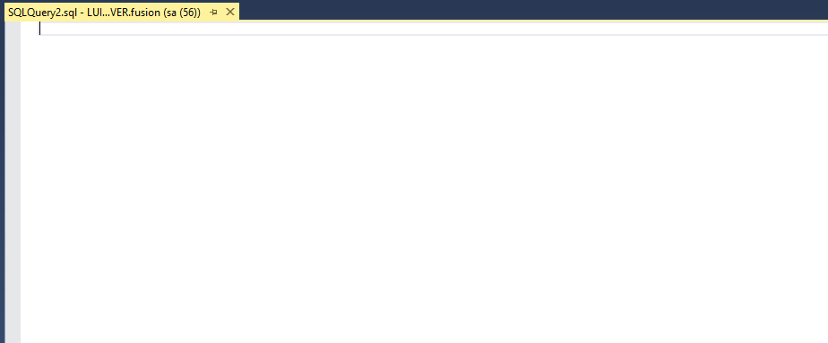
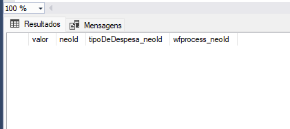
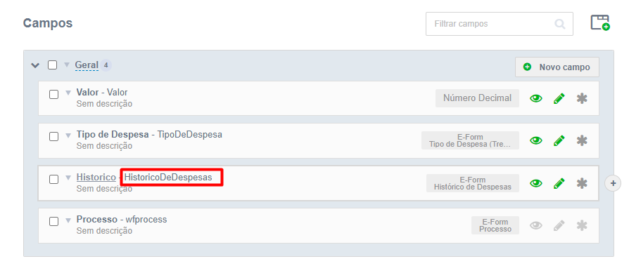
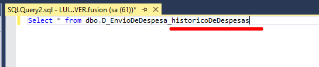
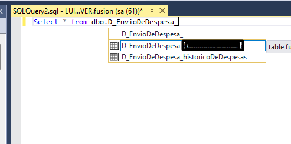
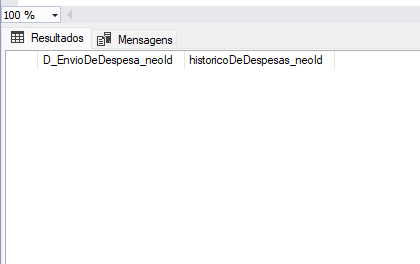

Ao trabalharmos com aplicações ou serviços orientados a objetos que utilizam o banco de dados para guardar informações, estamos relacionados à [ORM(Object-Relational Mapping)](https://www.devmedia.com.br/orm-object-relational-mapper/19056). Com essa técnica do mapeamento objeto relacional conseguimos aproximar a orientação objeto ao paradigma do banco de dados.

E no *Fusion* por utilizarmos o Hibernate, usamos esta técnica para conciliar o POO com o banco de dados. Ou seja para cada formulário, processo e entre outras coisas que criamos dentro do *Fusion*, também é criado no banco de dados.

Além de podermos visualizar os campos do formulário dentro do *Fusion* podemos ver os mesmos dentro do Banco de dados.

Vale ressaltar que para cada campo no formulário do *Fusion* é criado uma coluna dentro da tabela relacionada ao formulário no banco de dados. Entretanto se for um campo do tipo **lista**, é criado uma nova tabela.

## 1. Visualização de campos NÃO lista

Inicialmente precisamos procurar pelo código do nosso formulário e para realizar esta etapa basta procurar onde está nosso formulário dentro do *Fusion* e pegar esse código.



Em seguida abriremos o nosso banco de dados e selecionaremos o banco do nosso ambiente, clicaremos com o botão direito e vamos selecionar a opção de **Nova Consulta**.



Quando selecionamos esta opção, ele irá abrir um página para digitação do lado direito e é nela que vamos procurar a tabela do nosso formulário.



Para fazermos isto basta digitar o seguinte:
```
SELECT * FROM dbo.D_CodigoDoFormulário
```
No lugar de **CodigoDoFormulário** substitua pelo código do formulário que você pegou anteriormente.

Então na nossa página de consulta deverá estar escrito desta forma, se estiver corretamente basta clicar em **Executar**.

 

Em seguida na parte inferior, irá aparecer uma outra telinha onde irá mostrar as colunas referente aos campos criados no *Fusion*.



!!! info
    Veja que temos uma coluna chamada **neoId**, esta coluna não aparece e nem foi criado no nosso formulário do Fusion, porém essa é a nossa chave que faz a ligação(Ou identificador) do formulário do Fusion com o do banco de dados.

Essa é a forma em que visualizamos as colunas e os registros(Se tiver algum) do Fusion em nosso banco de dados.

## 2. Visualização de campos com um tipo lista

Como foi dito inicialmente, se tivermos um campo do tipo **lista** em nosso formulário ele irá criar uma tabela nova, entretanto essa tabela é relacionada com a tabela do formulário onde está este campo.

E para acharmos as colunas e registros de um campo do tipo lista no nosso banco de dados, é simples também. A única diferença é que quando estamos inserindo a nossa nova consulta, devemos passar também no final o código do campo do tipo lista.

Para acharmos o código basta clicar no formulário selecionado que em seguida irá aparecer todos os seus campos. Em seguida ache o campo que contém o tipo lista e o copie.



Em seguida abriremos nosso banco de dados e iremos iniciar uma nova consulta, conforme foi feito em [Visualização de campos NÃO lista](form-in-database.md). Iniciaremos a digitar nossa consulta desta forma:
```
SELECT * FROM dbo.D_EnvioDeDespesa_CodigoDoCampoLista
```
!!! warning
    Note que eu estou utilizando o código do formulário **Envio de despesa**, informe o código a sua utilização!!

No lugar do **CodigoDoCampoLista** devemos substituir pelo *código do campo lista*.



Clique em **Executar**.

!!! info
    **Se por acaso der algum erro nesta etapa, tente a próxima forma para colocar o código do campo lista.**


Note que também podemos utilizar o **auto-complete** do BDA para procurar o código do campo lista. Basta fazer assim:

```
SELECT * FROM dbo.D_EnvioDeDespesa_
```

Antes de digitarmos o código, iremos segurar o botão **CRTL** e em seguida iremos apertar o botão **SPACE** do nosso teclado. Em seguida irá abrir algumas opções de tabelas, e com as setas do teclado navegue até encontrar o código do seu campo.



Clique em **Executar**.

Independente da forma que você escolher para buscar o código do campo do tipo lista, o resultado será o mesmo. Ou seja, ele irá trazer as colunas e registros referentes á aquele campo.




