# Trazendo Objetos do Banco de Dados

A próxima funcionalidade do processo de Envio de Despesas que implementaremos será a seguinte: Cada vez que iniciado um novo processo, será exibido para o funcionário e o gestor o histórico dos gastos anteriores.

Para a manipulação do banco de dados, é utilizada a classe PersistEngine, com ela podemos fazer modificações em registros e tabelas do banco de dados. No momento, utilizaremos o método getObject, para visualizar o seu funcionamento...

- Crie o Adapter **Traz Historico** na modelagem do processo.

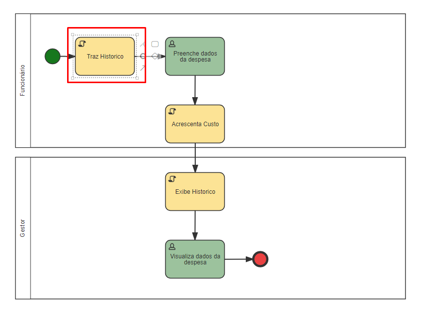

*Adapter Traz Historico na modelagem.*

- Crie a classe Java **TrazHistorico** e implemente a interface *AdapterInterface*.

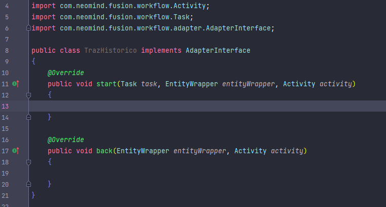

*Classe TrazHistorico.*

- Adicione o caminho da classe ao adapter na modelagem.

Antes de desenvolvermos nossa feature de fato, vamos entender o funcionamento desse método.

Utilizando a ferramenta de auto-complete de nossa IDE, é possível observar que existem duas assinaturas para o método *getObject*.

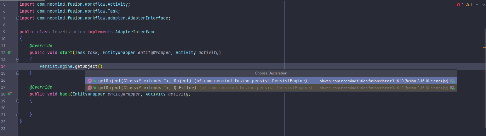

## *Assinatura do método getObject.*

A primeira assinatura do método recebe 2 argumentos, uma classe, que representa uma tabela do banco de dados, e um filtro. Utilizaremos o NeoId do registro para efetuar a busca.

- Acesse o SSMS do SQLServer e execute a seguinte consulta:

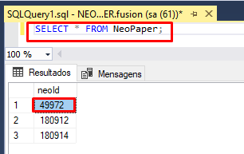

*Consulta no SSMS.*

Com o NeoId do registro, podemos utiliza-lo para trazer esse objeto NeoPaper, sendo possível ver o retorno no console.

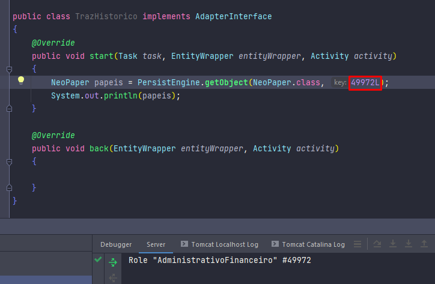

*Exemplo de getObject com NeoPaper.*

Repare que o primeiro argumento é a classe do objeto que se deseja trazer (podendo ser NeoPaper, NeoUser, ou outras tabelas padrões do fusion), e so segundo, o NeoId, que foi adquirida através de uma consulta no banco de dados.

Vamos agora trazer o histórico para nosso processo, como nosso histórico retornará vários objetos ao invés de um, usaremos o ***getObjects***, pois esse método retorna vários registros. Esse método também possui diversas assinaturas, mas vamos abordar por hora sua assinatura mais simples,  que recebe apenas uma classe.

Implemente:

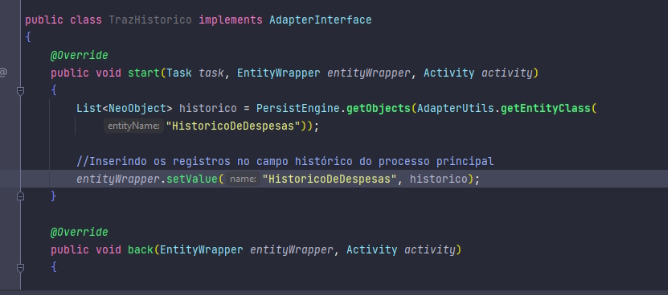

*Exemplo de getObject.*

É possível verificar que:

- Como o formulário *HistoricoDeDespesas* não é um formulário padrão do Fusion, é passado como parâmetro o *AdapterUtils.getEntityClass(HistoricoDeDespesas)*, essa é a maneira de buscar formulários que não são padrões do sistema.

- O retorno é armazenado em uma lista de NeoObjects, ou seja, vários registros (no caso, todos) foram trazidos.

- Esse retorno é inserido no campo *HistoricoDeDespesas* do form principal, utilizando o método setValue.

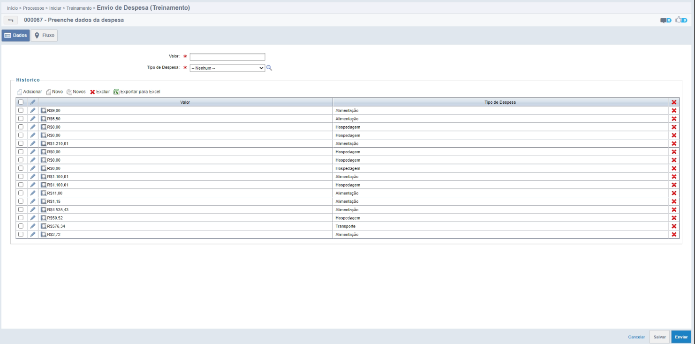

*Histórico das Despesas.*

!!! info
    Caso seja necessário adicionar apenas um registro a um campo do tipo lista, utilize o método ***addValue()*** ao invés de ***setValue()***

Veja o ***PersistEngine.getObjects()*** como um select no banco de dados. Por exemplo:

```java
    PersistEngine.getObjects(NeoPaper.class);
```

- A sentença acima é equivalente a:

```sql
    SELECT * FROM NeoPaper;
```

Trazendo todos registros da tabela NeoPaper.

Utilizando a outra assinatura do método ***getObject***:

```java
    PersistEngine.getObject(NeoPaper.class, 49972L);
```

- Com a segunda assinatura, a sentença equivale a consulta SQL:

```sql
    SELECT * FROM NeoPaper WHERE neoId = 49972;
```

Lembrando que números inteiros no fusion são números *Long* em Java;

## Segunda assinatura do método getObeject

A segunda maneira de utilizarmos os métodos ***getObject*** e ***getObjects*** é fazemos uma consulta no banco de dados pelo próprio Java, utilizando um filtro da classe ***QLFilter***.

Para ter uma ideia melhor de como isto funcionaria usando o getObject, vamos supor o seguinte cenário:

*"Estou precisando pegar um papel especifico para definir que apenas as pessoas que participam deste papel, são as pessoas que vão poder receber e/ou dar continuidade na atividade."*

### 1.1 Primeira etapa

<p id="etapa1">Inicialmente precisaremos criar um campo novo no nosso formulário principal de <b>Envio de despesa</b>.</p>

Ele terá as seguintes configurações:

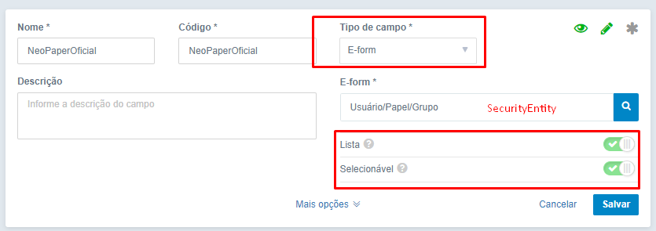

!!! info
    Invés de usarmos o NeoPaper, usaremos o SecurityEntity por ser o mais genérico possível já que ele abrange um Papel,Grupo e Usuário.

    Outro motivo é que o backend tem um pequeno bug na qual conseguimos adicionar valores usando apenas o SecurityEntity, ou seja, se for utilizar um NeoPaper,NeoGroup,NeoUser provavelmente ele vai dar erro.

### 1.2 Segunda etapa

Vamos para parte legal que é de *code*. Vamos criar um classe nova que se chamará **AdapterExemploGetObject**. Em seguida implemente a classe **Adapter Interface** e implemente os métodos.

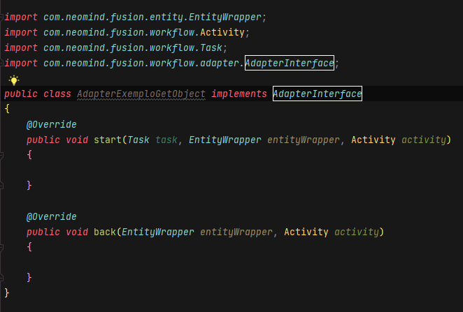

- A nossa primeira etapa é criarmos uma variável do tipo **SecurityEntity** com o nome de **papel**.

- Em seguida iremos digitar por **PersistEngine.getObject()** conforme imagem abaixo.

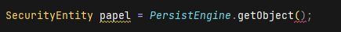

Confira que ele irá declarar um erro, que falta argumentos a serem passados. Os argumentos a serem passados são:

- O 1º argumento que devemos passar é uma classe padrão do *Fusion*. Exemplo: *SecurityEntity, NeoPaper, NeoUser, NeoGroup, NeoObject, NeoCalender e etc...*

- O 2º argumento que devemos passar é um QLFilter, é possível usar alguns QLFilter para fazer a filtragem do que queremos buscar no banco de dados. Exemplo: *QLEqualsFilter, QLRawFilter, QLGroupFilter, QLOpFilter, QLIsnotnull, QLisNull e etc...*.

### Saiba como funciona os QLFilter.

Normalmente quando queremos realizar alguma consulta no banco de dados de algum coluna especifica e trazer o valor, utilizamos o **WHERE** para fazer a filtragem da informação que queremos buscar.

Os QLFilters são exatamente isso, eles seriam o nosso WHERE para realizar as buscas dentro do banco.

Veja alguns exemplos de QLFilters:

#### 1. QLEqualsFilter

O *QLEqualsFilter* seriam para especificar se uma coluna for igual a um valor x. No resumo ele seria basicamente um *WHERE Codigo = 1L* dentro do nosso select.

*Exemplo:*

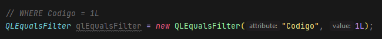

#### 2. QLRawFilter

O *QLRawFilter* seria basicamente como escrever o nosso where de forma semelhante de como seria em uma consulta usando a query do SQL.

*Exemplo:*

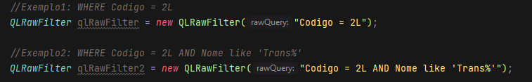

#### 3. QLGroupFilter

O *QLGroupFilter* é como se a gente desmembrasse o nosso *where*, usando como exemplo o QLRawFilter, ele faz o *where* todo em uma linha, porem, o QLGroupFilter é feito em partes. 1º é passado o operador lógico de comparação. Em seguida adicionaremos o *where* podendo ser feito usando o QLEqualsFilter ou até mesmo o QLRawFilter.

Vale ressaltar que independente de como vamos ir adicionando esses "where", ele irá entender e executar toda a query no final.

*Exemplo 1 (Pouco desmembrado):*

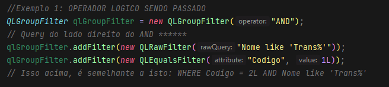

*Exemplo 2 (Mais desmembrado):*

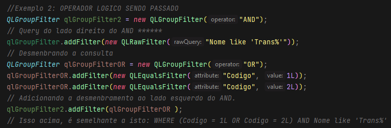

#### 4. QLOpFilter

O *QLOpFilter* é um filtro onde passamos operadores aritméticos para realizar o nosso where, então seria algo tipo assim: *WHERE Codigo > 1L*.

- O 1º parâmetro que iriamos passar seria a coluna.
- 2º Seria o operador.
- 3º Seria o valor.

*Exemplo:*

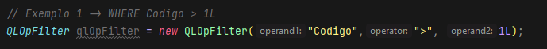

#### 5. QLIsNotNull

Esse tipo de filtro seria para conferir se a coluna passada como parâmetro **NÃO É VAZIA**.

*Exemplo:*

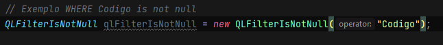

#### 6. QLIsNull

Esse tipo de filtro seria para conferir se a coluna passada como parâmetro **É VAZIA**.

*Exemplo:*

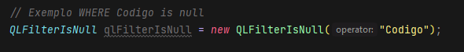

<br />

<p id="continuacao">Agora que sabemos como usar os QLFilter, podemos dar continuidade ao método getObject().</p>

No cenário que foi passado a gente tem que pegar um papel que tem cadastrado no banco de dados e em seguida trazer esse valor para um campo, onde futuramente será utilizado como participante da nossa raia.

- Para fazer isso, o nosso 1º primeiro argumento dentro do getObject(), será o *SecurityEntity.class*.

- Nosso 2º argumento será o *QLEqualsFilter*, onde iremos procurar pelo código do papel. O Código do nosso papel, podemos encontrar dentro do *Fusion* acessando **Administração > Segurança > Papéis** veja que terá uma coluna escrito Código, esse será o código que usaremos no nosso QLFilter.

Então nosso código deverá ficar desta forma:

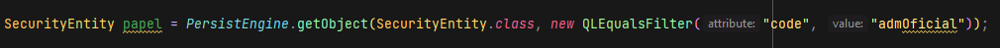

Agora que conseguimos recuperar o papel que a gente queria, precisamos adicionar esse valor utilizando o *EntityWrapper* e por se tratar de uma lista devemos procurar o campo que vamos adicionar essa informação.

- 1º vamos usar o *findField()* passando o campo que queremos procurar, nesse caso é o **NeoPaperOficial**.

- 2º vamos acessar outro método que vai servir para adicionar um valor a este campo, através do *addValue()*, passando como valor a nossa variável **papel**.

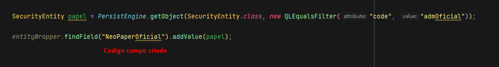

E para finalizar precisamos criar o nosso Adapter no processo(antes de chegar na raia de destino.) e colocar o path reference da classe. Também precisamos colocar esse campo como participante da nossa raia alvo que é a raia do **Gestor**.

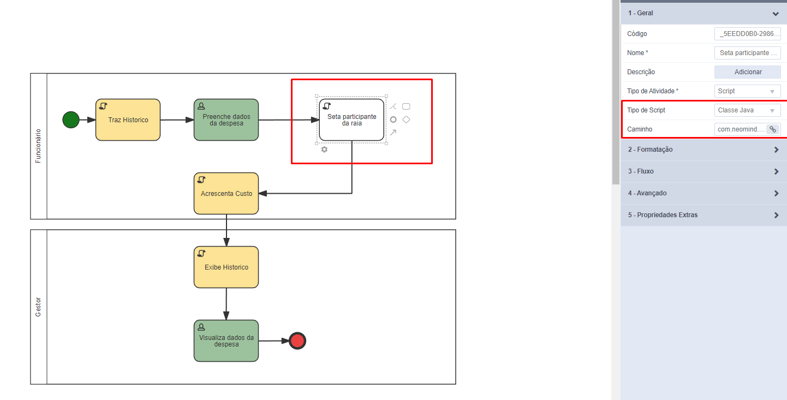

Agora vá até a raia com o nome de **gestor**, clique em *editar participantes*. Logo após exclua o usuário que está atualmente como participante e em baixo na opção de *selecionar a partir de campos de formulário* selecione o campo que criamos.

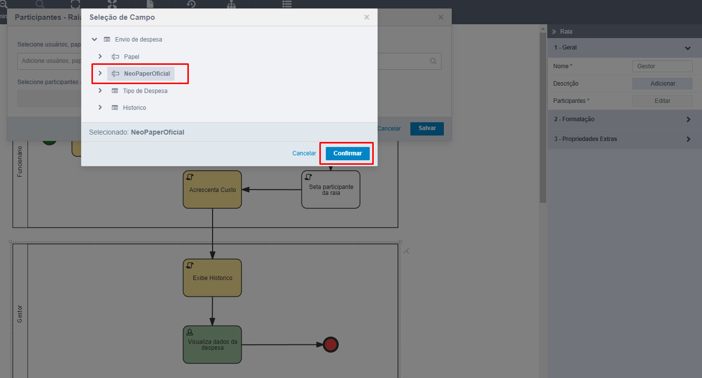

Clique em **Salvar**, e em seguida libere a versão.

Agora inicie um processo e veja que ao avançar a primeira atividade a segunda atividade irá para todos que participam daquele papel.


