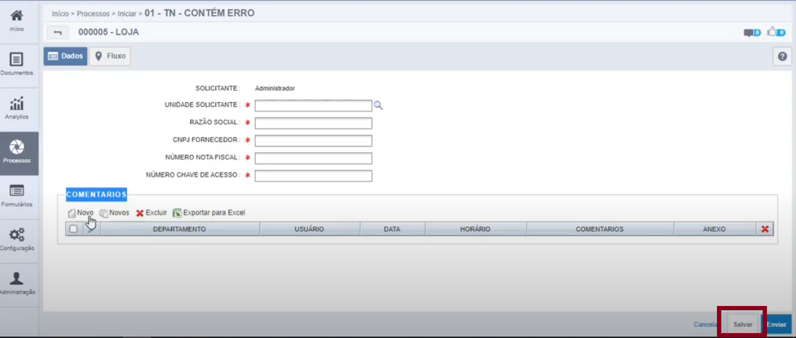
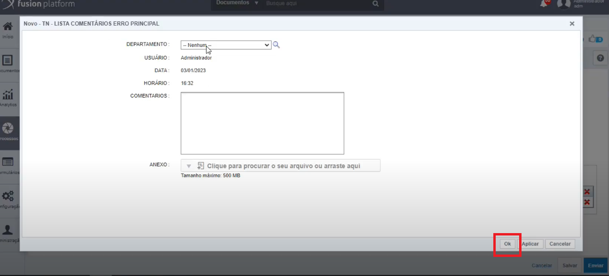
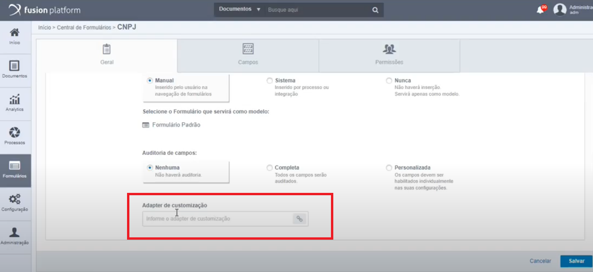

# Adapters de Formulário

## 1. Escolha da utilização de um EntityAdapter

A escolha de utilizar o Entity Adapter se dá quando é necessária **realizar uma validação na criação de um objeto**. 

Estando este *Adapter* vinculado ao formulário principal de um processo será executado no momento que a atividade é **Salva**, comportando-se de forma semelhante ao *Adapter Interface*. Ao clicar diretamente em **Enviar** a atividade é primeiramente salva e por isso o *Adapter* também é executado.

*Momento da validação do Adapter estando no formulário principal.*

Porém estando o *Entity Adapter* vinculado a um formulário que é chamado como *Eform* do tipo lista no formulário principal, como por exemplo o campo **COMENTARIOS** na foto acima, ocorrerá uma validação em tempo de tela ao dar **Ok**.

*Momento da validação do Adapter estando em um campo do formulário principal.*

Nesse caso, o *Adapter* é executado antes de persistir os dados do formulário e se torna uma boa alternativa para trabalhar com dados que foram inseridos, porém ainda não estão salvos no banco de dados.

## 2. Onde configurar um EntityAdapter

Os [Adapters de Formulário](../../../adapters\entity-adapter\understanding-about.md) são inseridos dentro dos próprios formulários, em seu momento de criação ou edição, na aba *Geral* e campo **Adapter de customização**. Neste campo é inserido o caminho de uma Classe Java 

*Local onde deve ser inserido o Adapter de Formulário.*

